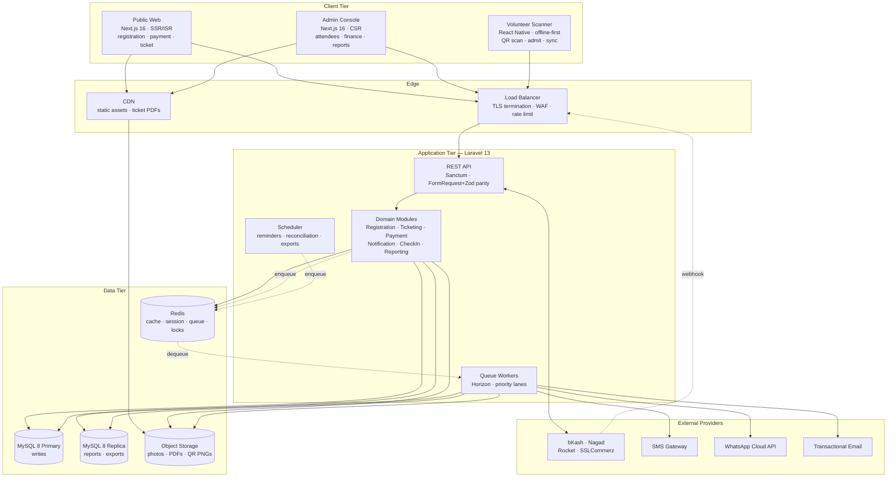
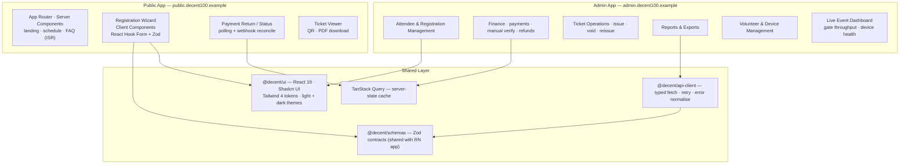
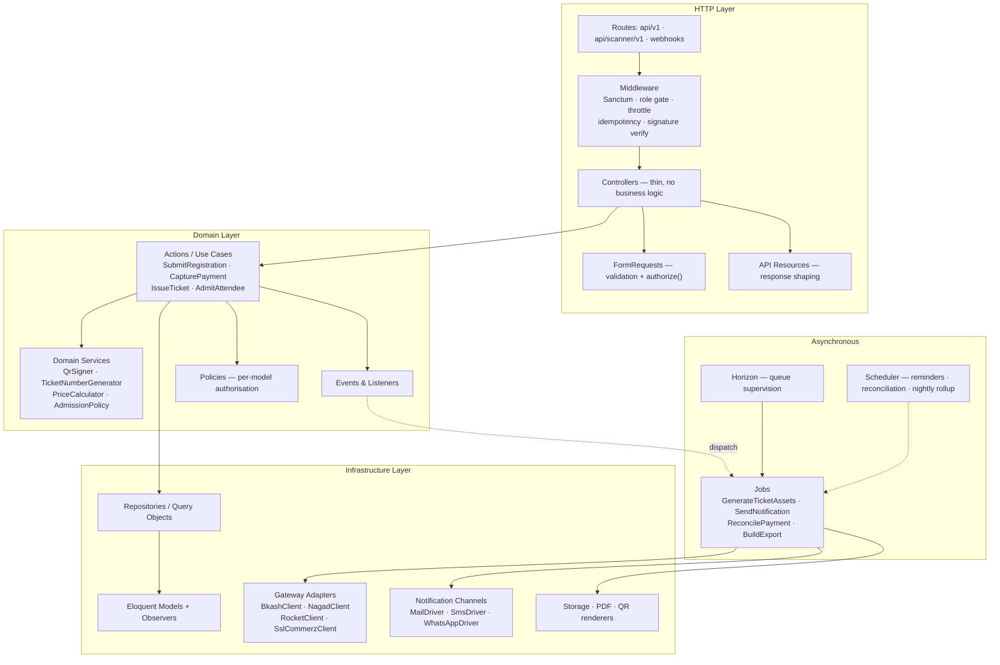
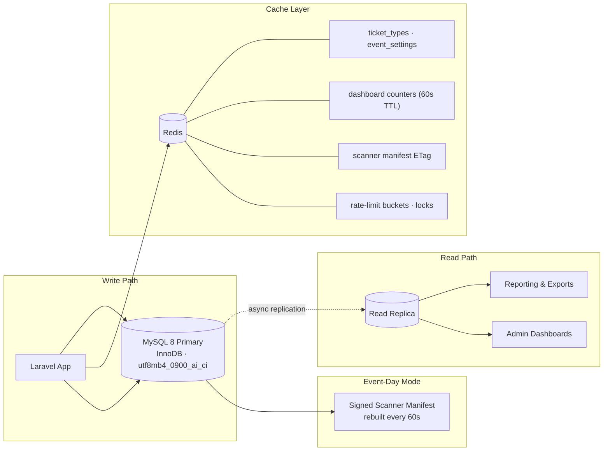
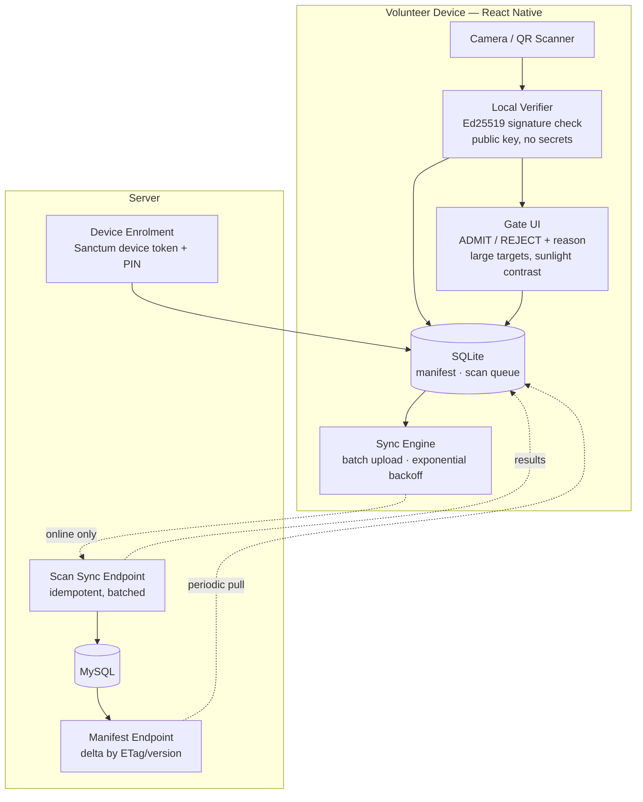
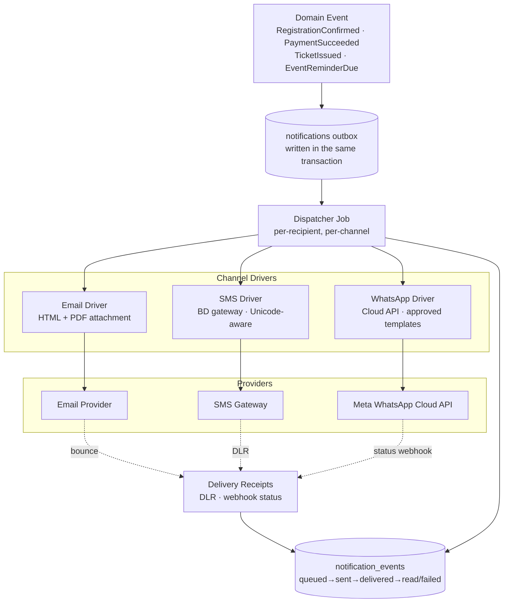
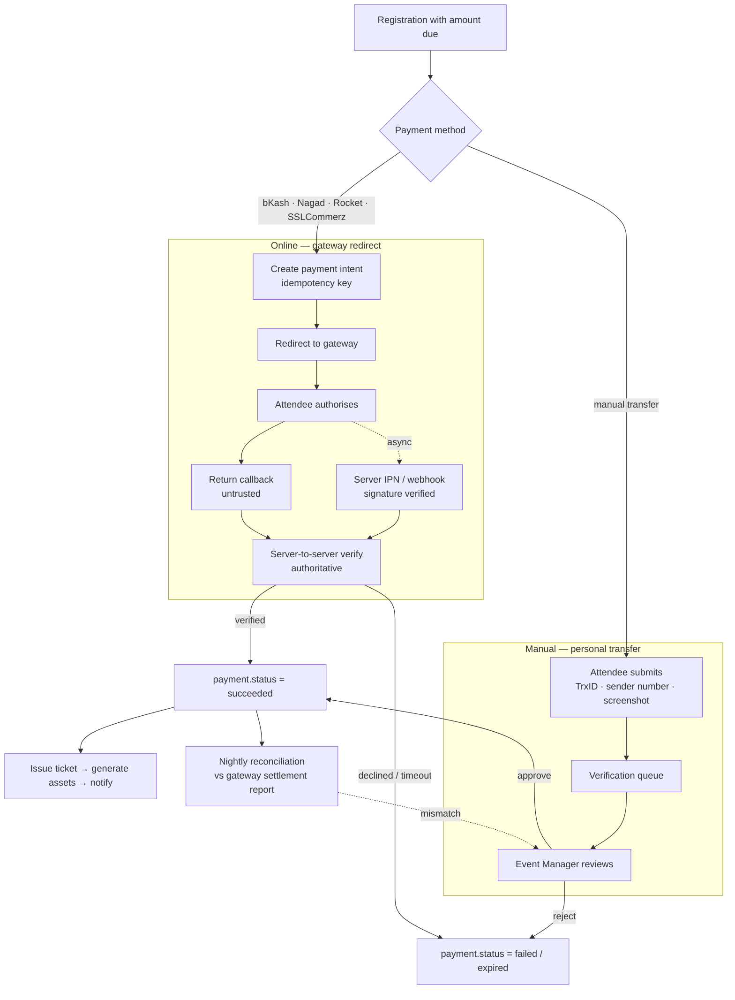

# 01 — System Architecture

> Phase 1 deliverable. Covers overall application architecture, and the frontend, backend, database, mobile verification, notification, and payment architectures.

---

## 1.1 Overall application architecture

Three clients talk to one Laravel API over HTTPS. The API is a modular monolith fronted by a load balancer, backed by MySQL with a read replica, Redis, and object storage. Everything slow, unreliable, or third-party sits behind a queue.

**Why the queue boundary matters.** The dotted enqueue/dequeue edges are the system's most important line. Everything to the right of it — SMS delivery, WhatsApp, PDF rendering, email — is allowed to be slow or briefly broken without affecting whether a registration succeeds. Everything to the left must be fast and transactional.

### Module boundaries

The monolith is partitioned into six domain modules. Modules communicate through published events and service interfaces, never by reaching into each other's Eloquent models.

| Module | Owns | Publishes |
|---|---|---|
| **Registration** | attendees, registrations, guests, uploads | `RegistrationSubmitted`, `RegistrationConfirmed` |
| **Payment** | payments, transactions, refunds, reconciliation | `PaymentSucceeded`, `PaymentFailed`, `RefundIssued` |
| **Ticketing** | ticket_types, tickets, QR signing, PDF rendering | `TicketIssued`, `TicketVoided` |
| **Notification** | outbox, templates, channel drivers, delivery receipts | `NotificationDelivered`, `NotificationFailed` |
| **CheckIn** | gates, sessions, devices, scans, offline sync | `AttendeeAdmitted`, `ScanRejected` |
| **Reporting** | aggregates, exports, dashboard projections | — (read-only consumer) |

The critical chain is `PaymentSucceeded → TicketIssued → Notification`. Each link is an asynchronous, idempotent listener, so a failure in PDF rendering never rolls back a captured payment.

---

## 1.2 Frontend architecture

Two Next.js 16 applications share a component library and API client. They are separated because their rendering strategies, auth models, and bundle budgets are genuinely different — bundling an admin data grid into the public registration page would be a real cost on a 3G connection.

**Rendering strategy per route class**

| Route class | Strategy | Reason |
|---|---|---|
| Marketing, schedule, FAQ | Static + ISR (revalidate 300s) | Absorbs the 5,000-concurrent spike at the CDN, never touching Laravel |
| Registration wizard | Client-side, progressively enhanced | Multi-step state, file upload, conditional family fields |
| Payment return | Server Component shell + client poller | Must reflect webhook-driven state that arrives out of band |
| Ticket viewer | Server Component, ULID-addressed, `noindex` | Renders fast on mobile, signed URL for the PDF |
| All admin routes | Client-side, auth-gated | No SEO value, heavy interactive tables |

**Styling and theming.** One design system serves both apps: Tailwind CSS 4 with a CSS-first `@theme` token layer in OKLCH, Shadcn UI primitives on top, and no second styling approach anywhere in the frontend. Light and dark are both first-class — only the semantic token block is redefined per theme, so components are styled through tokens and never inside a theme selector. The OS preference is the default signal; an explicit user toggle overrides it in both directions and is applied before first paint. Full specification and acceptance checks: [08 §3.1](08-development-roadmap.md#31-design-system--theming-foundation).

Dark mode is not cosmetic here. The admin console is operated for eight continuous hours on event day, often in a dim ops room next to a projected wall display — which is also why the live dashboard has a large-format mode.

**Validation parity.** Zod schemas in `@decent/schemas` are the single source of truth for shape and are mirrored by Laravel FormRequests for authority. The client schema exists for UX; the server schema exists for trust. Drift between them is caught by a contract test in Phase 8.

**Registration wizard structure.** Five steps matching the business requirements — Personal → Academic → Attendance & Family → T-Shirt → Review & Pay — with per-step Zod validation, draft persisted to `localStorage` under a ULID draft key, and resumable from an emailed link. Alumni completing a form on a mid-range Android over mobile data is the target device profile, not a desktop browser.

---

## 1.3 Backend architecture

Laravel 13 in a layered arrangement. The rule is that HTTP concerns never leak below the controller, and persistence concerns never leak above the repository.

**Queue lanes.** Not all work is equally urgent, so Horizon runs four named queues with separate worker pools:

| Queue | Contents | Target latency | Workers |
|---|---|---|---|
| `payments` | Gateway verification, webhook processing, reconciliation | < 5s | 8 |
| `tickets` | QR signing, PDF render, asset upload | < 30s | 6 |
| `notifications` | Email, SMS, WhatsApp dispatch + retries | < 60s | 10 |
| `reports` | Exports, nightly aggregation, bulk operations | minutes | 2 |

A 20,000-recipient reminder blast must never delay a payment webhook. Separate lanes are what guarantee that.

**Idempotency everywhere it matters.** Payment webhooks, ticket issuance, and offline check-in sync all carry client-supplied idempotency keys enforced by unique indexes. Gateways retry IPNs; scanner devices retry uploads over flaky connections. Both must be safe to replay.

---

## 1.4 Database architecture

**Engine and collation.** InnoDB throughout. `utf8mb4` with `utf8mb4_0900_ai_ci` collation is mandatory, not optional — attendee names and family member names will be entered in Bangla, and the T-shirt vendor's production sheet has to render them correctly.

**Replication posture.** The read replica serves reporting, exports, and admin dashboards. It never serves the check-in path or payment verification, where replication lag would produce wrong answers. Anything that reads to make a decision reads the primary.

**Partitioning stance.** No table partitioning at this scale. The largest table (`activity_logs`, projected ~2M rows) is handled with monthly archival to cold storage instead. Partitioning adds operational complexity that 20,000 registrations do not justify.

**Time and money conventions.**
- All timestamps stored UTC, rendered `Asia/Dhaka` (UTC+6). The event day is a hard local boundary; storing local time invites off-by-six-hours bugs in attendance reports.
- All money is `BIGINT UNSIGNED` paisa with explicit currency. See [ADR-02](README.md#adr-02--money-is-stored-as-integer-paisa-never-decimal-or-float).

Full table-by-table specification is in [03-database-schema.md](03-database-schema.md).

---

## 1.5 Mobile verification architecture

The design premise: **the network at the gate does not work.** Every capability below assumes zero connectivity and treats the network as an optimisation.

### The four-stage scan decision

Every scan resolves locally in under 300ms through four ordered checks:

| Stage | Check | Works offline | Fails with |
|---|---|---|---|
| 1 | Payload format and version | Yes | `invalid_format` |
| 2 | Ed25519 signature against embedded public key | Yes | `invalid_signature` |
| 3 | Manifest lookup — is the ticket voided, refunded, or unpaid? | Yes | `revoked` / `unpaid` |
| 4 | Local admission counter — remaining admissions on this ticket | Yes | `duplicate` / `over_capacity` |

Only stage 4's *authoritative* resolution requires the server, and only when the same ticket is scanned at two different gates while both devices are offline. That case is detected at sync time, flagged as a conflict, and surfaced to the Event Manager — it is not silently lost.

### Conflict resolution

First scan wins by device-recorded timestamp, with devices required to be NTP-synced at enrolment. Conflicting later scans are stored with `result = duplicate` and `conflict_flag = true`, giving the operations team a precise list of contested entries rather than a corrupted count.

### Manifest sizing

The manifest is deliberately minimal — ticket ULID, admits total, admitted count, status — roughly 48 bytes per ticket. At 12,000 tickets that is under 600 KB uncompressed, well under 200 KB gzipped. It downloads once during pre-event setup and refreshes by delta whenever a device has signal.

---

## 1.6 Notification architecture

A transactional outbox drained by workers, with provider-agnostic channel drivers and durable delivery receipts.

### Channel matrix

| Event | Email | SMS | WhatsApp | Notes |
|---|:--:|:--:|:--:|---|
| Registration received | ✓ | ✓ | ✓ | Includes registration ULID for support reference |
| Payment succeeded | ✓ | ✓ | ✓ | Amount, method, gateway transaction ID |
| Ticket delivered | ✓ | ✓ | ✓ | Email carries the PDF; SMS carries a short link; WhatsApp carries the QR image |
| Manual payment verified | ✓ | ✓ | ✓ | Triggered by admin approval |
| Payment failed / expired | ✓ | ✓ | — | With a retry link |
| Refund issued | ✓ | ✓ | — | |
| Event reminder T-7 / T-1 / T-0 | ✓ | ✓ | ✓ | Scheduled, batched, rate-limited |

### Bangladesh-specific constraints designed for

- **SMS segment cost.** A Bangla (Unicode) SMS holds 70 characters per segment versus 160 for GSM-7. At 20,000 recipients the difference between a 2-segment and 4-segment message is material money. Templates are length-budgeted per encoding, and `notifications` records `segment_count` and `cost_paisa` for real cost reporting.
- **WhatsApp templates need Meta approval.** Utility-category templates must be submitted and approved before Phase 5 can be tested. Drafting starts in Phase 2 to absorb the multi-day review latency.
- **Mobile vs WhatsApp numbers differ.** The registration form captures both separately because a meaningful share of alumni abroad use a foreign WhatsApp number with a Bangladeshi contact number.

### Delivery guarantees

At-least-once with idempotency. Each outbox row has a unique `(notifiable_type, notifiable_id, template_key, channel)` constraint for one-shot messages, so a retried job cannot double-send a ticket. Retries use exponential backoff (1m, 5m, 15m, 1h, 6h) and stop after 5 attempts, moving the row to `failed` for manual review.

---

## 1.7 Payment architecture

Four gateways behind one interface, with a mandatory server-side verification step and a manual-verification path for the significant share of attendees who will send money by personal bKash transfer regardless of what the website offers.

### The non-negotiable rule

**A browser callback never confirms a payment.** The attendee's return redirect is a UX signal only. `payments.status` moves to `succeeded` exclusively after a server-to-server verification call to the gateway, or after an authenticated IPN whose signature validates *and* which is then confirmed by a verify call. This closes the entire class of "attacker replays a success URL" fraud.

### Two-table split

- **`payments`** — the money intent for a registration. One row, holds `amount_due_paisa`, `amount_paid_paisa`, `status`, `method`. This is what the business reasons about.
- **`payment_transactions`** — every individual interaction with a gateway: init, callback, IPN, verify, refund. Append-only, stores the raw request/response payload. This is what reconciliation and dispute resolution read.

A single payment routinely produces four to six transaction rows. Collapsing them into one table destroys the audit trail exactly when it is needed.

### Gateway adapter interface

Each of `BkashClient`, `NagadClient`, `RocketClient`, `SslCommerzClient` implements one contract — `createIntent`, `verify`, `refund`, `parseWebhook` — so gateway-specific quirks (bKash's token refresh cycle, Nagad's RSA payload encryption, SSLCommerz's `val_id` validation call) stay contained in the adapter and never leak into domain logic.

### Reconciliation

A scheduled nightly job pulls each gateway's settlement report and diffs it against local `payment_transactions`. Three mismatch classes are flagged for the Event Manager: paid-but-not-recorded, recorded-but-not-settled, and amount mismatch. Without this, the revenue report and the bank balance will disagree by event day and nobody will know why.

---

## 1.8 Environment topology

| Environment | Purpose | Data | Gateways |
|---|---|---|---|
| Local | Development | Seeded fixtures | All sandboxed / faked |
| Staging | QA, UAT, load testing | Anonymised clone | Gateway sandboxes |
| Production | Live | Real | Live credentials |
| **Event-day standby** | Hot spare, promoted only if primary fails | Replica of production | Live |

The event-day standby exists because of the single-day risk profile. It is provisioned one week before the event, kept in replication, and load-tested against the check-in path specifically. Its only job is to make a total primary failure a ten-minute incident instead of a cancelled gate.

---

**Next:** [02 — RBAC & Permissions](02-rbac-permissions.md)
