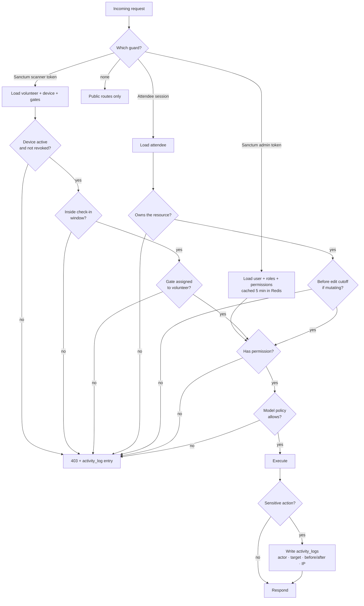

# 02 — User Roles & Permissions (RBAC)

> Phase 1 deliverable. Role definitions, the full permission catalogue, the policy matrix, and the enforcement model.

---

## 2.1 Design principles

**Two separate identity domains.** Staff (`users`) and attendees (`attendees`) are different tables with different guards. An attendee is not a low-privilege admin — they authenticate differently (magic link / OTP rather than password), have no console access, and can only ever see their own records. Conflating them into one `users` table with a `role` column is the most common way ticketing systems leak attendee data.

**Permissions are verbs on resources, roles are bundles.** Code checks permissions (`payment.verify_manual`), never roles (`if ($user->role === 'admin')`). Roles are configuration; permissions are the contract. This lets the client add an "Accounts Officer" role in Phase 9 without touching a single policy.

**Volunteers are scoped, not just limited.** A volunteer does not merely have fewer permissions — their access is bounded to an assigned gate, an enrolled device, and an active event window. A volunteer token that works from a laptop in another city three weeks before the event is a design failure, not a hardening detail.

**Every destructive or financial action is logged with actor, target, before/after, and IP.** See [06 §6.9 Audit logging](06-security-architecture.md#69-audit-logging).

---

## 2.2 Role definitions

| Role | Guard | Auth method | Session | Count (est.) |
|---|---|---|---|---|
| **Super Admin** | `web-admin` | Password + TOTP 2FA when `security.two_factor_enabled` is on | 8h, IP-pinned | 2–3 |
| **Event Manager** | `web-admin` | Password + TOTP 2FA when `security.two_factor_enabled` is on | 8h | 4–8 |
| **Volunteer** | `scanner` | Device enrolment token + 6-digit PIN | Event window only | 20–30 |
| **Attendee** | `attendee` | Magic link (email) or OTP (SMS) | 30 days, single-resource | 20,000+ |

### Super Admin
Full system authority. Owns the things that are dangerous rather than merely important: gateway credentials, event settings, role assignment, ticket-type pricing, hard deletion, and the QR signing key rotation. There should be very few of these accounts.

**2FA is a switch, not a constant — changed 2026-09-05.** Whether staff logins demand a TOTP code is `security.two_factor_enabled` (Settings → Security), and it ships **off**. The mandatory version had one failure mode nobody could recover from: a staff member who loses their authenticator is locked out of the only account that can disable 2FA on itself, so recovery meant shell access to the host. `App\Domain\Shared\Support\TwoFactorPolicy` is the single answer to "is 2FA in force?" — do not read the setting anywhere else. Turn it on for launch.

**Uniquely holds:** system settings, user/role management, credential management, key rotation, permanent deletion, audit log export.

### Event Manager
Runs the event day to day. Manages attendees, registrations, tickets, payments, communications, and reports. Can do almost everything operationally consequential but nothing structurally dangerous — they cannot change gateway credentials, cannot grant themselves Super Admin, cannot hard-delete, and cannot rotate signing keys.

**Notable boundary:** an Event Manager *can* issue a refund and *can* void a ticket, because those are routine operations. Both are irreversible-in-practice, so both are logged with mandatory reason text and both fire a notification to Super Admins.

### Volunteer
Scans and admits. Nothing else. Cannot see payment amounts, cannot see contact details beyond what is needed to confirm identity at the gate (name, photo, ticket type, admissions remaining), cannot search the attendee list, cannot export anything.

**Scoping constraints, all enforced server-side:**
- Token is bound to one enrolled device (`check_in_devices.id`)
- Access limited to the gates listed in `volunteer_gate_assignments`
- Token is only valid within `event_settings.checkin_window_start .. checkin_window_end`
- Token can be revoked instantly by an Event Manager; revocation propagates to the device on next sync and is enforced server-side immediately

**Deliberate exception:** a Volunteer can view a limited attendee card *only* as the result of a valid scan. There is no "browse attendees" capability. A lost phone therefore leaks, at worst, the details of tickets someone physically possesses.

### Attendee
The registrant. Sees and manages only their own registration, payment, tickets, and guests — enforced by policy on ownership, not by an unguessable URL. Can update their profile and guest details up to a configurable cutoff date, after which the T-shirt order and catering counts are locked.

---

## 2.3 Permission catalogue

Permissions are named `resource.action`. Grouped by domain.

### Registrations & attendees

| Permission | Super Admin | Event Manager | Volunteer | Attendee |
|---|:--:|:--:|:--:|:--:|
| `registration.view_any` | ✓ | ✓ | — | — |
| `registration.view` | ✓ | ✓ | — | own |
| `registration.create` | ✓ | ✓ | — | ✓ |
| `registration.update` | ✓ | ✓ | — | own, pre-cutoff |
| `registration.cancel` | ✓ | ✓ | — | own, pre-cutoff |
| `registration.delete` | ✓ | — | — | — |
| `registration.export` | ✓ | ✓ | — | — |
| `attendee.view_any` | ✓ | ✓ | — | — |
| `attendee.view` | ✓ | ✓ | scan-result only | own |
| `attendee.update` | ✓ | ✓ | — | own |
| `attendee.merge_duplicates` | ✓ | ✓ | — | — |
| `attendee.view_contact_details` | ✓ | ✓ | — | own |
| `guest.manage` | ✓ | ✓ | — | own, pre-cutoff |

### Tickets

| Permission | Super Admin | Event Manager | Volunteer | Attendee |
|---|:--:|:--:|:--:|:--:|
| `ticket.view_any` | ✓ | ✓ | — | — |
| `ticket.view` | ✓ | ✓ | scan-result only | own |
| `ticket.issue` | ✓ | ✓ | — | — |
| `ticket.reissue` | ✓ | ✓ | — | — |
| `ticket.void` | ✓ | ✓ | — | — |
| `ticket.download_pdf` | ✓ | ✓ | — | own |
| `ticket.transfer` | ✓ | ✓ | — | — |
| `ticket_type.view_any` | ✓ | ✓ | — | public subset |
| `ticket_type.manage` | ✓ | — | — | — |
| `ticket_type.set_price` | ✓ | — | — | — |

`ticket_type.set_price` sits with Super Admin alone. Pricing changes after sales open create refund liability and reconciliation mismatches; that decision should require the highest privilege in the system.

### Payments

| Permission | Super Admin | Event Manager | Volunteer | Attendee |
|---|:--:|:--:|:--:|:--:|
| `payment.view_any` | ✓ | ✓ | — | — |
| `payment.view` | ✓ | ✓ | — | own |
| `payment.initiate` | ✓ | ✓ | — | own |
| `payment.verify_manual` | ✓ | ✓ | — | — |
| `payment.reject_manual` | ✓ | ✓ | — | — |
| `payment.refund` | ✓ | ✓ | — | — |
| `payment.view_transactions` | ✓ | ✓ | — | — |
| `payment.view_raw_gateway_payload` | ✓ | — | — | — |
| `payment.reconcile` | ✓ | ✓ | — | — |
| `payment.manage_gateway_credentials` | ✓ | — | — | — |
| `payment.export` | ✓ | ✓ | — | — |

`payment.view_raw_gateway_payload` is Super Admin only because raw gateway responses can contain masked account identifiers and tokens that no operational task requires.

### Check-in

| Permission | Super Admin | Event Manager | Volunteer | Attendee |
|---|:--:|:--:|:--:|:--:|
| `checkin.scan` | ✓ | ✓ | ✓ scoped | — |
| `checkin.admit` | ✓ | ✓ | ✓ scoped | — |
| `checkin.manual_override` | ✓ | ✓ | — | — |
| `checkin.undo` | ✓ | ✓ | — | — |
| `checkin.view_any` | ✓ | ✓ | own scans | own |
| `checkin.view_live_dashboard` | ✓ | ✓ | own gate counts | — |
| `checkin.resolve_conflict` | ✓ | ✓ | — | — |
| `checkin.sync` | — | — | ✓ scoped | — |

`checkin.manual_override` — admitting someone whose QR will not scan (cracked screen, lost phone, printer failure) — deliberately excludes Volunteers. It is the single highest-abuse-risk action at the gate, so it routes to an Event Manager, requires a reason, and is logged. Every event needs this capability and every event gets it abused if it is handed to twenty temporary volunteers.

### Devices & volunteers

| Permission | Super Admin | Event Manager | Volunteer | Attendee |
|---|:--:|:--:|:--:|:--:|
| `volunteer.view_any` | ✓ | ✓ | — | — |
| `volunteer.create` | ✓ | ✓ | — | — |
| `volunteer.assign_gate` | ✓ | ✓ | — | — |
| `volunteer.revoke_access` | ✓ | ✓ | — | — |
| `device.enrol` | ✓ | ✓ | — | — |
| `device.view_any` | ✓ | ✓ | — | — |
| `device.revoke` | ✓ | ✓ | — | — |
| `device.view_sync_status` | ✓ | ✓ | own device | — |

### Notifications

| Permission | Super Admin | Event Manager | Volunteer | Attendee |
|---|:--:|:--:|:--:|:--:|
| `notification.view_any` | ✓ | ✓ | — | own |
| `notification.resend` | ✓ | ✓ | — | own ticket only |
| `notification.send_broadcast` | ✓ | ✓ | — | — |
| `notification.manage_templates` | ✓ | — | — | — |
| `notification.view_costs` | ✓ | ✓ | — | — |

`notification.send_broadcast` reaches 20,000 people and costs real money per send. It requires a confirmation step showing recipient count and estimated cost in BDT before dispatch, and is rate-limited to prevent a mistaken double-click from sending twice.

### Reporting

| Permission | Super Admin | Event Manager | Volunteer | Attendee |
|---|:--:|:--:|:--:|:--:|
| `report.view_registrations` | ✓ | ✓ | — | — |
| `report.view_revenue` | ✓ | ✓ | — | — |
| `report.view_attendance` | ✓ | ✓ | gate summary | — |
| `report.view_tshirt` | ✓ | ✓ | — | — |
| `report.view_batch_breakdown` | ✓ | ✓ | — | — |
| `report.export_pdf` | ✓ | ✓ | — | — |
| `report.export_excel` | ✓ | ✓ | — | — |
| `report.export_csv` | ✓ | ✓ | — | — |

### System administration

| Permission | Super Admin | Event Manager | Volunteer | Attendee |
|---|:--:|:--:|:--:|:--:|
| `user.view_any` | ✓ | — | — | — |
| `user.create` | ✓ | — | — | — |
| `user.update` | ✓ | — | — | — |
| `user.assign_role` | ✓ | — | — | — |
| `user.deactivate` | ✓ | — | — | — |
| `role.manage` | ✓ | — | — | — |
| `settings.view` | ✓ | ✓ read-only | — | — |
| `settings.update` | ✓ | — | — | — |
| `qr.rotate_signing_key` | ✓ | — | — | — |
| `activity_log.view` | ✓ | ✓ scoped | — | — |
| `activity_log.export` | ✓ | — | — | — |
| `system.impersonate_attendee` | ✓ | — | — | — |

`system.impersonate_attendee` exists for support ("I can't see my ticket") and is heavily constrained: session capped at 15 minutes, a persistent banner in the UI, all actions logged under both the real and impersonated identity, and payment-initiating actions blocked entirely during impersonation.

---

## 2.4 Permission resolution

**Two-stage authorisation.** A permission check answers "may this role ever do this?" A policy check answers "may this actor do this to *this specific record*?" Both must pass. `payment.refund` grants the capability; `PaymentPolicy::refund()` still blocks refunding an already-refunded payment or one past the refund cutoff.

---

## 2.5 Implementation notes for Phase 2

- **Package:** `spatie/laravel-permission` with the `web-admin` guard for staff. Volunteer scoping and attendee ownership are handled by Laravel Policies and a custom middleware, not by adding hundreds of scoped permission rows.
- **Middleware stack for scanner routes:** `auth:sanctum` → `EnsureDeviceActive` → `EnsureWithinCheckInWindow` → `EnsureGateAssigned` → `throttle:scanner`.
- **Permission caching:** resolved permission sets cached in Redis for 5 minutes, invalidated immediately on role change. A revoked Super Admin must lose access now, not in five minutes — role revocation busts the cache synchronously and also revokes active Sanctum tokens.
- **Seeding:** roles and permissions are seeded from a versioned config file, not created ad hoc, so staging and production provably match.
- **Testing:** every permission gets a two-case test — one authorised actor succeeds, one unauthorised actor receives 403. With ~70 permissions this is the single highest-value test suite in Phase 8.

---

**Next:** [03 — Database Schema](03-database-schema.md)
