# 04 — Entity Relationship Diagram

> Phase 1 deliverable. Full ERD, domain-focused sub-diagrams, cardinality rationale, and lifecycle state machines.

Field types below are shown in Mermaid's simplified notation. Exact MySQL types are in [03 — Database Schema](03-database-schema.md).

---

## 4.1 Full entity relationship diagram

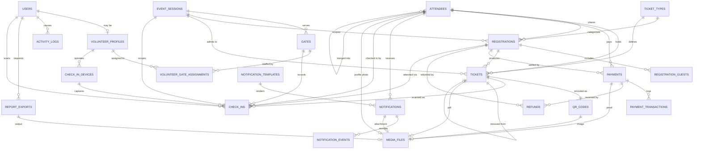

---

## 4.2 Registration domain

The core identity and order structure. One attendee places many registrations over time; each registration covers one or more people.

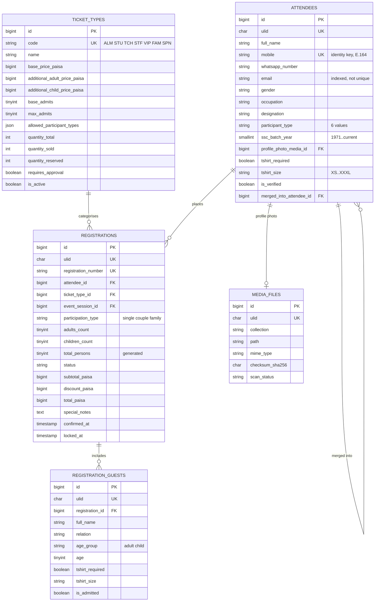

**Cardinality rationale**

| Relationship | Cardinality | Why |
|---|---|---|
| Attendee → Registrations | 1 : many | Alumni may register, cancel, and re-register; identity persists across all of it |
| Registration → Guests | 1 : many, cascade | A guest has no meaning without their registration |
| Registration → TicketType | many : 1 | Type is chosen at registration and priced from it |
| Attendee → Attendee (merge) | self, optional | Deduplication redirects without destroying the original row |

---

## 4.3 Ticketing domain

Where a paid registration becomes admission-bearing instruments.

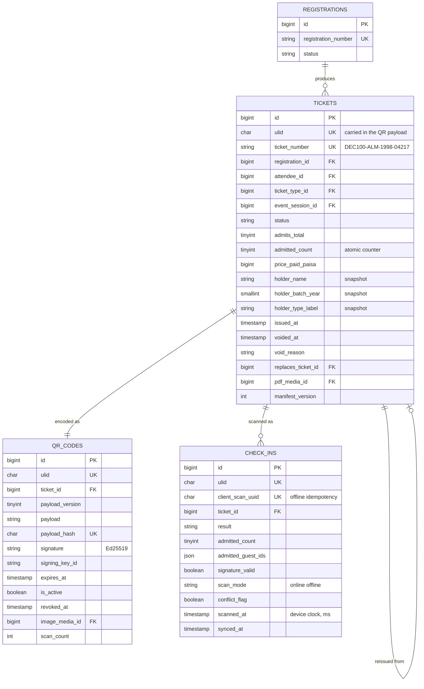

**Why `tickets` → `qr_codes` is 1:1 in practice but 1:many in structure.** A ticket has exactly one *active* QR code at a time, enforced by `idx_qr_ticket_active`. Historical QR rows are retained with `is_active = false` after a reissue or key rotation, so a scan of an old printed ticket produces `revoked` rather than an unexplained failure. Modelling this as a strict 1:1 would force destructive updates and lose the ability to explain a rejected scan at the gate.

---

## 4.4 Payment domain

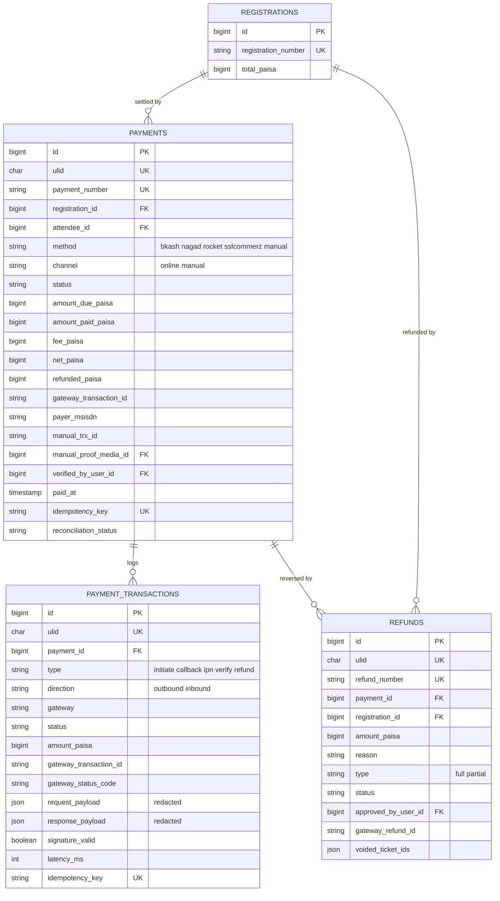

**Why one registration can have many payments.** A first attempt times out, the attendee retries with a different wallet, and a third attempt succeeds. Constraining this to 1:1 would force destructive updates and erase the failure history that reconciliation depends on. Exactly one payment per registration may hold `status = succeeded`, enforced in the application layer and asserted by the nightly consistency job.

---

## 4.5 Check-in domain

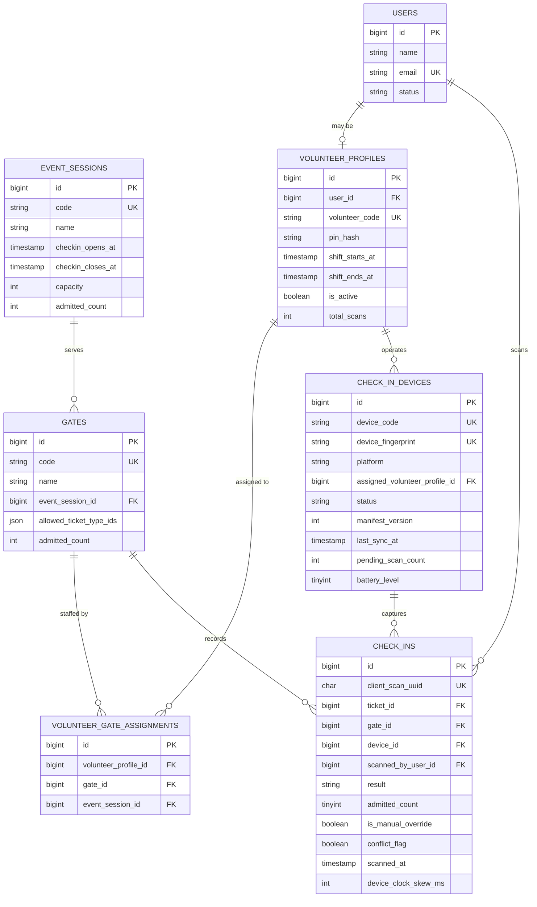

**Why devices and volunteers are separate entities.** Volunteers swap shifts and hand devices to each other. Binding scans to only a device loses accountability; binding to only a volunteer loses the ability to diagnose "gate C's tablet stopped syncing at 10:40." Both are recorded on every scan.

---

## 4.6 Notification domain

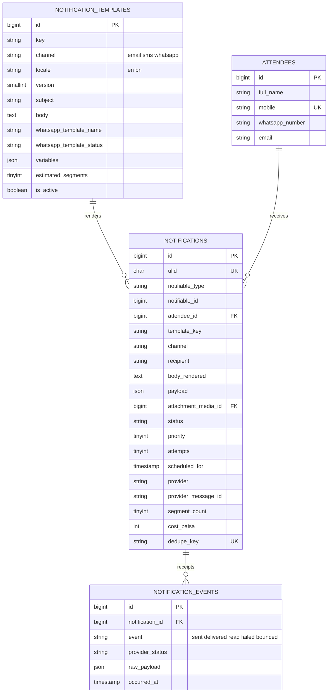

---

## 4.7 Lifecycle state machines

The ERD shows structure; these show permitted movement. Any transition not drawn here is rejected by the application layer.

### Registration

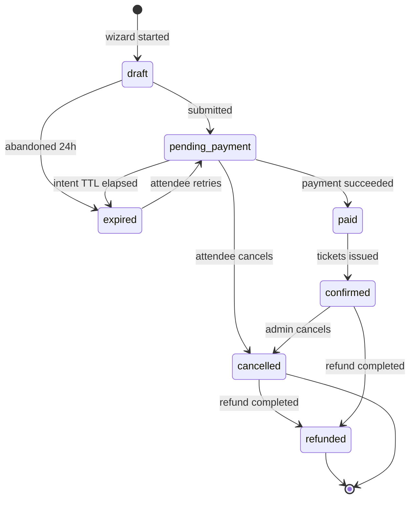

`expired → pending_payment` is deliberate. A dropped mobile connection mid-payment is common; forcing the attendee to re-enter a five-step form because their intent timed out is a real abandonment cause.

### Payment

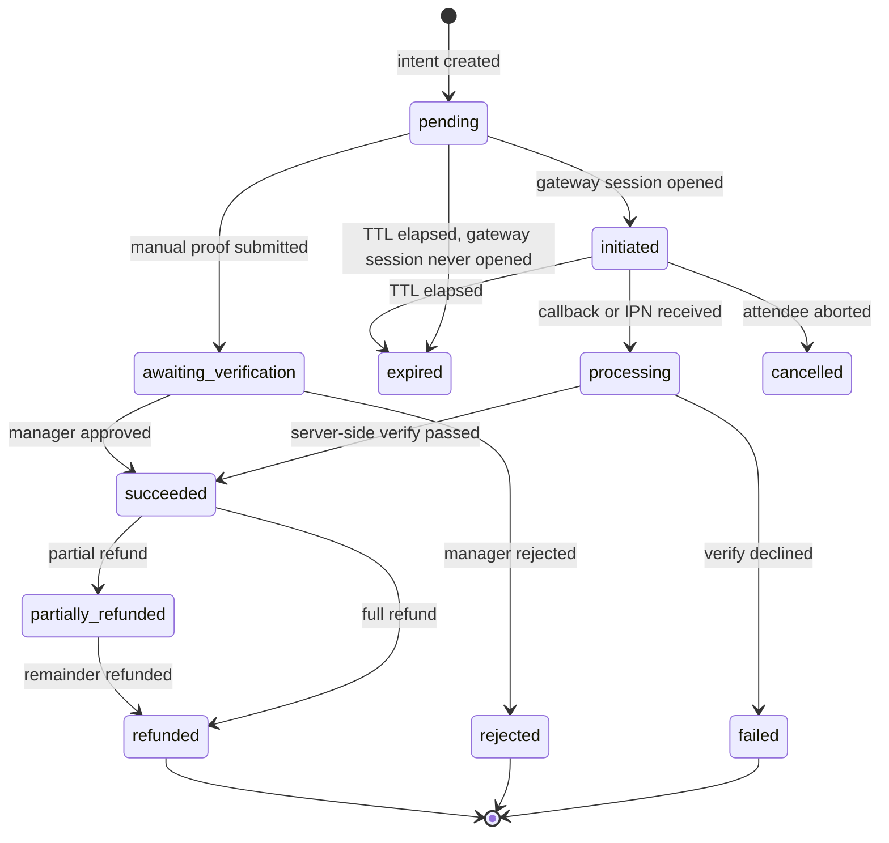

**The critical edge is `processing → succeeded`.** It is reachable only through a server-to-server verification call. No browser redirect, no unverified webhook, and no admin action other than manual approval can produce it. See [06 §6.6 Payment security](06-security-architecture.md#66-payment-security).

**`pending → expired` was added 2026-08-04 (Phase 4A).** The expiry sweeper's own query (§5.3 payment intent expiry) always included `pending` alongside `initiated` — an abandoned registration whose payer never even opened the gateway page must release capacity too, not just one that opened it and vanished. The diagram simply hadn't been updated to match; this is a doc fix, not a new business rule.

### Ticket

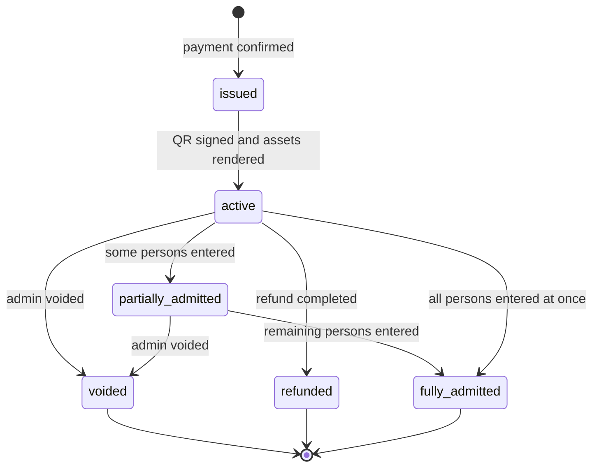

`partially_admitted` is what makes families work. A family of four arriving as two pairs, twenty minutes apart, is normal behaviour — not an error state.

### Check-in scan result

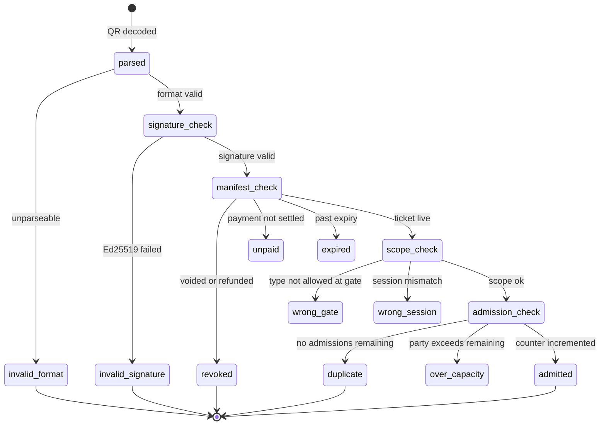

Every terminal state — including all six rejection states — writes a `check_ins` row. The gate operator sees a specific reason, and the Event Manager can later answer precisely why a given person was turned away.

### Notification

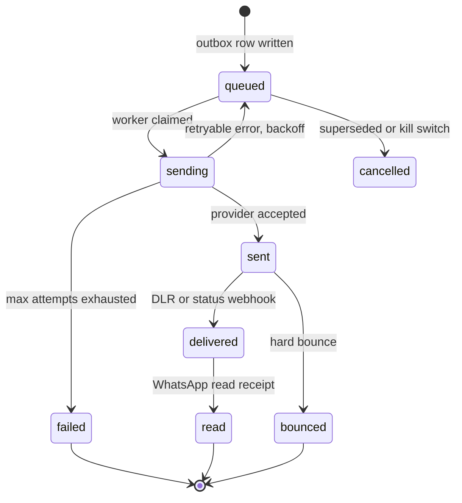

---

## 4.8 Referential integrity summary

| Parent → Child | On delete | Reason |
|---|---|---|
| `registrations` → `registration_guests` | CASCADE | Guests have no standalone meaning |
| `notifications` → `notification_events` | CASCADE | Receipts belong to their message |
| `volunteer_profiles` → `volunteer_gate_assignments` | CASCADE | Assignment is pure join data |
| `attendees` → `registrations` | RESTRICT | Never orphan a paid order |
| `registrations` → `tickets` | RESTRICT | Never orphan an issued ticket |
| `payments` → `payment_transactions` | RESTRICT | Audit trail is immutable |
| `tickets` → `check_ins` | RESTRICT | Attendance record is permanent |
| `users` → `check_ins.scanned_by_user_id` | SET NULL | Removing a volunteer must not erase attendance |
| `users` → `activity_logs.causer_id` | SET NULL | Audit survives account deletion |
| `media_files` → any referencing FK | SET NULL | A missing file degrades display, never breaks a record |

The pattern: **history is protected by RESTRICT, actors are released by SET NULL, and only pure child data cascades.** Deleting a user must never delete the record of what they did.

---

**Next:** [05 — Data Flow Design](05-data-flows.md)
