# 05 — Data Flow Design

> Phase 1 deliverable. End-to-end flows for registration, payment, ticket generation, notification, check-in, and offline sync — including the failure paths, which is where most of the real design lives.

---

## 5.1 Master flow

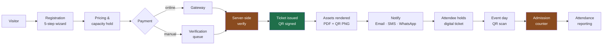

The two amber steps are the system's trust boundaries — the only places where an external claim becomes an internal fact. The green step is where money becomes an admission right. Everything else is transport.

---

## 5.2 Registration flow

### Happy path

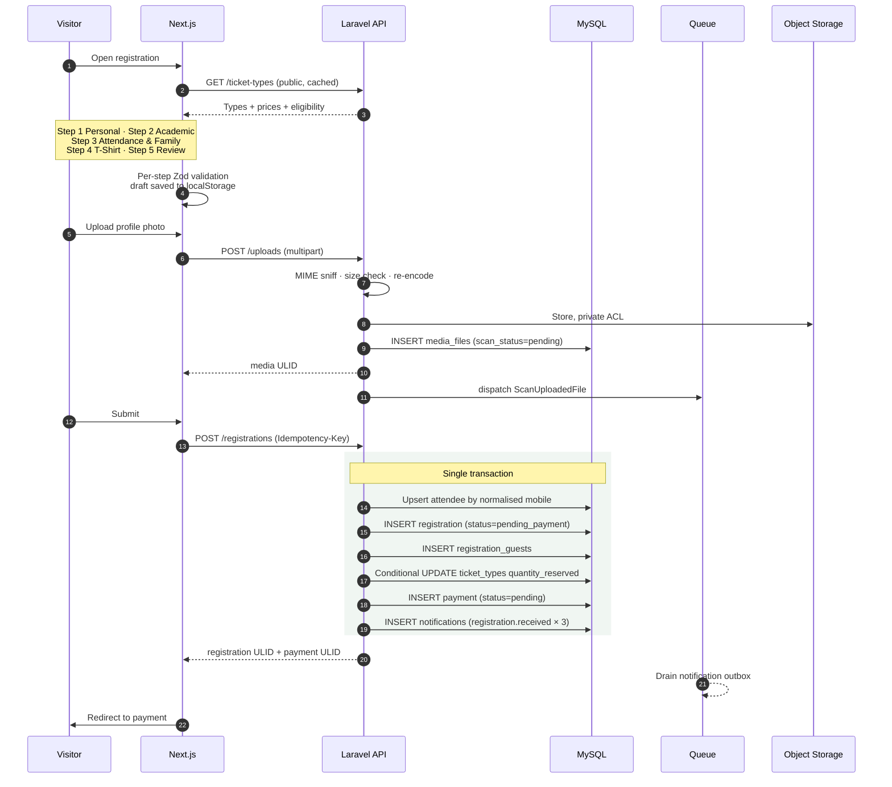

### Key decisions in this flow

**Attendee upsert, not insert.** Step 1 of the transaction matches on normalised mobile number. A returning alumnus who registered, cancelled, and came back is the *same person* — their batch year and profile carry forward, and the reporting stays correct. Conflicting field values (a changed designation) update the attendee; identity-bearing fields (batch year, participant type) require Event Manager confirmation before overwriting.

**Capacity is reserved, not sold, at submission.** `quantity_reserved` increments here; `quantity_sold` increments only on payment success. The reservation expires with the payment intent (`payment.intent_ttl_minutes`, default 30) and is released by a scheduled sweeper. Without this, a VIP tier "sells out" to fifty people who never paid.

**Notifications are written inside the transaction, sent outside it.** The outbox rows commit atomically with the registration; the SMS gateway being down cannot roll back a registration. [ADR-07](README.md#adr-07--notifications-go-through-a-database-outbox-not-direct-sends).

**The photo upload is decoupled from submission.** Uploading during step 1 rather than at submit means a failed upload on a weak connection doesn't discard four steps of typed data.

### Validation gates

| Rule | Where enforced |
|---|---|
| SSC batch year 1971 … current year | Zod + FormRequest + CHECK-equivalent app validation |
| Batch year required for student/alumni types | Conditional, both layers |
| Family fields required when `participation_type = family` | Conditional, both layers |
| `adults_count + children_count ≤ max_family_size` | FormRequest, bound from `event_settings` |
| T-shirt size required when `tshirt_required` | Conditional, both layers |
| Participant type allowed for chosen ticket type | Server only — `ticket_types.allowed_participant_types` |
| Mobile is a valid BD or international E.164 number | Server only, normalised on write |
| Sales window open, type active, capacity available | Server only |

Anything a client could lie about to gain an advantage — eligibility, price, capacity — is validated **server-side only**. Client validation exists for UX.

---

## 5.3 Payment flow — online gateway

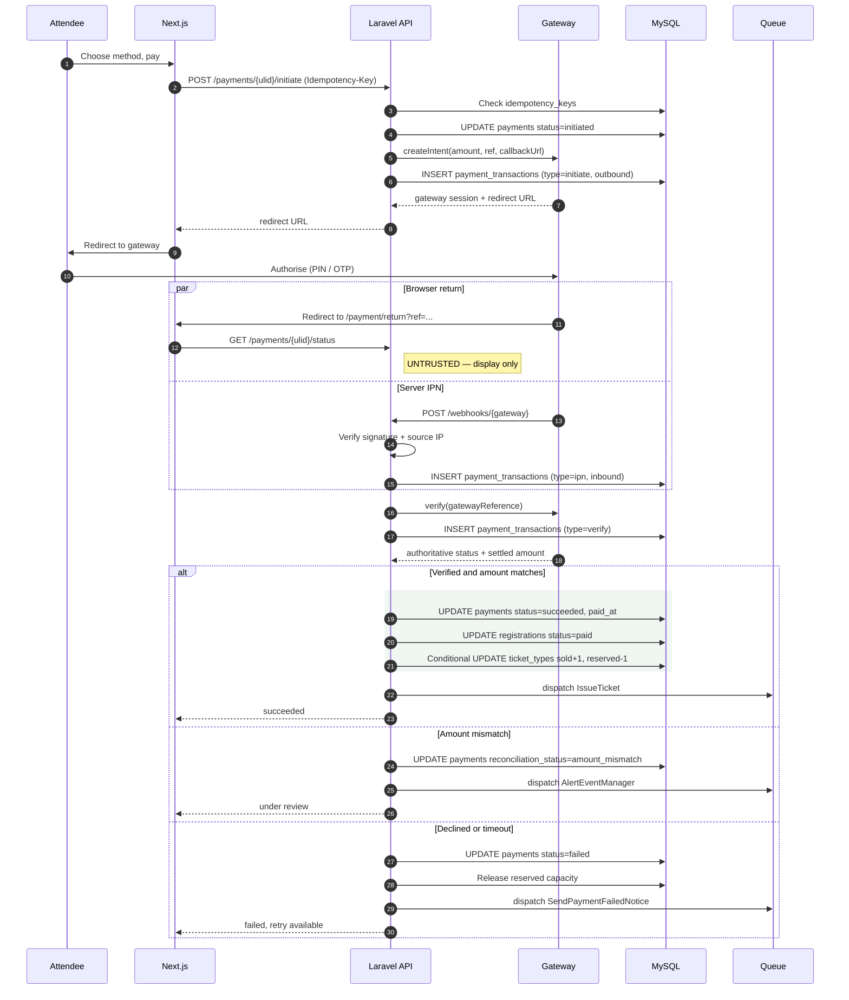

**The rule this flow exists to enforce:** the browser return is never trusted. The `par` block shows both signals arriving; only the server-to-server `verify` call moves the payment to `succeeded`. An attacker who forges a return URL gets a page that says "checking…" and then "failed."

**Amount mismatch is a distinct outcome, not a failure.** If the gateway reports a settled amount different from `amount_due_paisa`, the payment is neither succeeded nor failed — it is flagged for human review. Silently accepting an underpayment or treating an overpayment as a decline both cause reconciliation problems that surface weeks later.

### Payment intent expiry

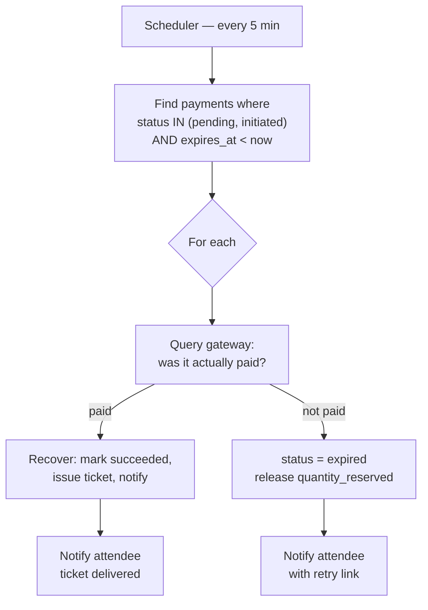

The sweeper queries the gateway before expiring anything. Mobile financial services in Bangladesh routinely deliver a successful transaction with a delayed or missing IPN; expiring a genuinely paid registration is far worse than holding capacity for five extra minutes.

---

## 5.4 Payment flow — manual verification

A meaningful share of attendees will send money by personal bKash transfer whatever the website offers. Designing this path properly is not optional.

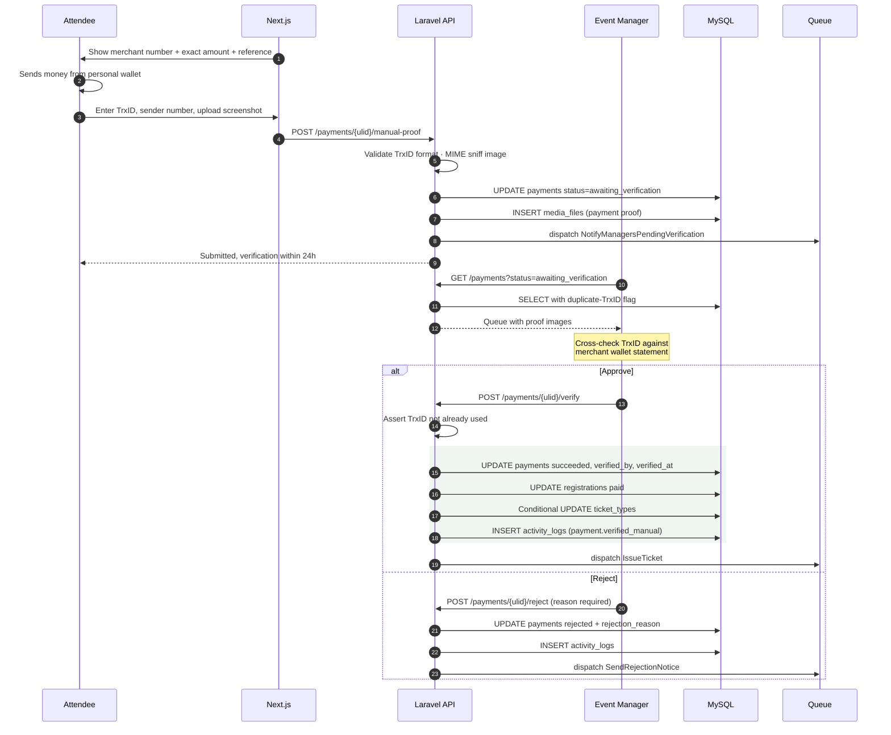

**Duplicate TrxID detection is the whole security model here.** `manual_trx_id` is indexed and checked on both submission and approval — the same screenshot forwarded by five people must fail four times. The verification UI surfaces a warning banner when a submitted TrxID matches any existing record, approved or not.

**Approval is a logged, attributed, irreversible act.** `verified_by_user_id`, `verified_at`, and an `activity_logs` entry with the before/after state. When the finance reconciliation finds an unmatched approval, the record shows exactly who approved it and when.

---

## 5.5 Ticket generation flow

Triggered by `PaymentSucceeded`. Split into a fast synchronous part (the ticket exists and is valid) and a slower asynchronous part (the pretty assets), so a PDF rendering failure never blocks an attendee from having a working ticket.

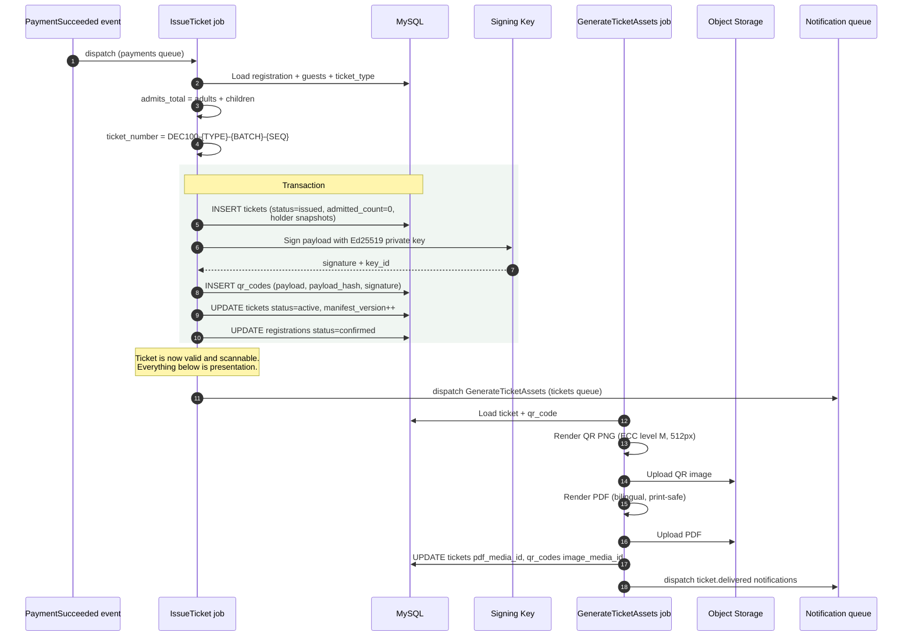

### Ticket number format

```
DEC100-ALM-1998-04217
│      │   │    └── zero-padded per-type sequence
│      │   └────── SSC batch year (0000 for non-alumni)
│      └────────── ticket_type.code
└───────────────── event prefix
```

Human-readable and diagnostic: a volunteer reading a number aloud at the gate immediately knows the person's category and batch, which matters when someone's phone is dead and the manual override path is being used. The unguessable identifier is the ULID; the ticket number is for humans and is never sufficient for admission on its own.

### PDF composition

Bilingual (English + Bangla), A5 portrait, designed to survive a phone screenshot and a low-toner office printer:
- QR code at ≥ 4cm with high quiet-zone margin and ECC level M
- Holder name, ticket number, type, admits count, batch year
- Event name, date, venue, gate instructions
- Profile photo thumbnail when present — the gate's identity check
- Footer: support contact and the "screenshot this page" instruction

---

## 5.6 Notification flow

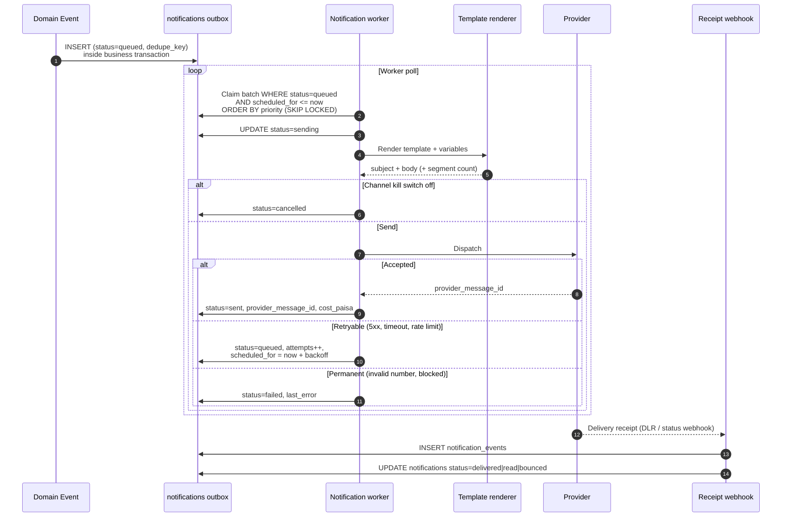

**`SKIP LOCKED` on the claim query** is what lets ten workers drain one outbox without contention or double-sends.

**`dedupe_key` is the one-shot guarantee.** For `ticket.delivered` it is `ticket:{ulid}:email`. A retried job, a re-fired event, or an admin clicking "resend" twice cannot produce two ticket emails — the unique index rejects the second insert.

**Per-channel kill switches** (`notification.sms_enabled`, `notification.whatsapp_enabled`) are checked at send time, not at enqueue time. When an SMS vendor fails at 9 AM on event day, an Event Manager flips one setting and the queue drains to `cancelled` instead of burning 20,000 retries and the entire SMS budget.

### Reminder scheduling

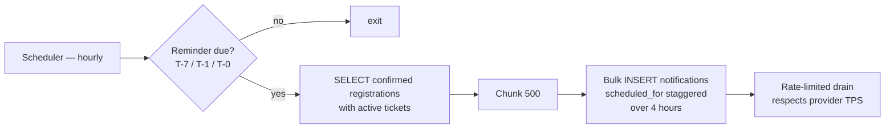

Staggering matters twice: it stays inside the SMS gateway's throughput limit, and it prevents 20,000 people opening their ticket link within the same sixty seconds.

---

## 5.7 Event check-in flow — online

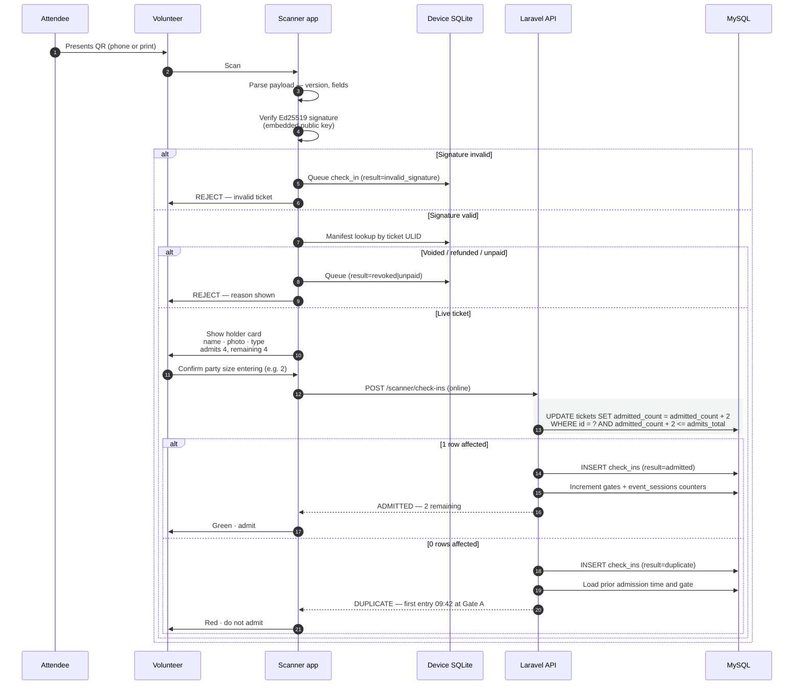

**The atomic conditional UPDATE is the entire duplicate-prevention mechanism** ([ADR-04](README.md#adr-04--duplicate-entry-is-prevented-by-an-atomic-conditional-update)). Twenty volunteers scanning the same forwarded QR simultaneously produce exactly one admission and nineteen `duplicate` records. No application locks, no read-then-write race.

**The rejection message carries the prior admission's time and gate.** "Already used" starts an argument at the gate; "entered 09:42 at Gate A" ends one.

---

## 5.8 Event check-in flow — offline

The default assumption, not the fallback. See [01 §1.5](01-system-architecture.md#15-mobile-verification-architecture).

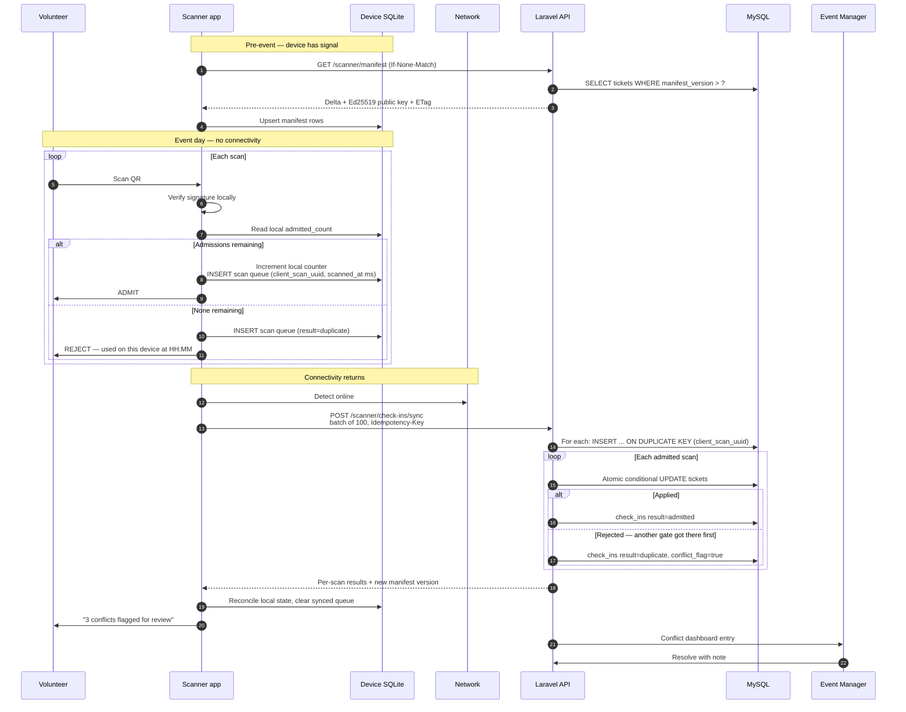

### Conflict resolution rules

| Situation | Resolution |
|---|---|
| Same ticket admitted on two offline devices | Earlier `scanned_at` (device clock) wins; later becomes `duplicate` with `conflict_flag = true` |
| Device clock skew > 60s detected at sync | Scans still accepted, skew recorded in `device_clock_skew_ms`, all affected scans flagged |
| Ticket voided after a device's last manifest sync | Offline admission is honoured for the person already inside, flagged for review — turning someone away retroactively is not possible |
| Same `client_scan_uuid` submitted twice | Second insert is a no-op via unique index; the original result is replayed |
| Family over-admitted across two gates | Later scan flagged `over_capacity` with conflict; Event Manager decides |

**The governing principle: offline scans are never silently discarded.** Every one is recorded with its true outcome. Where the offline decision and the server's authoritative state disagree, the disagreement becomes a visible, resolvable item — not a corrupted count.

### Sync triggers

| Trigger | Behaviour |
|---|---|
| Connectivity regained | Immediate sync attempt |
| Every 60 seconds while online | Batch upload, delta manifest pull |
| Queue depth > 50 | Force attempt regardless of timer |
| Volunteer taps "Sync now" | Manual, with progress UI |
| App foregrounded | Sync attempt |
| Backoff on failure | 5s → 15s → 60s → 5min, capped; never blocks scanning |

Scanning is **never** blocked by sync state. A device with 400 unsynced scans keeps admitting people at full speed.

---

## 5.9 Manual override flow

For the cracked screen, the dead battery, the printer that jammed. Every event needs it; every event gets it abused if it is given to volunteers ([02 §2.3](02-rbac-permissions.md#check-in)).

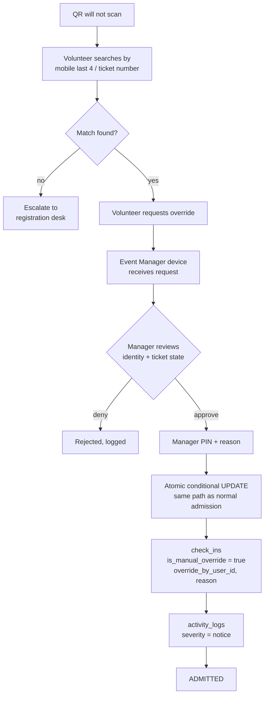

Overrides go through the **same** atomic admission path, so an override cannot double-admit a ticket that was already fully used. It bypasses the QR check, never the counter.

---

## 5.10 Reporting flow

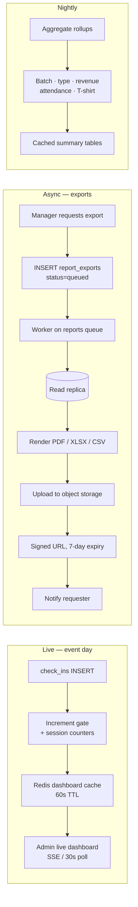

Exports read the **replica**, never the primary — a 20,000-row Excel render must not compete with payment writes. Live dashboards read incremented counters, not aggregate queries; counting 20,000 `check_ins` rows every thirty seconds across eight concurrent admin sessions is exactly the load pattern that takes a database down mid-event.

### Report catalogue

| Report | Grouping | Primary source | Formats |
|---|---|---|---|
| Registrations by SSC batch | `ssc_batch_year` × `participant_type` | `attendees` + `registrations` | PDF, XLSX, CSV |
| Ticket sales by type | `ticket_type` × `status` | `tickets` | PDF, XLSX, CSV |
| Revenue summary | `method` × day | `payments` (succeeded) | PDF, XLSX |
| Revenue reconciliation | `reconciliation_status` | `payments` + `payment_transactions` | XLSX |
| Attendance by gate | `gate` × hour | `check_ins` (admitted) | PDF, XLSX |
| Attendance vs registered | `ticket_type` | `tickets` | PDF |
| **T-shirt production order** | size × type, persons not registrations | `attendees` + `registration_guests` | XLSX, CSV |
| Family and guest manifest | `registration` | `registration_guests` | XLSX |
| Refunds | status × reason | `refunds` | XLSX |
| Notification delivery & cost | channel × status | `notifications` | XLSX |
| Volunteer scan throughput | volunteer × hour | `check_ins` | XLSX |

The T-shirt report is the one most likely to be built wrong. It must aggregate **people** — lead attendees plus registration guests — not registrations. A family of four with four different sizes contributes four rows, not one.

---

**Next:** [06 — Security Architecture](06-security-architecture.md)
