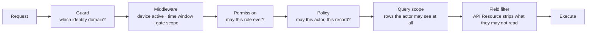
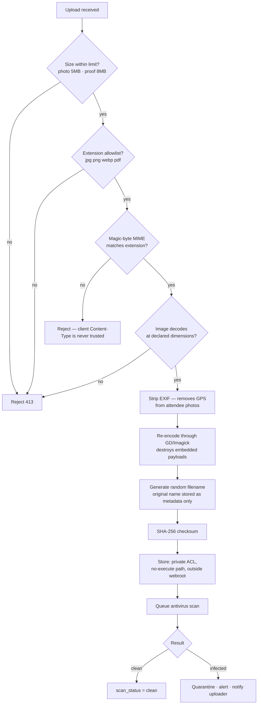

# 06 — Security Architecture

> Phase 1 deliverable. Authentication, authorisation, file upload security, QR code security, payment security, API security, and audit logging.

---

## 6.1 Threat model

Design against the attacks this system will actually face, not a generic checklist.

| # | Threat | Impact | Primary control |
|---|---|---|---|
| T1 | Forged QR code admits a non-payer | Revenue loss, capacity breach | Ed25519 signatures — private key never leaves the server |
| T2 | One paid ticket forwarded to a WhatsApp group and reused | Mass gate-crashing | Atomic admission counter; every reuse rejected and logged |
| T3 | Replayed gateway success callback | Free tickets | Server-side verification is the only path to `succeeded` |
| T4 | Same manual-payment screenshot submitted by many people | Revenue loss | Unique TrxID check + duplicate warning at approval |
| T5 | Attendee data scraped via enumerable IDs | Privacy breach affecting 20,000 people | ULIDs everywhere public; ownership policies; rate limits |
| T6 | Volunteer device lost or stolen on event day | Unauthorised admissions | Device revocation; PIN; no bulk data on device; scoped tokens |
| T7 | Malicious file upload | RCE or stored XSS | MIME sniffing, re-encoding, private storage, no execution path |
| T8 | Credential stuffing on admin accounts | Full system compromise | Mandatory TOTP 2FA, lockout, IP-pinned sessions |
| T9 | Insider abuse — refunds or comped tickets | Financial loss | Mandatory reasons, full audit diffs, Super Admin alerts |
| T10 | DoS during the registration-open spike | Outage at the worst moment | CDN, rate limits, queue isolation, static-first pages |
| T11 | Gateway credentials leaked via DB backup | Financial compromise | Encrypted at rest, payload redaction, separate key store |
| T12 | Bulk export of the attendee list leaves the organisation | Mass privacy breach | Signed short-lived links, per-download audit, permission-gated |

---

## 6.2 Authentication strategy

Three distinct authentication models for three distinct populations.

```mermaid
flowchart TD
    subgraph staff["Staff — Super Admin, Event Manager"]
        S1["Email + password<br/>bcrypt cost 12"] --> S2["Mandatory TOTP 2FA"]
        S2 --> S3["Sanctum token<br/>8h TTL, IP-pinned"]
        S3 --> S4["Re-auth for sensitive ops<br/>refunds · key rotation · role change"]
    end

    subgraph vol["Volunteer — scanner"]
        V1["Admin enrols device<br/>one-time QR code, 10 min TTL"] --> V2["Device binds fingerprint"]
        V2 --> V3["Long-lived scoped token<br/>valid only in check-in window"]
        V3 --> V4["6-digit PIN unlocks app<br/>10 min idle lock"]
    end

    subgraph att["Attendee"]
        A1["No password — ever"] --> A2{"Channel"}
        A2 -->|email| A3["Magic link, 15 min, single use"]
        A2 -->|mobile| A4["6-digit OTP, 5 min, 3 attempts"]
        A3 --> A5["Session token, 30 days"]
        A4 --> A5
    end
```



### Why attendees have no password

Twenty thousand people, most registering once, many on shared or public devices, many not technically fluent. A password here would generate a large volume of reset requests, would be reused from breached sites, and would create a credential database worth stealing. Magic link and OTP have no stored secret to leak and match how this audience already receives their ticket.

### Staff controls

| Control | Setting |
|---|---|
| Password policy | Min 12 chars, checked against the HIBP k-anonymity API on set |
| 2FA | TOTP, mandatory for all admin roles, enforced at first login |
| Failed attempts | Lockout for 15 min after 5 failures, exponential thereafter |
| Session | 8h absolute, 2h idle, IP-pinned — a changed IP forces re-auth |
| Sensitive-action re-auth | Password + TOTP re-entry for refunds, role changes, key rotation, credential edits |
| Token revocation | Role change or deactivation revokes all active Sanctum tokens immediately |

### Volunteer device enrolment

1. Event Manager creates the volunteer, assigns gates, generates a one-time enrolment QR (10-minute TTL, single use).
2. Volunteer scans it in the app; the device submits its hardware fingerprint.
3. Server issues a scoped Sanctum token bound to `check_in_devices.device_fingerprint`.
4. Volunteer sets a 6-digit PIN, hashed with bcrypt.
5. Token is valid **only** within `checkin.window_start .. checkin.window_end` and only for assigned gates.

A stolen device is contained by four independent layers: PIN to open the app, token bound to that specific device, time window, and instant server-side revocation. And per [02](02-rbac-permissions.md#volunteer), the device holds no browsable attendee list — worst case it exposes the details of tickets physically presented to it.

---

## 6.3 Authorisation strategy

Layered defence — every request passes all applicable layers, and any layer can deny.



**Layer 5 (query scoping) is what prevents the classic leak.** An attendee's registration list query is scoped to `attendee_id = auth()->id()` at the query builder, so even a controller bug that ignores the request filter cannot return another person's data.

**Layer 6 (field filtering) is what protects the gate.** A Volunteer's scan response and an Event Manager's registration view use different API Resources. The Volunteer resource never contains `email`, `mobile`, `total_paisa`, or `comments` — the fields are not filtered from a shared payload, they are never placed in it.

Full permission catalogue: [02 — RBAC](02-rbac-permissions.md).

### Sensitive operation gates

| Operation | Requires |
|---|---|
| Issue refund | Permission + re-auth + mandatory reason + Super Admin notification |
| Void ticket | Permission + mandatory reason + audit diff |
| Manual check-in override | Event Manager PIN at the gate + reason + audit |
| Rotate QR signing key | Super Admin + re-auth + all-manager notification |
| Change ticket price after sales open | Super Admin + re-auth + confirmation showing tickets already sold |
| Export attendee data | Permission + audit entry + signed 7-day link |
| Broadcast notification | Permission + confirmation showing recipient count and BDT cost |
| Impersonate attendee | Super Admin + 15-min cap + persistent banner + dual-identity logging + payments blocked |

---

## 6.4 File upload security

Three upload types, all hostile until proven otherwise: profile photos (attendee), payment proof screenshots (attendee), bulk import CSVs (admin).



**Re-encoding is the control that matters.** A polyglot file that is both a valid JPEG and a valid PHP script survives extension and MIME checks; it does not survive being decoded to a pixel buffer and written out fresh. This single step eliminates most of the stored-payload attack class.

**EXIF stripping is a privacy control, not a security one.** Alumni photographing themselves at home would otherwise upload their home GPS coordinates into a database with 20,000 records in it.

**Serving rules**
- All uploads are private by default; nothing is publicly readable.
- Access is via signed URLs with a 15-minute TTL, issued only after a policy check.
- Served from a separate storage domain with `Content-Disposition: attachment` and `X-Content-Type-Options: nosniff`, so a stored payload cannot execute in the application's origin.
- Payment proof images are additionally restricted to `payment.view_transactions` holders and every view is logged.

---

## 6.5 QR code security

The security centre of gravity for this system. See [ADR-03](README.md#adr-03--qr-codes-are-ed25519-signed-not-database-lookups).

### Payload

```
DTM1.<ticket_ulid>.<admits_total>.<exp_unix>.<key_id>.<signature_b64url>
```

- `DTM1` — format version, so the payload can evolve without breaking deployed scanners
- `ticket_ulid` — 26 chars, unguessable, not enumerable
- `admits_total` — lets a fully offline device know the party size without a lookup
- `exp_unix` — hard expiry, typically event end + 24h
- `key_id` — which signing key produced this, enabling rotation without invalidating everything
- `signature` — Ed25519 over the preceding fields, base64url, 86 chars

Total ≈ 150 characters — a QR version 7 symbol at ECC level M, which scans reliably from a cracked phone screen in daylight.

### Why Ed25519 and not HMAC

An HMAC scheme requires the shared secret on every scanner device. Thirty Android devices in the hands of volunteers, at least one of which will be rooted, lost, or resold. Extracting that secret would let anyone mint valid tickets for a 10,000-person event.

Ed25519 splits the capability: the server holds the private key and signs; devices hold only the public key and verify. **A fully compromised scanner device cannot forge a single ticket.** It is also fast — signature verification is sub-millisecond on mid-range Android hardware, which keeps the gate moving.

### Defence in depth

| Layer | Defends against | Works offline |
|---|---|---|
| Ed25519 signature | Forged QR codes (T1) | Yes |
| Revocation manifest | Voided and refunded tickets still in circulation | Yes |
| `expires_at` | Old event QR reuse | Yes |
| Atomic admission counter | Forwarded/shared tickets (T2) | Yes locally, authoritative on sync |
| `qr_codes.is_active` | Superseded QR after reissue | Yes, via manifest |
| Gate ticket-type scope | Wrong-gate entry | Yes |
| Photo on the ticket + holder card | Physical impersonation | Yes |

### Key management and rotation

- Private key stored in the secret manager, **never** in the repository, the database, or environment files committed anywhere.
- Signing happens in a single service class; no other code path touches the key.
- `signing_key_id` on every `qr_codes` row, so multiple keys can be valid simultaneously.
- Rotation: publish the new public key to devices → wait for confirmed device sync → start signing new tickets with the new key → old signatures remain verifiable via their `key_id`.
- Rotation is Super Admin only, requires re-auth, and notifies all Event Managers. Rotating without confirming device sync would break every scanner at the gate; the procedure enforces the ordering.

### What a leaked QR image cannot do

An attendee posting their ticket QR on Facebook — which will happen — exposes only their own ticket. A forwarder gets rejected at the gate by the admission counter, with the original holder's entry time shown to the volunteer. The QR contains no personal data beyond an opaque ULID.

---

## 6.6 Payment security

### The invariant

> `payments.status` reaches `succeeded` only via a server-to-server verification call to the gateway, or via an authenticated Event Manager approving a manual payment. There is no third path.

This is enforced in one place — a single guarded state transition on the payment model — and is covered by explicit tests in Phase 8. It closes T3 completely.

### Controls

| Control | Implementation |
|---|---|
| Webhook authentication | Signature verification per gateway (HMAC or RSA), plus source-IP allowlist where the gateway publishes ranges |
| Replay protection | `payment_transactions.idempotency_key` unique; duplicate webhooks are recorded and ignored |
| Amount tampering | Verified amount compared to `amount_due_paisa`; mismatch → `reconciliation_status = amount_mismatch`, human review, never auto-succeed |
| Currency confusion | `currency` explicit on every money row; cross-currency comparison throws |
| Double-charge | `payments.idempotency_key` unique — a double-clicked Pay button produces one intent |
| Credential storage | Gateway keys in the secret manager, `is_encrypted` settings encrypted at rest, never logged |
| Payload redaction | Adapters strip auth headers and tokens before writing `request_payload` / `response_payload` |
| Manual-payment fraud | Unique TrxID index, duplicate warning at approval, mandatory approver attribution |
| Refund abuse | Re-auth, mandatory reason, Super Admin notification, full audit diff |
| Reconciliation | Nightly settlement diff with three mismatch classes surfaced to the Event Manager |
| TLS | TLS 1.2+ enforced outbound; certificate verification never disabled, including in sandbox configs |

### Card data

**None is stored, ever.** All card handling occurs on the gateway's hosted page. SSLCommerz is the only card-capable method in scope and it is redirect-based. The system never sees a PAN, which keeps PCI scope at SAQ-A.

### Reconciliation as a security control

The nightly settlement diff is usually framed as a finance task. It is also the detection mechanism for payment fraud that bypassed the preventive controls: a ticket issued against a payment the gateway has no record of shows up as `missing_at_gateway` the next morning, not after the event.

---

## 6.7 API security

```mermaid
flowchart LR
    C["Client"] --> WAF["WAF<br/>OWASP ruleset"]
    WAF --> TLS["TLS 1.3 termination<br/>HSTS preload"]
    TLS --> RL["Rate limiting<br/>per IP · per token · per route"]
    RL --> COR["CORS allowlist<br/>exact origins"]
    COR --> AUT["Sanctum auth"]
    AUT --> VAL["FormRequest validation<br/>strict types, allowlisted fields"]
    VAL --> AUZ["Permission + policy"]
    AUZ --> APP["Handler"]
    APP --> RES["API Resource<br/>explicit field allowlist"]
    RES --> HDR["Security headers"]
```



### Rate limits

| Route class | Limit | Rationale |
|---|---|---|
| Public reads (types, schedule) | 120/min per IP | Cached at CDN anyway |
| Registration submit | 5/min per IP, 3/hour per mobile | Blocks scripted spam registration |
| OTP request | 3 per 15 min per mobile, 10/hour per IP | Blocks SMS-cost abuse — a real financial attack |
| Magic link request | 3 per 15 min per email | Same |
| Payment initiate | 10/min per registration | Blocks gateway hammering |
| Admin API | 300/min per token | Generous, catches runaway clients |
| Scanner sync | 60/min per device | Batched anyway |
| Scanner scan lookup | 600/min per device | Must never throttle a working gate |
| Export request | 5/hour per user | Expensive operations |
| Webhooks | 300/min per gateway IP | Not throttled below plausible volume |

**OTP rate limiting is a cost control as much as a security control.** Unthrottled OTP endpoints are routinely abused to burn an organisation's entire SMS balance in an afternoon.

### Response discipline

- **Field allowlists, not blocklists.** API Resources declare what goes out. A column added to a table never appears in a response by accident.
- **Uniform errors.** `{ code, message, errors?, request_id }` — the same shape everywhere, with `request_id` correlating to `activity_logs` for support.
- **No detail leakage.** "Invalid credentials" regardless of whether the account exists. Stack traces never reach production responses.
- **No enumeration.** Requesting another attendee's registration returns 404, not 403 — a 403 confirms the record exists.

### Headers

`Strict-Transport-Security` (preload) · `Content-Security-Policy` (strict, nonce-based, no `unsafe-inline`) · `X-Content-Type-Options: nosniff` · `X-Frame-Options: DENY` · `Referrer-Policy: strict-origin-when-cross-origin` · `Permissions-Policy` (camera allowed only on the scanner origin)

### Webhook endpoints

Unauthenticated by necessity, so they are hardened specifically: CSRF-exempt but signature-required, source-IP allowlisted, request body size capped, idempotency-keyed, and every hit recorded in `payment_transactions` with `signature_valid`. A run of `signature_valid = false` entries is a monitored alert — it means someone is probing.

---

## 6.8 Data protection

| Data | At rest | In transit | Retention |
|---|---|---|---|
| Attendee PII | Full-disk + encrypted DB volume | TLS 1.3 | Event + 2 years, then anonymised |
| Profile photos | Encrypted object storage, private | TLS + signed URL | Event + 1 year |
| Payment proofs | Encrypted object storage, private | TLS + signed URL | Event + 7 years (financial record) |
| Gateway credentials | Secret manager + app-layer encryption | TLS | Rotated post-event |
| QR signing private key | Secret manager only | Never transmitted | Rotated post-event |
| 2FA secrets | Laravel encrypted casts | TLS | Account lifetime |
| Audit logs | Encrypted, append-only | TLS | 90 days hot, 2 years cold |
| Exports | Encrypted, signed URL | TLS | 7 days, auto-purged |

**Anonymisation for staging.** Any production clone used for QA has names, phones, emails, and photos replaced with generated equivalents by a scripted, tested process. Real attendee data never lands in a non-production environment.

**Backups.** Encrypted, tested by quarterly restore drills, and stored in a separate region. A backup that has never been restored is not a backup — and this system gets exactly one event day.

---

## 6.9 Audit logging

### What is always logged

| Category | Events |
|---|---|
| `auth` | Login success/failure, 2FA success/failure, lockout, token issued/revoked, password change |
| `payment` | Manual verification approve/reject, refund request/approve/process, credential change, reconciliation mismatch |
| `ticket` | Issue, void, reissue, transfer, PDF download by staff |
| `checkin` | Manual override, conflict resolution, device enrol/revoke, undo admission |
| `registration` | Admin create/update/cancel, bulk import, attendee merge |
| `system` | Settings change, role/permission change, user create/deactivate, key rotation, export request and download |
| `security` | Permission denied, rate limit exceeded, invalid webhook signature, upload rejected, impersonation start/end |

### Record contents

Actor (with `impersonator_user_id` when applicable), subject, before/after diff in `properties`, IP, user agent, `request_id`, severity, and UTC timestamp. Schema: [03 §3.24](03-database-schema.md#324-activity_logs).

### Integrity

- Append-only — no `updated_at`, no update or delete route exists in the application.
- Only Super Admin can export; only Super Admin can view `security` category entries.
- Shipped to external log aggregation within 60 seconds, so a database compromise cannot erase the record of itself.
- `security` entries retained two years regardless of the 90-day archival policy.

### Monitored alerts

| Signal | Threshold | Why |
|---|---|---|
| Failed admin logins | > 10 in 5 min | Credential stuffing (T8) |
| Invalid webhook signatures | > 5 in 10 min | Payment endpoint probing (T3) |
| `check_ins` with `invalid_signature` | > 20 in 5 min | Forged QR attempt in progress (T1) |
| `duplicate` scan rate | > 15% of scans | A ticket is circulating publicly (T2) |
| Manual overrides | > 5% of admissions | Gate process failure or abuse (T9) |
| Refunds by one user | > 10 in an hour | Insider abuse (T9) |
| Duplicate TrxID submissions | any | Manual payment fraud (T4) |
| Export downloads | > 3/day by one user | Data exfiltration (T12) |
| Device pending scans | > 200 or no sync in 15 min | Gate going dark |
| Failed jobs | > 50 | Systemic processing failure |

On event day these route to an on-call channel with a named responder. A duplicate-scan rate spike at 09:30 is an operational emergency, and the difference between catching it in five minutes and five hours is whether the gate holds.

---

## 6.10 Compliance and operational security

- **Bangladesh context.** No general data protection statute currently imposes specific obligations here, but the design follows GDPR-equivalent principles — minimisation, purpose limitation, retention limits, and a deletion path — because the alumni body includes people resident in the EU and UK.
- **Privacy notice** shown at registration, stating what is collected, why, who sees it, and how long it is kept.
- **Consent for photography** at the event captured as a registration checkbox, stored on the attendee record.
- **Right to deletion:** post-event, an attendee may request erasure. Financial records are retained as legally required; PII is anonymised in place, preserving aggregate reporting.
- **Dependency scanning** in CI (`composer audit`, `npm audit`), with a policy that no known-critical advisory ships to production.
- **Penetration test** in Phase 8, scoped to payment flows, QR forgery, and authorisation boundaries specifically — not a generic scan.
- **Incident response plan** written before the event, naming the on-call responder, the escalation path, and the kill switches ([03 §3.23](03-database-schema.md#323-event_settings)) available for each subsystem.

---

**Next:** [07 — Scalability Plan](07-scalability-plan.md)
