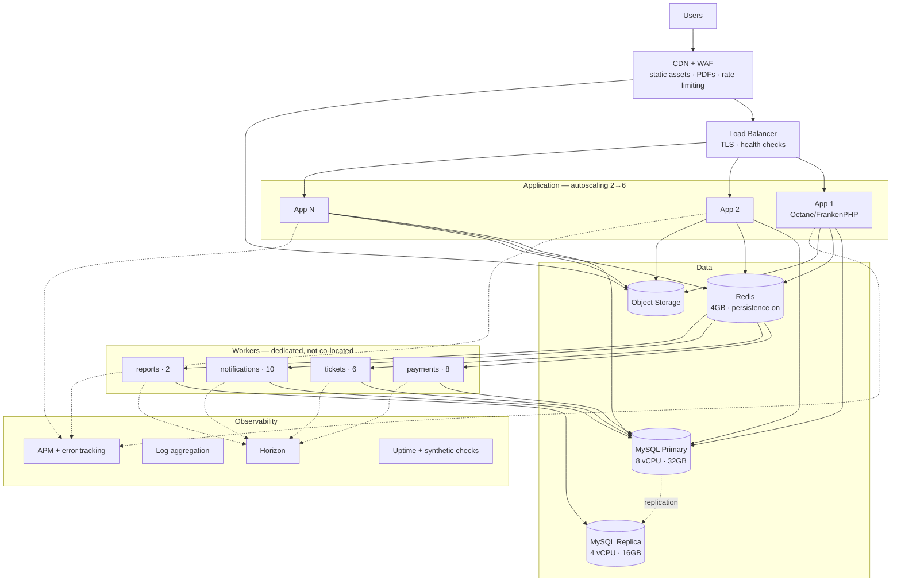

# 07 — Scalability Plan

> Phase 1 deliverable. Capacity model, infrastructure sizing, caching, queue strategy, and the load profile the system is actually built for.

**Targets:** 20,000+ registrations · 10,000+ ticket sales · 5,000+ concurrent visitors · 20–30 volunteers scanning simultaneously.

---

## 7.1 Read the load shape, not the totals

The headline numbers are modest. What makes this system hard is that the load is not spread across a year — it arrives in three sharp spikes, and one of them is unrepeatable.

```
Registrations/hour (illustrative)

 3000 ┤                    ╭╮                            ╭╮
 2500 ┤                    ││                            ││
 2000 ┤                    ││                            ││
 1500 ┤                    ││                            ││
 1000 ┤                   ╭╯╰╮                          ╭╯╰╮
  500 ┤                  ╭╯  ╰──╮      ╭─╮        ╭─╮  ╭╯  ╰╮
    0 ┼──────────────────╯      ╰──────╯ ╰────────╯ ╰──╯    ╰──────
      └────────────────────────────────────────────────────────────
       T-90d          Launch      reminders    T-7d   Deadline   Event
                       spike                          spike       day
```

| Phase | Duration | Dominant load | Failure cost |
|---|---|---|---|
| **A — Launch spike** | First 48h after registration opens | Concurrent form submits + payment initiations | High: reputational, alumni WhatsApp groups amplify it instantly |
| **B — Steady sales** | ~10 weeks | Low, steady | Low: recoverable |
| **C — Deadline spike** | Final 48h before close | Highest write concurrency of the whole project | High: lost revenue, angry late registrants |
| **D — Reminder blasts** | T-7, T-1, T-0 | 60,000 outbound messages + resulting ticket-page traffic | Medium: cost and delivery delay |
| **E — Gate window** | 2–3 hours on event day | Scanner sync, live dashboard, manual lookups | **Catastrophic and unrepeatable** |

**Everything in this document is prioritised by that last row.** Phases A and C can be survived with autoscaling and a queue. Phase E has to work the first time.

---

## 7.2 Capacity model

### Phase C — deadline spike (peak write load)

Assume 35% of all registrations land in the final 48 hours, and half of those in the final 6 hours:

- 20,000 × 0.35 × 0.5 = **3,500 registrations in 6 hours** ≈ 0.16/s average
- Peak hour ≈ 3× average ≈ **1,750/hour ≈ 0.5/s**
- Each registration ≈ 12 write queries + 1 payment initiate + 3 outbox rows

**Peak sustained write load ≈ 8–10 writes/second.** A correctly indexed MySQL 8 instance handles this without effort. The write path is not the constraint.

### Phase A/C — concurrent visitors

5,000 concurrent visitors, with the realistic mix:

| Behaviour | Share | Requests | Served by |
|---|---|---|---|
| Reading the landing/schedule page | 60% | ~3,000 | **CDN — never reaches Laravel** |
| Filling the form (idle between steps) | 25% | ~1,250 | Occasional validation calls |
| Actively submitting or paying | 10% | ~500 | Full API path |
| Checking ticket status | 5% | ~250 | Cached reads |

**Effective dynamic request rate ≈ 400–600 req/s peak.**

At ~80ms average response time on an Octane/FrankenPHP worker, one worker sustains ~12 req/s. **50 workers** covers peak with headroom; 4 application instances × 16 workers = 64, comfortably sufficient.

The largest single lever is that 60% of traffic never touches the application at all — a static, CDN-cached landing page. Getting that right is worth more than any amount of PHP tuning.

### Phase D — notification blast

60,000 messages (20,000 recipients × 3 channels) per reminder wave:

- SMS gateway typical throughput: 50–100 TPS → 20,000 SMS ≈ 5 minutes at 60 TPS
- WhatsApp Cloud API tier limits: throttled to the account's messaging tier
- Email: batched, generous limits

Staggered over 4 hours via `notifications.scheduled_for`, this is ~4 messages/second — well inside every provider's limits and, more importantly, it prevents 20,000 people opening their ticket link in the same minute.

### Phase E — gate window (the one that matters)

- 12,000 tickets, ~10,000 admissions over a 2.5-hour window
- Average **1.1 admissions/second**; realistic peak **8–12/second** in the first 30 minutes

Per admission the server does one conditional UPDATE, one INSERT, and two counter increments. **At peak this is under 50 writes/second** — trivial in isolation.

**The real constraint at the gate is not the server. It is the venue's network.** Which is why the mobile app is offline-first ([01 §1.5](01-system-architecture.md#15-mobile-verification-architecture)) and gate throughput is bounded by scan speed and human flow, not by connectivity or backend capacity. A total backend outage during the gate window degrades the system to "scanners keep working, dashboard goes stale" rather than "nobody gets in."

### Storage

| Data | Volume |
|---|---|
| Database (all tables, indexes) | ~4 GB |
| Profile photos (20k × ~200KB post-processing) | ~4 GB |
| Ticket PDFs (12k × ~150KB) | ~1.8 GB |
| QR images (13k × ~15KB) | ~200 MB |
| Payment proofs (~6k × ~300KB) | ~1.8 GB |
| Backups (30 days) | ~40 GB |
| **Total** | **~55 GB** |

Small. Storage is not a scaling concern; it is a durability and access-control concern ([06 §6.8](06-security-architecture.md#68-data-protection)).

---

## 7.3 Infrastructure



### Sizing by phase

| Phase | App instances | Workers | DB | Notes |
|---|---|---|---|---|
| Build (Ph. 2–7) | 1 | 1 | 2 vCPU / 8 GB | Minimal cost |
| Launch spike (A) | 4 | Full set | 8 vCPU / 32 GB | Scaled up 24h before |
| Steady (B) | 2 | Reduced | 4 vCPU / 16 GB | Scale down, save cost |
| Deadline spike (C) | 6 | Full + 50% notifications | 8 vCPU / 32 GB | Highest write concurrency |
| **Event day (E)** | **6** | **Full** | **8 vCPU / 32 GB + hot standby** | **Nothing is scaled down; standby promoted in <10 min** |

The event-day configuration is deliberately over-provisioned. The marginal cost of extra capacity for 24 hours is trivial against the cost of a gate failure.

**Why workers are not co-located with app instances.** A 60,000-message notification blast must not steal CPU from the request path during the deadline spike. Separating them means the two peak loads never contend.

---

## 7.4 Caching strategy

| Layer | Contents | TTL | Invalidation |
|---|---|---|---|
| CDN | Landing, schedule, FAQ, images, JS/CSS | 5 min / 1 year immutable | Purge on deploy |
| Next.js ISR | Public pages | 300s revalidate | On-demand for settings changes |
| Redis — config | `event_settings`, `ticket_types` | 1h | Event-driven on update |
| Redis — dashboard | Registration, revenue, attendance counters | 60s | Time-based |
| Redis — permissions | Resolved permission sets | 5 min | Immediate on role change |
| Redis — manifest ETag | Scanner manifest version | 60s | On any `manifest_version` bump |
| Application | Ticket type pricing within a request | request | n/a |

**What is deliberately never cached:** ticket admission state, payment status, and capacity counts. Every one of these is a correctness decision, and a 60-second-stale answer produces a wrong outcome — a double admission, a double sale, or a ticket issued against an unpaid registration.

**Counter design.** Dashboard numbers come from incremented counters on `gates` and `event_sessions`, not from `COUNT(*)` over `check_ins`. Eight admin browsers polling an aggregate query every 30 seconds during the gate window is precisely the pattern that takes a database down at the worst moment.

---

## 7.5 Database scaling

### Index strategy

Indexes are already specified per table in [03](03-database-schema.md). The ones that carry the peak load:

| Index | Load phase | Purpose |
|---|---|---|
| `tickets.idx_tickets_manifest (manifest_version)` | E | Scanner delta sync — the hottest index on event day |
| `check_ins.uk_ci_client_uuid` | E | Offline sync idempotency, hit on every synced scan |
| `payments.idx_payments_status_created` | A, C | Payment sweeper and dashboard |
| `notifications.idx_notif_status_scheduled` | D | Worker claim query, hit thousands of times per minute |
| `attendees.idx_attendees_batch_type` | Reporting | The primary reporting axis |
| `registrations.idx_reg_status_created` | A, C | Funnel and dashboard queries |

### Connection management

Laravel Octane holds persistent connections. With 6 app instances × 16 workers + 26 queue workers, worst case is ~122 connections. `max_connections` set to 300 with a proxy layer (ProxySQL or the managed equivalent) in front of the primary, so a runaway worker cannot exhaust the pool.

### Read/write split

| Traffic | Target | Rationale |
|---|---|---|
| All writes | Primary | Obvious |
| Payment verification | **Primary** | Replication lag would produce a wrong decision |
| Check-in admission | **Primary** | Same — this is a correctness boundary |
| Attendee's own ticket view | Primary | Must reflect a payment that just succeeded |
| Admin lists and search | Replica | Seconds of staleness are acceptable |
| Reports and exports | Replica | Long queries must not touch the primary |
| Dashboard counters | Redis | Never queries either |

**The rule: anything that reads in order to make a decision reads the primary.** Anything that reads to display information can tolerate the replica.

### Query discipline

- Every list endpoint is cursor-paginated. Offset pagination at page 400 of an attendee list scans 20,000 rows.
- Exports use `chunkById`, never `->get()` on the full set.
- Eager loading enforced; `Model::preventLazyLoading()` enabled in non-production so N+1 queries fail tests rather than production.
- Slow query log at 200ms, reviewed weekly during build and daily in the final two weeks.

---

## 7.6 Queue strategy

Four isolated lanes with separate worker pools ([01 §1.3](01-system-architecture.md#13-backend-architecture)):

| Queue | Workers | Timeout | Retries | Backoff |
|---|---|---|---|---|
| `payments` | 8 | 30s | 5 | 5s, 15s, 60s, 5m, 15m |
| `tickets` | 6 | 120s | 3 | 30s, 2m, 10m |
| `notifications` | 10 | 60s | 5 | 1m, 5m, 15m, 1h, 6h |
| `reports` | 2 | 900s | 2 | 5m, 30m |

**Isolation is the point.** A 20,000-recipient blast on `notifications` cannot delay a payment webhook on `payments`. Without separate lanes, the deadline spike and the T-1 reminder wave overlap and payments queue behind SMS.

**Backpressure.** Horizon alerts when any queue exceeds its wait threshold (`payments` 30s, `notifications` 10 min). Autoscaling adds workers to `notifications` and `tickets`; `payments` stays fixed because it is latency-sensitive, not throughput-bound, and more concurrency there only increases gateway contention.

**Poison pills.** `failed_jobs` is monitored with an alert at 50. During the event window the threshold drops to 10 — a rising failed-job count is the earliest available signal that something systemic has broken.

---

## 7.7 Event-day operational plan

Distinct from normal operations. The system enters a different mode.

### T-7 days
- Scale to event-day sizing and leave it there
- Full load test against the check-in path specifically
- Provision and replicate the hot standby database
- Enrol and label every scanner device; verify each one syncs

### T-24 hours
- Freeze deployments — **no code changes**, no exceptions
- Final manifest build; confirm every device reports the current `manifest_version`
- Charge every device; distribute power banks
- Verify all kill switches respond ([03 §3.23](03-database-schema.md#323-event_settings))
- Dry run: 50 test scans across every gate, online and airplane-mode

### T-2 hours
- Volunteers arrive, PINs set, devices assigned and physically labelled
- Force a manifest sync on every device; confirm on the ops dashboard
- On-call engineer at the venue with laptop and mobile hotspot
- Print the paper fallback: alphabetical attendee list with ticket numbers

### During the gate window
- Ops dashboard watches: per-gate throughput, device last-sync, pending-scan depth, battery level, duplicate-scan rate, failed jobs
- Named responder on call, escalation path written down and distributed
- Manual override desk staffed by an Event Manager, not a volunteer

### Degradation ladder

| Failure | Response | Gate impact |
|---|---|---|
| Venue network down | None needed — offline mode is the default | **None** |
| One device fails | Swap to spare; its queued scans sync when recovered | Seconds |
| API slow or erroring | Devices continue offline; sync retries with backoff | **None** |
| Primary database fails | Promote hot standby | Dashboard stale <10 min; **gates keep running** |
| Total backend outage | Devices operate fully offline for the whole window | **None during the event**; full sync afterwards |
| App crashes on a device | Local SQLite persists the queue; reinstall recovers it | Minutes |
| Both device and backend fail | Paper list + manual override at the desk | Slow but functional |

**The design goal, stated plainly: no single backend failure can stop people entering the event.** That is why offline-first is architectural rather than a feature, and it is the property most worth protecting through Phases 7 and 8.

---

## 7.8 Load testing plan (executed in Phase 8)

| Scenario | Simulates | Pass criteria |
|---|---|---|
| Registration spike | 500 concurrent submissions over 10 min | p95 < 800ms, 0 errors, 0 duplicate attendees |
| Payment concurrency | 200 concurrent initiations | 0 double-charges, 0 orphaned intents |
| Capacity race | 300 concurrent buys of a 100-capacity tier | Exactly 100 sold, 200 clean rejections |
| Duplicate scan race | 20 devices scanning one ticket simultaneously | Exactly 1 admission, 19 `duplicate` records |
| Offline sync burst | 30 devices × 200 queued scans at once | All 6,000 processed, 0 lost, conflicts correctly flagged |
| Notification blast | 20,000 outbox rows | Fully drained within SLA, 0 duplicate sends |
| Export under load | 20k-row export during the registration spike | Export completes; API p95 unaffected |
| Read-heavy browse | 5,000 concurrent landing-page views | Served by CDN; origin request rate near zero |

The capacity race and duplicate scan race are the two tests that validate the core concurrency claims of this architecture ([ADR-04](README.md#adr-04--duplicate-entry-is-prevented-by-an-atomic-conditional-update)). If either fails, the design is wrong and must be revisited before launch — not patched.

---

## 7.9 Cost posture

Not a budget, but the shape of it. Costs are dominated by two things that are not infrastructure.

| Category | Driver | Control |
|---|---|---|
| **SMS** | 60,000+ segments; Bangla doubles segment count | Length-budgeted templates, per-message cost tracked in `notifications.cost_paisa`, kill switch |
| **WhatsApp** | Per-conversation pricing | Utility templates only, batched within conversation windows |
| Compute | Peak sizing for ~2 weeks of a 9-month project | Scale down during phase B |
| Storage/CDN | ~55 GB + egress | Immutable caching, image re-encoding at upload |
| Gateway fees | % of ~10,000 transactions | Tracked in `payments.fee_paisa` for true net revenue |

**Messaging is likely the largest single line item**, which is why cost is a first-class column in the notification schema rather than an afterthought. A Bangla SMS costing four segments instead of two is a 2× difference across 60,000 messages, and nobody notices until the invoice arrives.

---

**Next:** [08 — Development Roadmap](08-development-roadmap.md)
