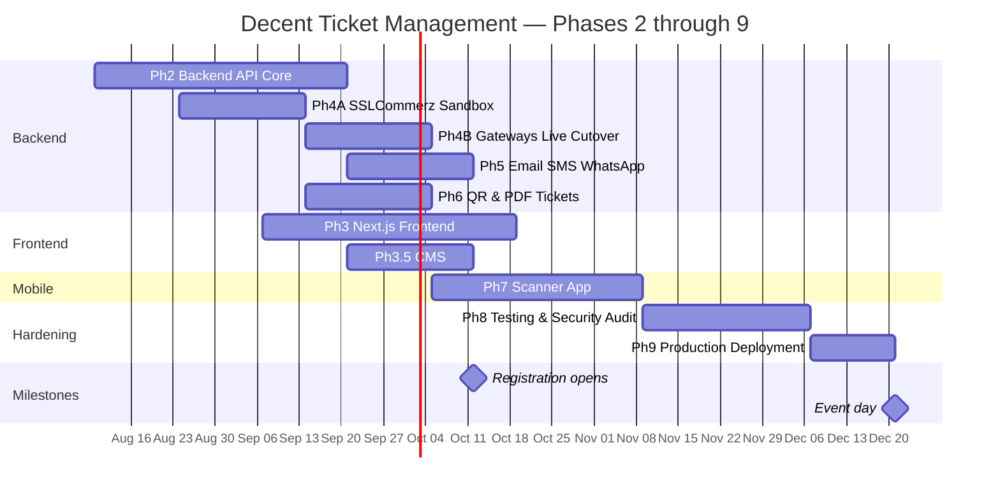
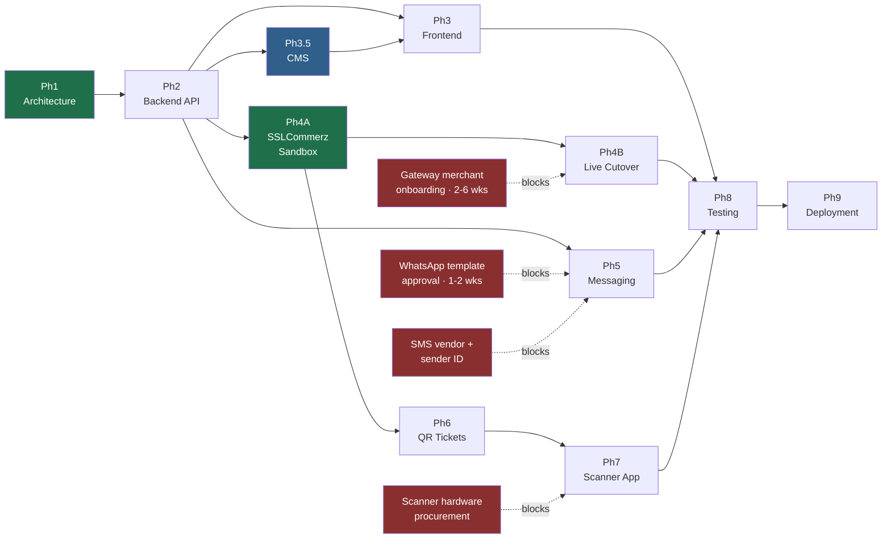

# 08 — Development Roadmap

> Phase 1 deliverable. Phases 2–9 with objectives, deliverables, timelines, and dependencies.

**Assumed team:** 1 backend lead, 1 backend engineer, 1 frontend lead, 1 frontend engineer, 1 mobile engineer (part-time from Phase 6), 1 QA (from Phase 4), 1 designer (Phases 2–3). Adjust the timeline proportionally for a smaller team.

**Total build:** ~24 weeks to production, plus a mandatory buffer before event day.

---

## 9.0 Timeline overview

**Critical path:** Phase 2 → Phase 4A → Phase 6 → Phase 7 → Phase 8 → Phase 9. Phases 3, 3.5, 4B, and 5 run in parallel and are not on it.

> **Revised 2026-08-03.** Phase 4 was split into **4A (sandbox)** and **4B (live cutover)** after confirming that SSLCommerz sandbox credentials are self-service and require no merchant onboarding — see [Phase 4A](#phase-4a--sslcommerz-sandbox-integration). This takes merchant onboarding off the critical path and pulls the projected event-ready date forward by roughly five weeks. Phase 3.5 (CMS) was added; it was previously in no phase at all. See [§9.5](#95-revision-log).

**The two schedule risks that are not engineering problems:**
1. **Payment gateway merchant onboarding** (bKash, Nagad, Rocket, SSLCommerz) takes 2–6 weeks in Bangladesh and requires trade licence, TIN, and bank documents. **Start this during Phase 2, not Phase 4.** It is the single most common cause of slipped launch dates on projects like this. *It no longer blocks engineering* — Phase 4A builds and proves the full money path against sandbox — but it still blocks **Phase 4B**, and therefore blocks taking a single real taka.
2. **WhatsApp Business template approval** by Meta takes days per template and templates get rejected for wording. **Draft and submit during Phase 2.**

Both are procurement, not development. Neither can be compressed by working harder.

---

## Phase 2 — Backend API Development

**Duration:** 6 weeks · **Depends on:** Phase 1 sign-off

### Objectives
Build the domain core — schema, models, business rules, authentication, RBAC, and the REST API — with everything external stubbed behind interfaces. At the end of this phase the system correctly manages registrations, tickets, and admissions; it simply cannot take real money or send real messages yet.

### Deliverables
- Laravel 13 project with the six-module structure from [01 §1.3](01-system-architecture.md#13-backend-architecture)
- All 26 migrations from [03](03-database-schema.md), with seeders and realistic factories (20,000-row seed for load testing)
- Eloquent models, relationships, observers, and the state machines from [04 §4.7](04-erd.md#47-lifecycle-state-machines) as guarded transitions
- Sanctum authentication for all three guards; TOTP 2FA for staff
- Full RBAC: roles, permissions, policies, scoped middleware ([02](02-rbac-permissions.md))
- REST API v1 — registration, attendee, ticket, ticket type, payment (stubbed gateway), check-in, report, settings, admin
- `FakeGateway`, `FakeSmsDriver`, `FakeWhatsAppDriver`, `FakeEmailDriver` implementing the real interfaces
- Idempotency middleware and `idempotency_keys` handling
- Activity logging on all sensitive actions
- Horizon with the four queue lanes configured
- OpenAPI 3.1 specification, generated and published
- Unit + feature test suite, target ≥ 80% coverage on domain logic
- CI pipeline: lint (Pint), static analysis (PHPStan level 8), tests, `composer audit`

### Exit criteria
- ✅ A registration can be created, paid via the **fake gateway**, ticketed, and admitted end-to-end in tests — *met 2026-08-04, closing D1/D2; see the revision log below. `EndToEndTest::test_complete_registration_to_admission_flow_via_gateway()` proves the gateway path (public initiate → server-to-server IPN → ticket → gate admission), not just manual verification.*
- ✅ The concurrency tests pass: 300 concurrent purchases against a 100-capacity tier sell exactly 100; 20 concurrent scans of one ticket admit exactly once
- ✅ Every permission has a passing allow-case and deny-case test
- ⚠️ OpenAPI spec published and reviewed by the frontend lead — *published (47 endpoints); frontend-lead review outstanding, and Phase 3 formally depends on it*

### Phase 2 review findings — 2026-08-03 (D1–D4 closed 2026-08-04)

An architecture and code review at the end of week 2 found the following. **D1–D4 were Phase 2 defects that had to close before Phase 2 could be signed off — they closed 2026-08-04.** D5–D10 are drift between these docs and the code, or deliverables quietly missing from the phase; they are cheap now and expensive later, and remain open.

| # | Finding | Evidence | Status |
|---|---|---|---|
| **D1** | **Gateway-verified payments never issue a ticket.** `VerifyPayment::markSucceeded()` transitions the payment to `succeeded` and the registration to `paid`, then stops. Only `VerifyManualPayment` calls `IssueTicket`. A gateway-paid attendee gets no ticket, no QR, no PDF. | `app/Domain/Payment/Actions/VerifyPayment.php:75-100` vs `VerifyManualPayment.php:65` | ✅ **Closed 2026-08-04** — `markSucceeded()` now dispatches `Payment\Events\PaymentSucceeded`, handled by `Ticketing\Listeners\IssueTicketForSucceededPayment` |
| **D2** | **The test suite cannot see D1.** The end-to-end test reaches `paid` via `POST admin/payments/{ulid}/verify-manual`, and `VerifyPaymentTest` asserts payments, registrations, and ticket_types but never asserts a `tickets` row exists. The exit criterion above is satisfied by the wrong code path. | `tests/Feature/EndToEndTest.php:111`; `tests/Feature/Payment/VerifyPaymentTest.php` | ✅ **Closed 2026-08-04** — added `EndToEndTest::test_complete_registration_to_admission_flow_via_gateway()` plus ticket assertions in `VerifyPaymentTest` and `WebhookTest` |
| **D3** | **No payment endpoint of any kind exists.** `InitiatePayment` has zero callers. The deliverable "REST API v1 — … payment (stubbed gateway)" is unmet, and Phase 3's payment-selection step has no contract to build against. | `app/Domain/Payment/Actions/InitiatePayment.php`; `routes/api/public.php` | ✅ **Closed 2026-08-04** — `POST /public/registrations/{registration}/payment/initiate` added, backed by the existing `FakeGateway`. Dedicated success/fail/cancel handlers were judged unnecessary: the browser redirect must never mutate a payment (docs/06 §6.6), and the existing `GET /public/registrations/{registration}` already exposes live status to poll after redirect |
| **D4** | **Idempotency is required but never enforced.** `StoreRegistrationRequest` demands `idempotency_key` and `EnsureIdempotency` is aliased in `bootstrap/app.php` — but applied to **zero routes**. A double-submit creates two registrations, two capacity reservations, and two payments. | `bootstrap/app.php:34`; `routes/api/*.php` | ✅ **Closed 2026-08-04** — `idempotent:registration.create` and `idempotent:payment.initiate` attached to the registration-store and payment-initiate routes |
| **D5** | **Reserved capacity leaks permanently.** `tryReserve()` fires on every registration and is released only on explicit payment *failure*. `payments.expires_at` is never written, there is no sweeper, and `routes/console.php` defines no schedule. Abandoned checkouts consume seats forever — the event reads sold out with empty seats. | `CreateRegistration.php:31`; `routes/console.php` | Open — Phase 4A deliverable |
| **D6** | **The event-driven module boundary mostly does not exist.** Nine of ten `Events/`/`Listeners/` directories are still empty. `CreateRegistration` still writes `Payment` directly; `VerifyManualPayment` still calls `IssueTicket` directly. Closing D1 added the first real instance (`Payment\Events\PaymentSucceeded` → `Ticketing\Listeners\IssueTicketForSucceededPayment`), but the rest of the boundary [01 §1.3](01-system-architecture.md#13-backend-architecture) and `CLAUDE.md` describe still doesn't exist. | `app/Domain/*/Events`, `app/Domain/*/Listeners` | Open — partially addressed, not closed |
| **D7** | **Registration validation gaps.** `payment_method` reaches the database unvalidated and silently defaults to `bkash`. No check of `max_admits`, `allowed_participant_types`, `is_active`/`is_public`, or the `sale_starts_at`/`sale_ends_at` window. | `app/Http/Requests/Public/StoreRegistrationRequest.php`; `CreateRegistration.php:130` |
| **D8** | **Audit logging lives in controllers, not actions.** `ActivityLog::create()` appears in five admin controllers. Any non-HTTP caller — console command, queue job, CMS — silently skips the audit trail, contradicting the append-only guarantee in [06 §6.8](06-security-architecture.md#68-data-protection). | `app/Http/Controllers/Api/Admin/*.php` | Open |
| **D9** | **No observers exist**, though the deliverable list names them. Also: no media upload endpoint, so `manual_proof_media_id` and the manual-payment proof flow are unusable; no `config/cors.php` for the separate Next.js origin; `config/sanctum.php` sets `'expiration' => null`, so staff console tokens never expire. | `app/Domain/*/Models`; `config/sanctum.php:53` | Open |
| **D10** | **No admin check-in endpoints**, though this phase's deliverable list names check-in among the REST API v1 surfaces. The admin SPA's Check-in page is therefore an unbacked placeholder. Users/roles, gates, devices, and volunteer CRUD are likewise absent. The Notifications page is correctly waiting on Phase 5. | `routes/api/admin.php`; `resources/js/features/checkin/CheckInPage.tsx` | Open — **explicitly rescheduled** 2026-08-04 as the next follow-up slice after D1–D4, not silently dropped; sized as its own multi-endpoint piece of work (check-in, gates, devices, users/roles, volunteer CRUD) rather than a same-day fix |

**Not defects — correctly deferred.** The review also flagged the `placeholder_sig` QR signature, the absent `QrSigner`, missing PDF rendering, the O(n) ticket-number counter, absent notification delivery, and the missing expiry-sweeper/reconciliation jobs. All six are **scheduled deliverables of Phases 4A, 5, and 6** and are the intended Phase 2 state. They are listed here only so they are not re-reported as bugs.

### Revised exit criteria

Add to the four above:
- [x] D1–D4 closed, with a regression test that asserts a `tickets` row after **gateway** verification — **done 2026-08-04**
- [x] D10's admin check-in endpoints delivered, or explicitly rescheduled into a named phase rather than left implicit — **rescheduled** 2026-08-04 (see D10 above); not delivered this pass
- [x] `composer test` green with the new assertions, Pint and PHPStan level 8 clean — **115 tests passing, Pint clean, PHPStan level 8 clean, `composer audit` clean**

### Parallel non-engineering work (starts week 1)
- [ ] Payment gateway merchant applications submitted
- [ ] WhatsApp Business account + template drafts submitted to Meta
- [ ] SMS gateway vendor selected, contract signed, sender ID registered
- [ ] Domains registered, SSL provisioned, email sending domain SPF/DKIM/DMARC configured

---

## Phase 3 — Next.js Frontend Development

**Duration:** 6 weeks · **Depends on:** Phase 2 OpenAPI spec (week 3 of Phase 2) · **Runs in parallel with:** Phases 4 and 5

### Objectives
Build both frontend applications against the published API contract, with the registration wizard and the admin dashboard as the two highest-value surfaces — one is where 20,000 people form their impression of the event, the other is where the organising team runs it.

**Stack:** React 19 · Next.js 16 App Router · **Tailwind CSS 4** · Shadcn UI · TanStack Query + TanStack Table · TypeScript strict. Both apps and the shared packages use one design system; there is no second styling approach anywhere in the frontend.

> **Amended 2026-08-03 — the admin dashboard is not Next.js.** It is built as a **Vite + React 19 SPA inside the Laravel repo** (`resources/js`, served by the catch-all in `routes/web.php`), while the **public site remains Next.js** on its own origin. This is a deliberate deviation: the admin console is authenticated-only, so it gains nothing from SSR/ISR, and co-locating it with the API removes a deployment target.
>
> Two consequences to manage rather than ignore:
> - `@decent/api-client` and `@decent/schemas` are no longer shared by construction. The SPA hand-writes its types in `resources/js/features/*/types.ts`. **Generate the SPA's client from `public/docs/openapi.json` as part of the build**, or the Phase 3 exit criterion *"no drift between client and server validation"* has no mechanism behind it and will quietly become false.
> - `@decent/ui` is consumed only by the public app. The design system in [§3.1](#31-design-system--theming-foundation) must still be implemented **twice from the same token file** — ship the `@theme` token CSS as a shared package, not a copy-paste.

### Week plan

| Week | Focus |
|---|---|
| 1 | Design system foundation — tokens, theming, typography, base components ([§3.1](#31-design-system--theming-foundation)) |
| 2–3 | Registration wizard (the risk; build it early) |
| 3–4 | Admin dashboard shell, data tables, finance and attendee modules ([§3.2](#32-admin-dashboard--build-specification)) |
| 5 | Live event dashboard, reports, exports, settings |
| 6 | Public marketing pages, ticket viewer, self-service portal, accessibility and performance pass |

### Deliverables
- Design system and dual-theme token layer — specified in [§3.1](#31-design-system--theming-foundation)
- `@decent/ui` — Shadcn-based component library consumed by both apps
- `@decent/schemas` — Zod contracts shared with the API and the mobile app
- `@decent/api-client` — typed client generated from the OpenAPI spec
- **Public app:** landing (static/ISR), schedule, FAQ, 5-step registration wizard, payment selection and return, ticket viewer, attendee self-service portal
- **Admin dashboard:** every module in [§3.2](#32-admin-dashboard--build-specification)
- Draft persistence and resume-by-link for the registration wizard
- Accessibility: WCAG 2.1 AA, keyboard navigation, screen-reader labels — **verified in both themes**
- Mobile-first responsive; the public target device is a mid-range Android on mobile data, not a desktop
- Frontend tests: component (Vitest), E2E happy paths (Playwright), visual regression on the dashboard in both themes

### Exit criteria
- Registration wizard completes on a throttled 3G connection in under 4 minutes
- Lighthouse ≥ 90 on performance and accessibility for the landing and wizard
- Zod/FormRequest contract test passes — no drift between client and server validation
- All [§3.1](#31-design-system--theming-foundation) and [§3.2](#32-admin-dashboard--build-specification) acceptance checks pass
- Full admin flow demonstrated in UAT with the client, on a real laptop screen and a tablet

### Notes
The wizard is the schedule risk. Five steps, conditional family fields, file upload, draft persistence, and bilingual labels — budget more time here than the page count suggests. Build it first, not last.

---

### 3.1 Design system & theming foundation

Built in week 1, before any screen. Everything downstream consumes it; nothing downstream defines its own colours.

**Tailwind CSS 4 setup**

Tailwind 4 is CSS-first. There is no `tailwind.config.js` and no `@tailwind` directives — the theme lives in CSS.

| Item | Rule |
|---|---|
| Entry | `@import "tailwindcss";` in one global stylesheet per app |
| Theme | Tokens declared in `@theme` — this is the single source of truth for colour, type scale, spacing, radii, shadows |
| Colour space | **OKLCH**, not hex. Perceptually uniform lightness makes the dark palette a principled derivation instead of a guess |
| Build | Native Tailwind 4 engine via `@tailwindcss/postcss`; no JS config shim, no legacy plugin chain |
| Arbitrary values | Allowed for one-off layout only. A raw colour value in a component is a review rejection |

**Token layer**

Three tiers, and components may only reference the third:

1. **Primitive** — the raw ramp (`--color-brand-50 … --color-brand-950`), theme-independent
2. **Semantic** — `--color-bg`, `--color-surface`, `--color-border`, `--color-text`, `--color-text-muted`, `--color-accent`, redefined per theme
3. **Component** — `--color-table-row-hover`, `--color-chart-grid`, resolved from semantic tokens

**Status colours are a separate axis from the accent.** `success` / `warning` / `critical` / `info` carry meaning (payment failed, capacity near limit, sync stale) and must never be reused decoratively, or an operator stops trusting red.

**Light and dark mode**

Both themes are designed, not one inverted into the other. The dark palette is built by re-deriving lightness in OKLCH and re-checking contrast, because a naive inversion produces glaring surfaces and dead accents.

| Requirement | Implementation |
|---|---|
| Signal | `@media (prefers-color-scheme: dark)` for the OS preference |
| Override | `:root[data-theme="dark"]` and `:root[data-theme="light"]` must win over the media query **in both directions** |
| Scope | Only the semantic token block is redefined per theme. Components are styled through tokens and never inside a theme selector |
| Persistence | Choice stored in `localStorage`, applied to `<html>` by a small blocking inline script in `<head>` **before first paint** |
| No flash | A dark-mode user must never see a white flash on load. This is an explicit acceptance check, not a nicety |
| Native controls | `color-scheme: light dark` so scrollbars, date pickers, and form controls follow the theme |
| Assets | Logo, illustrations, and the QR preview need dark-safe variants; a QR always renders on a light plate regardless of theme, because scanners need the contrast |
| Charts | Series, grid, and axis colours come from tokens and re-resolve on theme change without a remount |

**Typography**

Bilingual is the constraint that shapes the type system. A display face chosen for Latin that has no Bangla coverage will silently fall back mid-sentence.

- One Bangla-capable family covering both scripts, or a deliberately paired Latin + Bangla stack with matched vertical metrics
- Self-hosted `woff2`, `font-display: swap`, subset per script — no font CDN
- Fixed type scale in `@theme`; ad-hoc sizes are a review rejection
- `font-variant-numeric: tabular-nums` on every money, count, and batch-year column
- Bangla names run longer than their Latin equivalents — table columns and buttons are tested with real Bangla data, not Latin placeholders

**Design direction**

The dashboard is *operated*, not read. Aim for a confident, modern interface with a genuine point of view — not a generic admin template — while keeping the restraint that a tool used for eight hours on event day demands.

- Dense but breathable: information design over decoration
- State readable at a glance — pills, severity stripes, status dots — so an operator scanning the queue does not have to read numbers
- Motion is functional only: state transitions, loading skeletons, toast entry. Respect `prefers-reduced-motion`
- Spend visual boldness in one place (the live event dashboard) and keep the working screens quiet

**Acceptance checks**

- [ ] Every semantic token has a light and a dark value; no component references a primitive or a literal colour
- [ ] Contrast passes WCAG AA for text and UI borders **in both themes** — automated check in CI
- [ ] Theme toggle overrides the OS preference in both directions and survives reload
- [ ] No flash of the wrong theme on cold load, verified on a throttled connection
- [ ] Bangla and English render correctly in every component, including tables, PDFs previews, and toasts
- [ ] Visual regression baselines captured for both themes

---

### 3.2 Admin dashboard — build specification

**Shell**

Persistent left navigation grouped by domain (Attendees · Finance · Tickets · Check-in · Notifications · Reports · Settings), collapsible to icons; top bar with global search, theme toggle, notification bell, and account menu; breadcrumbs on every detail route. Navigation is rendered from the permission set returned at login — a Volunteer Coordinator never sees a Finance link they cannot open ([02](02-rbac-permissions.md)).

**Modules**

| Module | Screens | Notes |
|---|---|---|
| Overview | KPI row, registration trend, revenue trend, capacity by ticket type, recent activity | Landing route; must render in under 1s from cached counters |
| Attendees | List, detail, edit, merge duplicates, guest management | 20k+ rows — server-side pagination, sort, and filter |
| Registrations | List, detail, status timeline, document viewer | Timeline mirrors the state machine in [04 §4.7](04-erd.md#47-lifecycle-state-machines) |
| Finance | Payments list, **manual verification queue**, refunds, reconciliation, revenue reports | The verification queue is the highest-traffic admin screen before the event |
| Tickets | Issue, void, reissue, resend, ticket type and capacity management | Void and reissue require confirmation with a typed reason |
| Check-in | Live gate monitor, scan log, override requests, device and volunteer status | Read-heavy, high refresh |
| Notifications | Delivery dashboard, failures, cost by channel, template management, kill switches | Kill switches need a deliberate two-step confirm |
| Reports | 11-report catalogue from [05](05-data-flows.md), export to PDF/Excel/CSV, job status | Exports are async jobs with progress, never a blocking download |
| Settings | Event settings, gates, sessions, roles and users, audit log viewer | Audit log is read-only for everyone |

**Data tables** — the dashboard's core component, built once

Server-driven pagination, sorting, filtering, and column visibility against 20,000+ rows; URL-synced state so a filtered view is shareable; saved views per user; row selection with bulk actions gated by permission; sticky header and first column; density toggle; skeleton loading, and distinct empty / no-results / error states. Client-side sorting of a full table is forbidden — it will not survive real data volume.

**Live event dashboard**

The one screen that must be readable across a room on event day: total admitted vs expected, per-gate throughput, scan rate, device online/offline and battery, sync lag, and a rejection feed by reason. Auto-refresh on a short interval (SSE if available, polling otherwise), a stale-data banner the moment refresh fails, and a large-format mode for a wall display. It reads projections from cache — never the check-in write path ([07 §7.4](07-scalability-plan.md#74-caching-strategy)).

**Charts**

Recharts, wrapped in `@decent/ui` so no chart is configured twice. Tokenised colours that re-resolve on theme change, tabular-num axis labels, accessible text alternatives, and an explicit empty state. No chart animates on refresh — a moving number is unreadable at a glance.

**Behaviour**

- TanStack Query for all server state; optimistic updates only where the server can be trusted to reconcile
- Every destructive action confirms, and states what will happen in plain words
- Errors from `@decent/api-client` normalise to a single toast/inline contract; a 403 explains which permission is missing
- Keyboard: `/` focuses search, `Esc` closes overlays, tables are fully arrow-navigable
- Target viewport is a laptop at 1440px, must remain usable at 1024px and on a tablet at the gate

**Acceptance checks**

- [ ] Attendee table paginates, sorts, and filters 20,000 seeded rows with sub-400ms interactions against staging
- [ ] Every module renders correctly in light and dark, verified by visual regression
- [ ] Navigation and actions correctly hide and deny for each of the four roles
- [ ] Live dashboard shows a stale banner within 15s of losing its data source
- [ ] Full keyboard traversal of the verification queue with no mouse
- [ ] Exports run as background jobs with visible progress and a retrievable result

---

## Phase 3.5 — Content Management System

**Duration:** 3 weeks · **Depends on:** Phase 2 · **Runs in parallel with:** Phase 3 weeks 2–5 · **Added:** 2026-08-03

### Why this exists

The CMS was named in the project brief but appeared in no phase of this roadmap. Phase 3 assumed hand-built Next.js marketing pages and Phase 9 assumed content would be "loaded" once. Neither gives the organising committee a way to change a schedule, add a sponsor logo, or fix a Bangla typo without a developer and a deploy — for a year-long centenary campaign that is not viable.

Backend-led, so it does **not** compete with the registration wizard, which [Phase 3's notes](#notes) correctly identify as the top schedule risk.

### Scope boundary

A **structured content CMS**, not a page builder. Editors fill typed fields in known content types; they do not compose arbitrary layouts. This is the difference between three weeks and three months, and it is the right trade for a single-event site.

### Deliverables

- [x] Seventh domain module `app/Domain/Content/`, following the same Actions/Models/Policies layering
- [x] Migrations for: `content_pages`, `content_blocks`, `content_page_revisions`, `menus`/`menu_items`, `sponsors`, `schedule_items`, `faqs`, `gallery_albums`/`gallery_items` — ten tables, all shipped 2026-08-04
- [x] **Bilingual by construction** — every editable string is `en`/`bn` at the schema level, not a duplicated page tree
- [x] **Draft → review → published** via `HasStateMachine`, with `published_at` scheduling and a preview token for unpublished content
- [~] Revision history with restore; `content_pages` rows are versioned, never overwritten in place — `content_page_revisions` table and model exist; the capture-on-save and restore actions land with the admin CRUD slice
- [ ] Media library UI over the **existing** `media_files` table — this also closes D9's missing upload endpoint and unblocks manual payment-proof upload
- [x] Public read API: `GET /api/v1/public/content/pages/{slug}`, `/menus`, `/sponsors`, `/schedule`, `/faqs`, `/gallery`, cache-tagged and CDN-friendly with ETags
- [ ] Admin CMS screens in the React SPA: page list, typed block editor, media picker, menu ordering, publish controls
- [x] RBAC: new `content.*` permissions in `config/rbac.php` (`view_any`, `view`, `create`, `update`, `publish`, `delete`, `manage_media`), seeded via `RbacSeeder`, with allow/deny test pairs
- [ ] `next/image` + ISR revalidation hook so a publish invalidates the public site without a redeploy

#### Two schema decisions taken on 2026-08-04, differing from the list above

- **No `content_translations` table.** Bilingual content is paired `field`/`field_bn` columns (`title`/`title_bn`, `data`/`data_bn`), not a row-per-(record, locale, field) translation table. This matches how `ticket_types.name`/`name_bn` already works, stays type-safe under PHPStan level 8, and keeps a page read to a single row with no join — which matters because every public content response is ETagged and CDN-cached. The cost is that a third language would need a migration; for a single-event bilingual site that trade is deliberate. `App\Domain\Content\Support\ContentLocale` owns resolution and the per-field fallback to English.
- **Pages live at `/public/content/pages/{slug}`, not `/public/content/{slug}`.** The original path would collide with the sibling collection routes the moment an editor slugs a page `faqs`, `sponsors`, `schedule`, `menus` or `gallery` — all of which are plausible on an event site.

### Exit criteria

- [ ] A non-technical editor publishes a new page with an image and a Bangla title, unaided, in under five minutes — needs the admin CMS screens
- [ ] Publishing invalidates the CDN and the public site reflects it within 60 seconds — needs the ISR revalidation hook
- [x] Unpublished content is unreachable without a valid preview token — verified by test, including the 404-not-403 rule — **met 2026-08-04**: `ContentApiTest` covers draft, in-review, archived, soft-deleted and future-scheduled pages, wrong/empty preview tokens, and asserts a draft page and a nonexistent slug return byte-identical bodies
- [x] Every `content.*` permission has an allow-case and a deny-case test — **met 2026-08-04** via the catalogue loop in `ComprehensivePermissionTest` plus explicit Event-Manager-can-publish-but-not-delete and Volunteer-holds-no-`content.*` pairs. HTTP round-trips follow with the admin CRUD slice
- [ ] Phase 3's public marketing pages render entirely from CMS content, with **no hard-coded copy**
- [x] Bangla renders correctly through the full path: editor → database → API → rendered page — **met 2026-08-04** for the database → API half, including inside JSON block payloads; the editor half arrives with the admin screens

### Notes

Sequence the schema and public read API in weeks 1–2 so Phase 3's week 6 (public marketing pages) builds against real content rather than fixtures it will later have to unpick. **That first slice shipped on 2026-08-04** — schema, models, factories, a bilingual `ContentSeeder`, `content.*` RBAC, and the public read API with locale resolution, ETag revalidation and preview tokens. What remains is the admin half: CRUD controllers with revision capture and restore, the media upload endpoint, the SPA screens, and the ISR hook. Uploads must follow the file rules in [06](06-security-architecture.md) — magic-byte validation, image re-encoding to strip EXIF/GPS, randomised private filenames, signed short-TTL URLs. A CMS is the most common place those rules get quietly skipped.

---

## Phase 4A — SSLCommerz Sandbox Integration

**Duration:** 3 weeks · **Depends on:** Phase 2 (D1–D4 closed) · **Blocked by nothing external** · **Added:** 2026-08-03

### Why this phase was split

The original Phase 4 was gated on "merchant credentials in hand," which put a 2–6 week procurement queue directly on the critical path ahead of Phases 6–9. That gating is unnecessary: **SSLCommerz sandbox credentials are self-service and require no merchant onboarding.** The entire money path — session creation, IPN verification, server-side validation, refunds, and every adversarial case — can be built and proven against sandbox now. Only the credential swap and the live-transaction proof have to wait.

Sequencing SSLCommerz first also matches [R1](#92-risk-register), which already identified it as the fastest gateway to approve.

**Development environment:** SSLCommerz sandbox, per <https://sandbox-gw.sslcommerz.com/docs> and <https://developer.sslcommerz.com/doc/v4/>.

| Purpose | Sandbox endpoint |
|---|---|
| Session initiation | `POST https://sandbox-gw.sslcommerz.com/gwprocess/v4/api.php` |
| Order validation (`val_id`) | `GET https://sandbox.sslcommerz.com/validator/api/validationserverAPI.php` |
| Transaction query | same validator API, by `sessionkey` or `tran_id` |
| Refund | `https://sandbox.sslcommerz.com/validator/api/merchantTransIDvalidationAPI.php` |

Store credentials are `store_id` / `store_passwd` (sandbox default store `testbox`), held in `config/services.php` and `.env` — **never** in `event_settings` unencrypted, and never committed.

### The invariant this phase must not break

SSLCommerz's own documentation is unambiguous: *"Due to the security issue and to avoid data tampering, you must call the SSLCOMMERZ APIs from your server,"* and the `success_url` redirect is explicitly insufficient on its own. This is the same rule already stated in [06 §6.6](06-security-architecture.md#66-payment-security) and enforced in `ProcessGatewayWebhook`.

Concretely, for every transaction:
1. `success_url` returns the browser. **This proves nothing** and must never transition a payment.
2. The IPN arrives server-to-server. Verify `verify_sign` against the fields listed in `verify_key`, hashed with the store password. An invalid signature is recorded and ignored.
3. **Only then** call the validation API with `val_id` and accept `VALID` or `VALIDATED`. `INVALID_TRANSACTION` is a failure.
4. Re-check `total_amount` and `currency` against `payments.amount_due_paisa` before `succeeded`. Mismatch goes to `reconciliation_status`, never auto-resolved.

Note the paisa boundary: SSLCommerz transacts in decimal BDT with a **10.00 minimum**, while the database stores integer paisa. Conversion belongs in `SslCommerzClient` alone — no decimal amount may leak past the adapter.

### Deliverables

> **Buildable-now slice closed 2026-08-04** — same split as Phase 3.5/5: everything that's pure engineering is done; only a live sandbox smoke test and the Phase 3.5 media endpoint remain outstanding. See CLAUDE.md §"Phase 4A (SSLCommerz Sandbox)" for full detail.

- [x] `SslCommerzClient` implementing `PaymentGatewayInterface` — `createIntent` (session init), `verify` (`val_id` validation, with a `tran_id`-lookup fallback for a lost/delayed IPN), `refund`, `parseWebhook` (IPN with `verify_sign`/`verify_key`) — **unverified against a live sandbox call**, no `SSLCOMMERZ_STORE_PASSWORD` provisioned in this environment
- [x] Wire `PaymentGatewayResolver::forMethod()` to return it for `sslcommerz`; other gateways keep resolving to `FakeGateway` until Phase 4B
- [x] **Public payment endpoints** — initiate against a registration (Phase 2/D3), plus `success`/`fail`/`cancel` return handlers that only *read* status and never mutate it
- [x] `idempotent:payment.initiate` middleware actually attached to those routes (Phase 2/D4)
- [x] IPN endpoint hardening: signature verification (real), replay rejection (real, generic since Phase 2); IP allowlisting (`ipn.allowlist:sslcommerz`, config-driven, no-op until SSLCommerz's published ranges are added to `.env` — see CLAUDE.md)
- [x] Payment intent expiry sweeper with a gateway pre-check, plus the scheduler entry that runs it. Closes D5.
- [x] Nightly reconciliation job with two of the three mismatch classes (`matched`, `amount_mismatch`, `missing_at_gateway`); `missing_locally` deliberately not implemented — needs a settlement-report enumeration API no adapter exposes (see CLAUDE.md)
- [ ] Manual verification workflow completed: proof upload still blocked on the Phase 3.5 media endpoint; duplicate-TrxID detection, approval queue, and attributed approval already existed from Phase 2
- [x] Refund workflow with approval, gateway call, and ticket voiding
- [x] Sandbox test suite (unit-level, via `Http::fake()`, not a live sandbox call): success, failure, forged signature, amount mismatch, duplicate IPN, partial refund, `INVALID_TRANSACTION`. **Not yet exercised:** timeout and cancelled-callback scenarios, and everything above at "not yet exercised against a real sandbox".

### Exit criteria

- [ ] A full sandbox transaction completes: session → hosted page → IPN → `val_id` validation → `succeeded` → **ticket issued** → admitted at a gate — **blocked on a live sandbox credential**; the equivalent path is proven against `Http::fake()`, not a real SSLCommerz response
- [x] A forged or replayed `success_url` hit produces **no** payment transition and **no** ticket — `SslCommerzReturnController` never mutates a payment; `ProcessGatewayWebhook`'s replay guard is unchanged
- [x] An IPN with an invalid `verify_sign` is recorded and ignored — `SslCommerzClientTest::test_parse_webhook_rejects_a_tampered_payload`
- [x] A double-clicked Pay button produces exactly one charge and one registration — closed in Phase 2 (D4)
- [x] An amount-mismatched transaction lands in `reconciliation_status` and never reaches `succeeded` — both at verify-time (`VerifyPayment`, Phase 2) and at nightly reconciliation (`ReconcilePaymentsTest`)
- [x] The expiry sweeper returns leaked reservations to available capacity — `ExpirePaymentIntentsTest`

---

## Phase 4B — Live Gateway Cutover

**Duration:** 3 weeks · **Depends on:** Phase 4A + **merchant credentials in hand**

### Objectives
Swap sandbox for live, and add the remaining three gateways against the contract Phase 4A has already proven.

### Deliverables
- SSLCommerz live credential cutover; live endpoints (`securepay.sslcommerz.com`) behind config, not code
- `BkashClient` — tokenised checkout, token refresh cycle, create/execute/query/refund
- `NagadClient` — RSA payload encryption/signing, initialise/complete/verify
- `RocketClient` — per the current merchant integration spec
- Per-gateway signature verification and IP allowlisting for the remaining three webhook endpoints
- Gateway credentials stored encrypted, gated by `payment.manage_gateway_credentials`
- Runbook: switching a gateway off mid-event without a deploy

### Exit criteria
- Every enabled gateway completes a live low-value production transaction (100 BDT), verified and refunded
- Reconciliation correctly flags a manually introduced mismatch against real settlement data
- A gateway can be disabled from settings and the public site stops offering it within 60 seconds

### Risk
This phase still cannot start without credentials — but nothing downstream now waits on it. If onboarding slips, Phase 4B slips **alone**; Phases 6–9 proceed on the sandbox-proven adapter. Track credential status weekly from Phase 2 week 1 and escalate at the first delay. If credentials slip past registration open, launch with SSLCommerz-only or manual-verification-only, which R1 already contemplates as a fallback.

---

## Phase 5 — Email, SMS & WhatsApp Integration

**Duration:** 3 weeks · **Depends on:** Phase 2 + approved WhatsApp templates + SMS contract · **Runs in parallel with:** Phase 4

### Objectives
Make the outbox actually deliver, with cost visibility and per-channel kill switches.

### Deliverables
- `MailDriver` with the transactional provider; SPF/DKIM/DMARC verified and passing
- `SmsDriver` for the chosen Bangladesh gateway, with DLR webhook handling
- `WhatsAppDriver` on Meta Cloud API, with status webhook handling
- All templates from [01 §1.6](01-system-architecture.md#16-notification-architecture) in both English and Bangla
- Segment counting and cost tracking per message, with Bangla/Unicode length budgeting
- Reminder scheduling for T-7, T-1, T-0 with staggered dispatch
- Delivery receipt processing into `notification_events`
- Bounce and opt-out handling
- Admin notification dashboard: delivery rates, failures, cost by channel
- Per-channel kill switches wired to `event_settings` and verified

### Exit criteria
- End-to-end delivery confirmed on real Bangladeshi numbers across major operators (GP, Robi, Banglalink, Teletalk) — coverage differs by operator and must be tested per network
- Bangla SMS renders correctly on both feature phones and smartphones
- Cost per message recorded accurately and reconciles against the vendor's dashboard
- A kill switch flip stops sending within 60 seconds
- No duplicate sends under job retry

### Notes
Bangla SMS rendering is the classic failure here — it looks correct in the vendor's web console and arrives as boxes on an actual handset. Test on physical devices across all four operators, not on a simulator.

### Buildable-now slice closed 2026-08-04

Applied the same split Phase 4A used for SSLCommerz: none of the three external dependencies below (WhatsApp template approval, SMS vendor contract, verified email domain) are secured, so pull forward everything that's pure engineering and explicitly flag the rest — don't silently drop it, and don't guess at a vendor-specific webhook contract that doesn't exist yet.

**Built:** the full outbox → dispatcher job → channel driver → delivery-receipt pipeline for all seven channel-matrix events, a real `MailDriver` (works against `MAIL_MAILER=log` today, swaps to Postmark/SES/Resend on credentials alone), GSM-7/Unicode SMS segment budgeting, the T-7/T-1/T-0 reminder scheduler, bilingual draft templates, per-channel kill switches enforced at send-time, and the admin delivery-log/costs/kill-switches/templates dashboard (backend + SPA, browser-verified).

**Exit criteria this closes:** "A kill switch flip stops sending within 60 seconds" and "No duplicate sends under job retry" are met — both have passing regression tests. Cost/segment tracking is real infrastructure, tested against `FakeSmsDriver`'s real budgeting math; it has no live numbers to reconcile against a vendor dashboard yet.

**Exit criteria still open, and why:** "End-to-end delivery confirmed on real Bangladeshi numbers" and "Bangla SMS renders correctly on physical handsets" need a live SMS vendor, which is unpicked. "Cost per message reconciles against the vendor's dashboard" needs the same. None of these are engineering gaps — see CLAUDE.md's Phase 5 section for the exact deferred list (real `SmsDriver`/`WhatsAppDriver`, DLR webhooks, automated bounce handling).

---

## Phase 6 — QR Ticket Generation

**Duration:** 3 weeks · **Depends on:** Phases 2 and **4A** (sandbox is sufficient — this phase needs a proven ticket-issuance trigger, not live money)

### Objectives
Implement the signing scheme, ticket assets, and the manifest endpoint the scanner will depend on.

> **Security note added 2026-08-03.** Until this phase lands, QR admission is **unauthenticated by design and must not be exposed outside development**. Issuance currently writes the literal string `'placeholder_sig'` (`IssueTicket.php:52-58`) and `ProcessCheckIn` hardcodes `'signature_valid' => true` (`ProcessCheckIn.php:176`) without verifying anything — it parses the payload, reads the ticket ULID, and admits. Payload expiry is not checked either. Anyone holding a ticket ULID could forge `DTM1.<ulid>.<n>.<exp>.K1.<anything>`. This is the expected Phase 2 state, but **no ticket PDF may be sent to a real attendee before this phase closes**, and the gate rehearsal in Phase 8 must include a forged-QR attempt.
>
> This phase also replaces the interim ticket-number counter — `Ticket::…->lockForUpdate()->count() + 1` in `IssueTicket.php:19`, which full-scans on every issuance and can collide under concurrency — with `TicketNumberGenerator`.

### Deliverables

> **Buildable-now slice closed 2026-08-04** — same split as Phase 3.5/4A/5: everything that's pure engineering is done; physical print/scan testing and a live device-rotation rehearsal remain outstanding, since neither can be simulated. See CLAUDE.md §"Phase 6 (QR & PDF Tickets)" for full detail.

- [x] Ed25519 key generation — `QrSigner` + `php artisan qr-signing:generate-key`. **Secret-manager storage is not this**: the private key lives in `QR_SIGNING_PRIVATE_KEY` (env), the same stand-in used for `SSLCOMMERZ_STORE_PASSWORD` elsewhere in this environment — swap for a real secret manager before production
- [x] `QrSigner` service — the only code path that touches the private key
- [x] Payload encoding/decoding with version support ([06 §6.5](06-security-architecture.md#65-qr-code-security)) — `QrPayload`
- [x] QR image rendering: ECC level M, 512px, generous quiet zone — `RenderTicketQrImage`
- [x] Bilingual A5 PDF ticket with photo — `GenerateTicketPdf`, rendered by headless Chrome via `HtmlToPdfRenderer` since 2026-08-21. Conjunct shaping *and* the extractable text layer are both correct now; under mpdf the shaping looked right on the page while the text layer silently dropped every conjunct (see CLAUDE.md's Phase 6 close-out). Bold Bangla works, which it did not under mpdf's bundled FreeSerifBold. **Still not print-tested on low-quality output** — needs a real printer
- [x] `TicketNumberGenerator` with the `DEC100-{TYPE}-{BATCH}-{SEQ}` format — race-safety proven under real concurrent-process load, not just reasoned about
- [x] Void, reissue, and revocation flows with `manifest_version` bumping — predates this slice (`TicketController::void`/`reissue` already did this); unchanged here
- [x] **Manifest endpoint** with ETag-based delta sync — the scanner's dependency; now a real `?since=` delta plus published signing keys
- [~] Key rotation procedure — documented and tooled (`qr-signing:generate-key`, multi-key `QrSigner`, CLAUDE.md checklist); **not rehearsed on staging**, since no staging environment exists here
- [x] Server-side verification endpoint for online scans — `ProcessCheckIn` via the scanner sync endpoint

### Exit criteria
- [ ] QR scans reliably from: a cracked phone screen, 40% screen brightness, a laser print, an inkjet print, and a photocopy — **needs real hardware and a printer, not met in this environment**
- [x] A signature verifies with the public key alone, and fails on a single-bit payload mutation — `QrSignerTest`
- [x] Manifest delta sync returns only changed tickets, **and correctly handles a 12,000-ticket cold start** — closed 2026-08-21: the endpoint streams via an unbuffered cursor instead of `->get()`, taking row-holding memory from 42 MB to ~0 for one request, with an opt-in resumable cursor for poor connections. Pinned by `tests/Feature/Scanner/ManifestScaleTest.php`
- [~] Key rotation completes without invalidating existing tickets — **asserted directly** by `QrKeyRotationTest::test_a_ticket_signed_before_the_rotation_still_verifies_after_it`, and the publish → confirm-device-sync → activate ordering is now refused server-side rather than followed by hand (2026-08-21). Still not rehearsed *on staging*, because no staging environment exists here

### Notes
Physical scan testing is not optional and cannot be simulated. Print real tickets, damage them, and scan them in daylight and under fluorescent light. This is the cheapest possible time to discover a QR that is too dense or a quiet zone that is too small.

---

## Phase 7 — Mobile Verification App

**Duration:** 5 weeks · **Depends on:** Phase 6 manifest endpoint

### Objectives
Ship an offline-first React Native scanner that works reliably in the hands of a volunteer who received ten minutes of training.

### Deliverables
- React Native app (Android primary, iOS secondary — volunteer devices in this context are overwhelmingly Android)
- Device enrolment via one-time QR; hardware fingerprint binding; PIN setup
- Camera scanner with torch toggle, autofocus tuning, and haptic feedback
- **Local Ed25519 verification** against the embedded public key
- SQLite manifest store with delta sync
- Local admission counter with offline decision logic
- Scan queue with idempotent batched upload and exponential backoff
- Gate UI: large targets, high-contrast for sunlight, unambiguous green/red result with reason text
- Holder card on successful scan: name, photo, type, admits total, remaining
- Party-size confirmation for family tickets (the partial-admission flow)
- Manual lookup by mobile last-4 or ticket number
- Override request flow routed to an Event Manager
- Sync status UI: last sync, pending count, battery, manifest version
- Volunteer's own scan history and session totals
- Crash reporting and offline-capable diagnostic log

### Exit criteria
- 500 consecutive scans in airplane mode with zero data loss and correct duplicate rejection
- Full 12,000-ticket manifest syncs in under 90 seconds on 4G
- Sub-second scan-to-result on a mid-range Android (target: Redmi-class hardware, not a flagship)
- Two devices offline scanning the same ticket produce exactly one admission after sync, with the second correctly flagged as a conflict
- 8-hour battery life with continuous scanning and the screen at gate brightness
- A volunteer with no training completes 20 correct scans after a 5-minute briefing

### Notes
Test on the actual hardware that will be used, and buy it early. Camera quality, autofocus speed, and battery behaviour vary enormously across budget Android devices, and the app's gate throughput is determined by the slowest device in the fleet.

---

## Phase 8 — Testing & Security Audit

**Duration:** 4 weeks · **Depends on:** Phase 7

### Objectives
Prove the system works under load, under attack, and in the hands of real users — before there is no chance to fix it.

### Deliverables

**Functional**
- Full regression suite across all phases
- E2E scenarios: single, couple, family, sponsor, VIP registration paths
- Cross-browser and cross-device matrix
- Bangla text correctness end-to-end: form → database → PDF → SMS → badge

**Load testing** — all scenarios from [07 §7.8](07-scalability-plan.md#78-load-testing-plan-executed-in-phase-8)
- Registration spike, payment concurrency, capacity race, duplicate scan race, offline sync burst, notification blast, export under load, read-heavy browse

**Security**
- Third-party penetration test scoped to payment flows, QR forgery, and authorisation boundaries
- Automated scanning (OWASP ZAP) plus manual authorisation testing
- Dependency audit with zero unresolved critical advisories
- Explicit verification of each threat in the [T1–T12 model](06-security-architecture.md#61-threat-model)
- Secret scanning across the full git history

**Operational**
- **Full-scale gate rehearsal**: 20+ devices, 500+ test tickets, simulated network failure mid-event
- Database failover drill with the hot standby
- Backup restore drill
- Every kill switch exercised
- Incident response runbook written, distributed, and walked through with the named responders
- Volunteer training materials and a one-page gate cheat sheet

**UAT**
- Client acceptance across all admin workflows
- Pilot registration with 50 real alumni, including at least 10 over age 60 — the usability signal that matters most for this audience

### Exit criteria
- Zero critical or high findings open
- All load test pass criteria met
- Gate rehearsal completes with no data loss under simulated network failure
- Client sign-off on UAT

### Notes
The gate rehearsal is the highest-value activity in this phase and the one most likely to be cut when the schedule tightens. Protect it. It is the only realistic opportunity to discover that the venue's lighting defeats the camera, or that volunteers consistently tap the wrong button, while there is still time to change something.

---

## Phase 9 — Production Deployment

**Duration:** 2 weeks + event-day operations · **Depends on:** Phase 8 sign-off

> **Buildable-now slice landed 2026-08-04**, started ahead of the Phase 8 dependency above at explicit user request — Phase 8 is not signed off (see its own section). Unlike every prior phase, most of this phase's deliverable list is not achievable by engineering effort alone in any dev sandbox: it needs a chosen hosting provider, a live event, and real people, not more code. Full detail in CLAUDE.md's Phase 9 section; this section only updates the checklist below and records what's genuinely still blocked and on what.

### Objectives
Deploy, cut over, operate the event, and hand over.

### Deliverables

**Infrastructure**
- [ ] Production provisioned to the event-day sizing in [07 §7.3](07-scalability-plan.md#73-infrastructure) — blocked on a hosting provider decision (docs/07 §7.3 specs sizing/topology, not a vendor); a provider-agnostic image and reference `docker-compose.prod.yml` topology exist to provision *from*, not yet provisioned anywhere
- [~] CDN, WAF, TLS, HSTS preload — the app now sends `Strict-Transport-Security` (preload directive included) on every response; CDN/WAF/TLS termination are infrastructure this environment cannot stand up
- [ ] Read replica and hot standby in replication — needs a managed database or real second instance
- [~] Encrypted backups with verified restore — `db:backup`/`db:restore --verify` exist and are proven against real MySQL (dump → restore into a scratch DB → row-count diff against a manifest); the dump itself is gzip only, not encrypted, and nothing here replicates it offsite
- [~] Monitoring, alerting, log aggregation, on-call rotation — `/up` now performs real dependency checks (DB, Redis, storage) for a monitor to poll; nothing here aggregates logs, alerts on failures, or staffs an on-call rotation

**Release**
- [~] Zero-downtime deploy pipeline with a tested rollback — `.github/workflows/deploy-image.yml` builds, gates on `migrate --pretend`, boot-checks, and publishes a tagged image to GHCR on every push to `main`; there is no job that deploys that image to a live host, cuts traffic over, or rolls back, because no host is chosen yet
- [ ] Live gateway credentials installed; production QR signing key generated — blocked on Phase 4B's merchant applications and a provisioned production environment respectively; `qr-signing:generate-key` is ready to run the moment one exists
- [ ] Production settings and content loaded — needs a real production database
- [~] Smoke tests against production — the release pipeline boot-checks the built image (`php artisan --version` inside the container); that is a pre-deploy check on the artifact, not a post-deploy check against a live production environment, which doesn't exist

**Launch**
- [ ] Registration opens; first-48-hours monitoring at heightened alert thresholds
- [ ] Daily reconciliation review

**Event day** — per the [operational plan](07-scalability-plan.md#77-event-day-operational-plan)
- [ ] T-7 scale-up and load verification
- [ ] T-24 deployment freeze, device charging, dry run
- [ ] T-2 volunteer briefing, forced manifest sync, paper fallback printed
- [ ] Live ops dashboard, on-site engineer, escalation path active

**Post-event**
- [ ] Full data sync and offline conflict resolution
- [ ] Final attendance, revenue, and reconciliation reports
- [ ] Post-mortem
- [ ] Handover: architecture docs, runbooks, credentials transfer, admin training
- [ ] Data retention actions per [06 §6.8](06-security-architecture.md#68-data-protection)
- [ ] Scale-down and decommissioning plan

### Exit criteria
- [ ] Event completes with all attendees admitted
- [ ] Financial reconciliation balances against the merchant account
- [ ] Client sign-off and handover complete

---

## 9.1 Dependency graph

Red nodes are external dependencies with lead times outside the team's control. All four must be initiated during Phase 2.

**The change that matters:** merchant onboarding (EX1) now blocks **only Phase 4B**. Previously it blocked Phase 4 and therefore Phases 6, 7, 8, and 9 behind it. Phase 4A is self-service sandbox and starts immediately, so a procurement delay costs the ability to take live money — it no longer costs the scanner app, the security audit, or the deployment window.

---

## 9.2 Risk register

| # | Risk | Likelihood | Impact | Mitigation |
|---|---|---|---|---|
| R1 | Gateway onboarding delayed | High | ~~High~~ **Medium** | *Revised 2026-08-03.* Start week 1 of Phase 2; sequence SSLCommerz first as the fastest to approve; keep manual verification as a launch-capable fallback. **Impact downgraded** because Phase 4A proves the full money path against self-service sandbox, so a delay no longer blocks Phases 6–9 — it blocks only live collection |
| R2 | Venue network unusable on event day | High | — | Already mitigated architecturally: offline-first is the default, not a fallback |
| R3 | Registration spike exceeds forecast | Medium | Medium | CDN-first static pages, autoscaling, load-tested headroom |
| R4 | Bangla rendering breaks in PDF or SMS | Medium | Medium | Test on physical devices and real printers in Phases 5 and 6 |
| R5 | WhatsApp templates rejected repeatedly | Medium | Low | Submit early; Email + SMS cover every critical message without WhatsApp |
| R6 | Volunteer devices underperform | Medium | High | Procure and test real hardware in Phase 6; specify a minimum device standard |
| R7 | Scope creep (seating, catering, merchandise) | High | Medium | Phase 1 scope boundaries are the reference; new scope becomes a Phase 10 |
| R8 | Manual payment fraud at volume | Medium | Medium | Duplicate TrxID detection, attributed approval, daily reconciliation |
| R9 | Key person unavailable near the event | Medium | High | Documented runbooks, no single-owner subsystem, two people trained on gate ops |
| R10 | SMS cost overruns budget | Medium | Medium | Cost tracked per message from day one; kill switch; length-budgeted templates |
| R11 | Dark theme retrofitted late, or brand assets arrive without dark variants | Medium | Medium | Theming is week 1 of Phase 3 and token-level, so no screen is ever built single-theme; dark logo variant is a Phase 2 prerequisite ([§9.4](#94-what-phase-2-needs-before-it-starts)) |
| R12 | **A phase is marked done on the strength of a test that exercises the wrong code path** | High | High | *Added 2026-08-03 — already materialised as [D1/D2](#phase-2-review-findings--2026-08-03).* Every exit criterion naming a flow must be met by a test that asserts the flow's **terminal artefact** (a `tickets` row, a delivered notification, an `admitted` check-in), not an intermediate status. Review exit-criterion tests against the criterion wording at phase sign-off |
| R13 | **CMS scope expands into a page builder** | Medium | Medium | *Added 2026-08-03.* [Phase 3.5](#phase-35--content-management-system) is explicitly a structured-content CMS with fixed content types. Arbitrary layout composition, per-page theming, and plugin systems are Phase 10, per R7 |
| R14 | **Unsigned QR tickets escape development before Phase 6** | Low | Critical | *Added 2026-08-03.* Admission is unauthenticated until [Phase 6](#phase-6--qr-ticket-generation). No ticket PDF may be delivered to a real attendee before it closes; the Phase 8 gate rehearsal must include a forged-QR attempt as an explicit test case |

---

## 9.3 Definition of done — per phase

Every phase is complete only when all of these hold:

- [ ] All deliverables reviewed and merged
- [ ] Tests written and passing in CI
- [ ] No critical or high security findings open
- [ ] Documentation updated in `/docs`
- [ ] Deployed to staging and verified there
- [ ] Client demo delivered and signed off
- [ ] Follow-up items logged, not left implicit

---

## 9.4 What Phase 2 needs before it starts

1. Sign-off on this Phase 1 architecture
2. Answers to the [six open questions](README.md#open-questions-for-the-client)
3. Confirmed event date, venue, and capacity
4. Final ticket types with prices in BDT
5. Merchant of record identified for gateway onboarding
6. Brand assets for the design system — logo in **light and dark variants**, brand colours, the school's Bangla name, and a licensed Bangla-capable typeface (font licensing for web embedding is frequently overlooked and blocks §3.1)
7. Refund policy and cutoff date

Items 4, 5, and 7 are business decisions that block engineering. Getting them settled during Phase 1 sign-off rather than mid-Phase-2 is worth roughly a week of schedule.

---

## 9.5 Revision log

### 2026-08-03 — Phase 2 review, SSLCommerz sandbox decision, CMS scoping

Triggered by an architecture, code, and schema review at the end of Phase 2 week 2.

**What was found**

The database design and the module layering hold up well — integer paisa with explicit currency, ULID/BIGINT separation, append-only `payment_transactions`, atomic reservation and admission counters, and the state machines are all correct and worth protecting. The gap is between what these docs claim is finished and what the code does. Ten findings are recorded as [D1–D10](#phase-2-review-findings--2026-08-03); four are Phase 2 defects, of which **D1 (gateway payments never issue a ticket)** is the one that would have surfaced during Phase 4 as a mysterious payment bug.

Six further gaps were raised and then dismissed as **correctly deferred** — the placeholder QR signature, the missing `QrSigner`, PDF rendering, the interim ticket-number counter, notification delivery, and the expiry/reconciliation jobs. All are scheduled deliverables of Phases 4A, 5, and 6. They are recorded so they are not re-reported as bugs on the next review.

**What changed**

| Change | Rationale |
|---|---|
| Phase 4 split into **4A (sandbox)** and **4B (live cutover)** | SSLCommerz sandbox is self-service. Gating engineering on merchant onboarding was a self-inflicted 2–6 week critical-path dependency |
| Phase 6 now depends on **4A**, not 4 | The signing scheme needs a proven issuance trigger, not live settlement |
| **Phase 3.5 (CMS)** added, 3 weeks, parallel with Phase 3 | It was in the brief and in no phase. Placed before registration opens so the site is editable at launch |
| Phase 3 amended: admin dashboard is a **Vite + React SPA**, not Next.js | Records a deviation already made in code, and names the two things it costs |
| R1 impact downgraded High → Medium; **R12, R13, R14** added | Onboarding no longer blocks Phases 6–9. R12 captures the exit-criterion failure mode that D1/D2 already demonstrated |
| Phase 2 exit criteria re-scored | One met criterion was met by the wrong code path |

**Projected effect on the schedule:** event-ready moves from roughly late January 2027 to roughly late December 2026 — about five weeks — entirely from removing procurement from the critical path. Registration open (~12 October 2026) is essentially unchanged, since it depends on Phase 5 messaging.

**Development environment for payments:** SSLCommerz sandbox, per <https://sandbox-gw.sslcommerz.com/docs> and <https://developer.sslcommerz.com/doc/v4/>. Endpoints and the mandatory server-side `val_id` validation rule are recorded in [Phase 4A](#phase-4a--sslcommerz-sandbox-integration).

**Immediate actions**

1. Submit the SSLCommerz merchant application — still the longest pole, even though it no longer blocks engineering
2. ~~Close D1–D4~~ — **done 2026-08-04**, see the revision log entry below
3. Obtain the frontend-lead OpenAPI review that Phase 3 formally depends on — the one remaining Phase 2 sign-off blocker

---

### 2026-08-04 — D1–D4 closed

Closed the four Phase 2 defects that were blocking sign-off, per the 2026-08-03 review above.

**What changed**

| Defect | Fix |
|---|---|
| D1 | `VerifyPayment::markSucceeded()` dispatches a new `Payment\Events\PaymentSucceeded` event; a new `Ticketing\Listeners\IssueTicketForSucceededPayment` listener (registered in `AppServiceProvider::boot()`) issues the ticket. Built as an event/listener rather than a direct cross-module call — the first real instance of the module boundary described in [01 §1.3](01-system-architecture.md#13-backend-architecture) — deliberately not extended to `VerifyManualPayment`'s existing direct call, which stays tracked under D6 |
| D2 | Added a ticket-row assertion to the existing gateway-verification tests (`VerifyPaymentTest`, `WebhookTest`) and a new full gateway-path scenario, `EndToEndTest::test_complete_registration_to_admission_flow_via_gateway()` — registration → public initiate → signed IPN → `VerifyPayment` → ticket → gate admission, with no manual-verification shortcut |
| D3 | Added `POST /public/registrations/{registration}/payment/initiate`, wired to the existing `InitiatePayment` action against `FakeGateway`. Its return URL is built server-side from `services.frontend.url` (`FRONTEND_URL` env) — never accepted from the request, to avoid an open-redirect. Dedicated success/fail/cancel *handlers* were scoped out: the browser redirect must never mutate a payment (docs/06 §6.6), and the existing `GET /public/registrations/{registration}` already exposes live status for the frontend to poll |
| D4 | `idempotent:registration.create` and `idempotent:payment.initiate` attached to the registration-store and payment-initiate routes; existing tests updated to send `Idempotency-Key`, plus new replay-produces-cached-response tests for both routes |

D10 (missing admin check-in/gates/devices/users/volunteer endpoints) was reviewed and **explicitly rescheduled** rather than folded into this pass — it's sized as its own multi-endpoint slice, not a same-day fix like D1–D4, and is the next follow-up ahead of Phase 3 needing the SPA's Check-in page un-stubbed. D5, D7, D8, D9 are unchanged and remain open. D6 (event-driven module boundary) is now *partially* addressed — the D1 fix is the first real event/listener pair — but the other nine `Events/`/`Listeners/` directories are still empty and `CreateRegistration`/`VerifyManualPayment` still call directly.

**Verification:** 115 tests passing (up from 109, all new assertions/tests green), Pint clean, PHPStan level 8 clean, `composer audit` clean, OpenAPI regenerated (47 endpoints, up from 46).

**What's left for Phase 2 sign-off:** only the frontend-lead OpenAPI review — a human step outside engineering's control.

---

### 2026-08-04 — Phase 5 buildable-now slice closed

Applied the same split [Phase 4A](#phase-4a--sslcommerz-sandbox-integration) used for payments: none of Phase 5's three external dependencies (WhatsApp template approval, SMS vendor contract, verified email domain — all still unchecked) are secured, so the pure-engineering slice was built now and the vendor-blocked pieces were explicitly flagged rather than guessed at or silently dropped.

**What changed**

| Area | What shipped |
|---|---|
| Outbox pipeline | Six new domain events (`RegistrationCreated`, `PaymentFailed`, `ManualPaymentVerified`, `RefundIssued`, `TicketIssued`, plus the existing `PaymentSucceeded`) each wired to a `Notification\Listeners\Queue*Notification` → `Notification\Actions\QueueNotification`, which writes the outbox row and dispatches `app/Jobs/SendNotificationJob` (first job in the codebase) after commit |
| Retry/backoff | `SendNotificationJob` follows the exact ADR-07 schedule (`60,300,900,3600,21600`s, 5 attempts) already configured in `config/horizon.php`'s `notifications` lane, and checks the per-channel kill switch at send-time so a flip cancels anything still queued |
| Real email | `Notification\Channels\MailDriver` wired into `NotificationChannelResolver` for `email` — works today against `MAIL_MAILER=log`, needs only credentials (not a rebuild) to point at Postmark/SES/Resend |
| SMS cost accounting | `SmsSegmentCalculator` — real GSM-7/Unicode segment budgeting per [§1.6](01-system-architecture.md#16-notification-architecture), replacing `FakeSmsDriver`'s hardcoded rate |
| Reminders | `QueueEventReminders` console command, scheduled daily, queues T-7/T-1/T-0 per `EventSession`; per-window `template_key`s make the outbox's dedupe constraint handle same-day re-runs |
| Templates & kill switches | Bilingual (EN/BN) draft templates for all 9 (event, channel) combos via `NotificationTemplateSeeder`; three kill-switch `event_settings` rows |
| Admin surface | 7-endpoint `NotificationController` (log, detail, resend, costs, kill-switches, templates), with `ResendNotification`/`SetChannelKillSwitch` Actions writing their own `ActivityLog` entry (new code following the D8 discipline); SPA `features/notifications/` replaces the placeholder, browser-verified against a real login |

**Explicitly deferred, not silently dropped:** real `SmsDriver`/`WhatsAppDriver` (no vendor named, no approved templates — `NotificationChannelResolver` keeps both on `Fake*Driver`), DLR/delivery-status webhook endpoints (vendor-specific payload/signature shape, unknown without a chosen vendor), automated bounce/opt-out handling via provider webhooks, and live cross-carrier delivery verification. Full list and rationale in CLAUDE.md's Phase 5 section.

**Verification:** 219 tests passing (up from 189, 31 new), Pint clean, PHPStan level 8 clean, `composer audit` clean, OpenAPI regenerated (81 paths). SPA changes verified with `npm run typecheck` and a real browser session (login → delivery log/costs/kill-switches/templates tabs → a live kill-switch flip round-tripped through the API with a toast and UI update).

---

### 2026-08-04 — Phase 6 buildable-now slice closed

Applied the same split [Phase 3.5](#-phase-6-qr--pdf-tickets)/[4A](#phase-4a--sslcommerz-sandbox-integration)/5 used throughout: build everything that's pure engineering now, flag what needs real hardware, a printer, or a staged human/ops procedure rather than guessing at it. This was the next unblocked slice on the critical path (Phase 2 → Phase 4A → **Phase 6** → Phase 7 → Phase 8 → Phase 9, docs/08 §9.0) once Phase 4A closed.

**What changed**

| Area | What shipped |
|---|---|
| Signing | `QrPayload` (parse/encode) + `QrSigner` (Ed25519 via libsodium, the only code path touching the private key, multi-key so a rotation doesn't invalidate prior tickets). `IssueTicket` signs for real instead of writing `'placeholder_sig'` |
| Verification | `ProcessCheckIn` now verifies the signature and payload expiry via `QrSigner`/`QrPayload` *before* a ticket ever reaches `AdmissionPolicy` — closing the gap where a ticket's ULID alone was a valid admission credential. New `invalid_signature` check-in result; `signature_valid` is a real boolean, not hardcoded `true` |
| Ticket numbering | `TicketNumberGenerator` + `ticket_number_sequences` table replace the O(n) `lockForUpdate()->count()` scan — one narrow row per (type, batch), incremented under `SELECT … FOR UPDATE`. Proven race-free under real concurrent-process load (20 processes → exactly 1..20, zero collisions); a `LAST_INSERT_ID(expr)` single-round-trip alternative was tried first and found to be unreliable for a genuinely new row on this MySQL version — see CLAUDE.md's Phase 6 section for the specific failure mode |
| QR + PDF assets | `RenderTicketQrImage` (bacon/bacon-qr-code, ECC level M, 512px) and `GenerateTicketPdf` — a real bilingual A5 ticket, rendered by headless Chrome via `HtmlToPdfRenderer` with Noto Sans Bengali bundled in `resources/fonts`. Chrome replaced mpdf on 2026-08-21 because mpdf mapped every Bengali conjunct to a private-use codepoint in the PDF's ToUnicode table, so extraction silently lost characters, and no ToUnicode map can fix its visual-order pre-base vowels (see CLAUDE.md's Phase 6 close-out). `GenerateTicketAssetsJob` is the first job on the `tickets` Horizon lane, dispatched from the existing `TicketIssued` event, idempotent by construction |
| Serving | `MediaFile::temporarySignedUrl()` + `SignedMediaController` (`GET /api/v1/media/{mediaFile:ulid}`, signed-route-only auth, real `Content-Disposition: attachment` + `X-Content-Type-Options: nosniff`) — a generic private-media primitive, reusable by the still-open manual-payment-proof work from Phase 4A. `Attendee\TicketController::downloadPdf()` now returns an actual signed URL instead of a bare storage path |
| Manifest | `ManifestController` gained real `?since=` delta sync (unfiltered by status, so a post-sync void/refund/expiry still reaches the device) alongside the existing cold-start + ETag path, plus published signing keys (`meta.active_key_id`, `meta.keys`) so a scanner can verify offline without a second endpoint. A fetch now updates `check_in_devices.manifest_version`/`last_sync_at` |
| Rotation tooling | `php artisan qr-signing:generate-key` prints a fresh keypair and the rotation checklist; `--if-missing` provisions a per-environment key during `composer setup` instead of shipping one shared secret across every clone |

**Explicitly deferred, not silently dropped:** physical print/scan testing (needs a real printer and devices — Phase 8 gate-rehearsal territory); the live device-rotation rehearsal (crypto and tooling exist, but the staged publish → confirm-device-sync → switch-active ops procedure has no admin-API/SPA surface yet); load-testing manifest delta sync at the 12,000-ticket cold-start scale named in this phase's exit criteria. Full list and rationale in CLAUDE.md's Phase 6 section.

**Verification:** 334 tests passing (up from 309, 25 new — `QrSignerTest`, `TicketNumberGeneratorTest`, `ProcessCheckInSignatureTest`, manifest delta/key cases in `ScannerFlowTest`, `GenerateTicketAssetsJobTest`, `TicketPdfDownloadTest`), Pint clean, PHPStan level 8 clean, `composer audit` clean, OpenAPI regenerated (104 paths — unchanged, since the new media-serving route is deliberately undocumented infrastructure, matching how Laravel's own equivalent built-in route isn't documented either). SPA changes (`invalid_signature` added to the Check-in result union and its status-colour map) verified with `npm run typecheck`.

---

**End of Phase 1 deliverables.** Index: [README](README.md)
