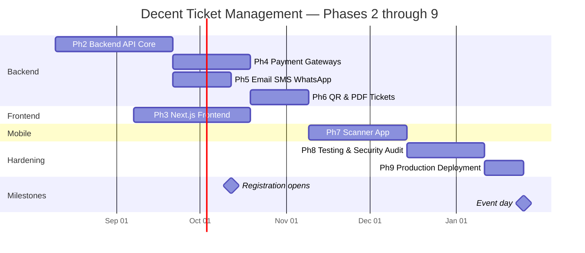
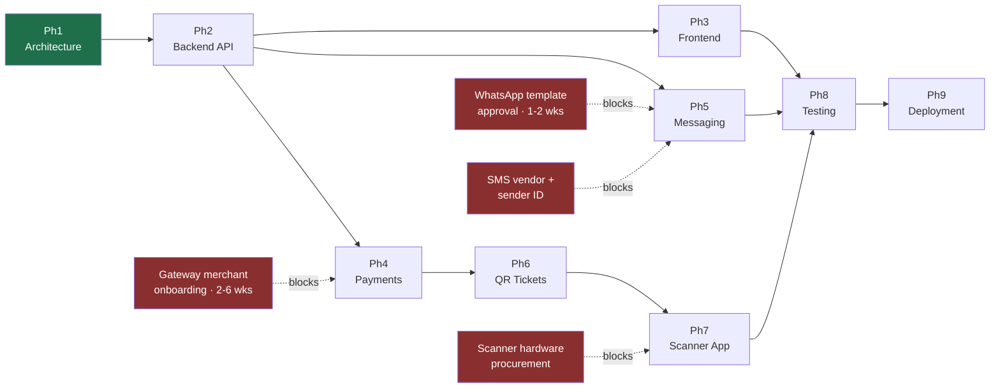

# 08 — Development Roadmap

> Phase 1 deliverable. Phases 2–9 with objectives, deliverables, timelines, and dependencies.

**Assumed team:** 1 backend lead, 1 backend engineer, 1 frontend lead, 1 frontend engineer, 1 mobile engineer (part-time from Phase 6), 1 QA (from Phase 4), 1 designer (Phases 2–3). Adjust the timeline proportionally for a smaller team.

**Total build:** ~24 weeks to production, plus a mandatory buffer before event day.

---

## 9.0 Timeline overview

**Critical path:** Phase 2 → Phase 4 → Phase 6 → Phase 7 → Phase 8 → Phase 9. Phases 3 and 5 run in parallel and are not on it.

**The two schedule risks that are not engineering problems:**
1. **Payment gateway merchant onboarding** (bKash, Nagad, Rocket, SSLCommerz) takes 2–6 weeks in Bangladesh and requires trade licence, TIN, and bank documents. **Start this during Phase 2, not Phase 4.** It is the single most common cause of slipped launch dates on projects like this.
2. **WhatsApp Business template approval** by Meta takes days per template and templates get rejected for wording. **Draft and submit during Phase 2.**

Both are procurement, not development. Neither can be compressed by working harder.

---

## Phase 2 — Backend API Development

**Duration:** 6 weeks · **Depends on:** Phase 1 sign-off

### Objectives
Build the domain core — schema, models, business rules, authentication, RBAC, and the REST API — with everything external stubbed behind interfaces. At the end of this phase the system correctly manages registrations, tickets, and admissions; it simply cannot take real money or send real messages yet.

### Deliverables
- Laravel 13 project with the six-module structure from [01 §1.3](01-system-architecture.md#13-backend-architecture)
- All 26 migrations from [03](03-database-schema.md), with seeders and realistic factories (20,000-row seed for load testing)
- Eloquent models, relationships, observers, and the state machines from [04 §4.7](04-erd.md#47-lifecycle-state-machines) as guarded transitions
- Sanctum authentication for all three guards; TOTP 2FA for staff
- Full RBAC: roles, permissions, policies, scoped middleware ([02](02-rbac-permissions.md))
- REST API v1 — registration, attendee, ticket, ticket type, payment (stubbed gateway), check-in, report, settings, admin
- `FakeGateway`, `FakeSmsDriver`, `FakeWhatsAppDriver`, `FakeEmailDriver` implementing the real interfaces
- Idempotency middleware and `idempotency_keys` handling
- Activity logging on all sensitive actions
- Horizon with the four queue lanes configured
- OpenAPI 3.1 specification, generated and published
- Unit + feature test suite, target ≥ 80% coverage on domain logic
- CI pipeline: lint (Pint), static analysis (PHPStan level 8), tests, `composer audit`

### Exit criteria
- A registration can be created, paid via the fake gateway, ticketed, and admitted end-to-end in tests
- The concurrency tests pass: 300 concurrent purchases against a 100-capacity tier sell exactly 100; 20 concurrent scans of one ticket admit exactly once
- Every permission has a passing allow-case and deny-case test
- OpenAPI spec published and reviewed by the frontend lead

### Parallel non-engineering work (starts week 1)
- [ ] Payment gateway merchant applications submitted
- [ ] WhatsApp Business account + template drafts submitted to Meta
- [ ] SMS gateway vendor selected, contract signed, sender ID registered
- [ ] Domains registered, SSL provisioned, email sending domain SPF/DKIM/DMARC configured

---

## Phase 3 — Next.js Frontend Development

**Duration:** 6 weeks · **Depends on:** Phase 2 OpenAPI spec (week 3 of Phase 2) · **Runs in parallel with:** Phases 4 and 5

### Objectives
Build both frontend applications against the published API contract, with the registration wizard and the admin dashboard as the two highest-value surfaces — one is where 20,000 people form their impression of the event, the other is where the organising team runs it.

**Stack:** React 19 · Next.js 16 App Router · **Tailwind CSS 4** · Shadcn UI · TanStack Query + TanStack Table · TypeScript strict. Both apps and the shared packages use one design system; there is no second styling approach anywhere in the frontend.

### Week plan

| Week | Focus |
|---|---|
| 1 | Design system foundation — tokens, theming, typography, base components ([§3.1](#31-design-system--theming-foundation)) |
| 2–3 | Registration wizard (the risk; build it early) |
| 3–4 | Admin dashboard shell, data tables, finance and attendee modules ([§3.2](#32-admin-dashboard--build-specification)) |
| 5 | Live event dashboard, reports, exports, settings |
| 6 | Public marketing pages, ticket viewer, self-service portal, accessibility and performance pass |

### Deliverables
- Design system and dual-theme token layer — specified in [§3.1](#31-design-system--theming-foundation)
- `@decent/ui` — Shadcn-based component library consumed by both apps
- `@decent/schemas` — Zod contracts shared with the API and the mobile app
- `@decent/api-client` — typed client generated from the OpenAPI spec
- **Public app:** landing (static/ISR), schedule, FAQ, 5-step registration wizard, payment selection and return, ticket viewer, attendee self-service portal
- **Admin dashboard:** every module in [§3.2](#32-admin-dashboard--build-specification)
- Draft persistence and resume-by-link for the registration wizard
- Accessibility: WCAG 2.1 AA, keyboard navigation, screen-reader labels — **verified in both themes**
- Mobile-first responsive; the public target device is a mid-range Android on mobile data, not a desktop
- Frontend tests: component (Vitest), E2E happy paths (Playwright), visual regression on the dashboard in both themes

### Exit criteria
- Registration wizard completes on a throttled 3G connection in under 4 minutes
- Lighthouse ≥ 90 on performance and accessibility for the landing and wizard
- Zod/FormRequest contract test passes — no drift between client and server validation
- All [§3.1](#31-design-system--theming-foundation) and [§3.2](#32-admin-dashboard--build-specification) acceptance checks pass
- Full admin flow demonstrated in UAT with the client, on a real laptop screen and a tablet

### Notes
The wizard is the schedule risk. Five steps, conditional family fields, file upload, draft persistence, and bilingual labels — budget more time here than the page count suggests. Build it first, not last.

---

### 3.1 Design system & theming foundation

Built in week 1, before any screen. Everything downstream consumes it; nothing downstream defines its own colours.

**Tailwind CSS 4 setup**

Tailwind 4 is CSS-first. There is no `tailwind.config.js` and no `@tailwind` directives — the theme lives in CSS.

| Item | Rule |
|---|---|
| Entry | `@import "tailwindcss";` in one global stylesheet per app |
| Theme | Tokens declared in `@theme` — this is the single source of truth for colour, type scale, spacing, radii, shadows |
| Colour space | **OKLCH**, not hex. Perceptually uniform lightness makes the dark palette a principled derivation instead of a guess |
| Build | Native Tailwind 4 engine via `@tailwindcss/postcss`; no JS config shim, no legacy plugin chain |
| Arbitrary values | Allowed for one-off layout only. A raw colour value in a component is a review rejection |

**Token layer**

Three tiers, and components may only reference the third:

1. **Primitive** — the raw ramp (`--color-brand-50 … --color-brand-950`), theme-independent
2. **Semantic** — `--color-bg`, `--color-surface`, `--color-border`, `--color-text`, `--color-text-muted`, `--color-accent`, redefined per theme
3. **Component** — `--color-table-row-hover`, `--color-chart-grid`, resolved from semantic tokens

**Status colours are a separate axis from the accent.** `success` / `warning` / `critical` / `info` carry meaning (payment failed, capacity near limit, sync stale) and must never be reused decoratively, or an operator stops trusting red.

**Light and dark mode**

Both themes are designed, not one inverted into the other. The dark palette is built by re-deriving lightness in OKLCH and re-checking contrast, because a naive inversion produces glaring surfaces and dead accents.

| Requirement | Implementation |
|---|---|
| Signal | `@media (prefers-color-scheme: dark)` for the OS preference |
| Override | `:root[data-theme="dark"]` and `:root[data-theme="light"]` must win over the media query **in both directions** |
| Scope | Only the semantic token block is redefined per theme. Components are styled through tokens and never inside a theme selector |
| Persistence | Choice stored in `localStorage`, applied to `<html>` by a small blocking inline script in `<head>` **before first paint** |
| No flash | A dark-mode user must never see a white flash on load. This is an explicit acceptance check, not a nicety |
| Native controls | `color-scheme: light dark` so scrollbars, date pickers, and form controls follow the theme |
| Assets | Logo, illustrations, and the QR preview need dark-safe variants; a QR always renders on a light plate regardless of theme, because scanners need the contrast |
| Charts | Series, grid, and axis colours come from tokens and re-resolve on theme change without a remount |

**Typography**

Bilingual is the constraint that shapes the type system. A display face chosen for Latin that has no Bangla coverage will silently fall back mid-sentence.

- One Bangla-capable family covering both scripts, or a deliberately paired Latin + Bangla stack with matched vertical metrics
- Self-hosted `woff2`, `font-display: swap`, subset per script — no font CDN
- Fixed type scale in `@theme`; ad-hoc sizes are a review rejection
- `font-variant-numeric: tabular-nums` on every money, count, and batch-year column
- Bangla names run longer than their Latin equivalents — table columns and buttons are tested with real Bangla data, not Latin placeholders

**Design direction**

The dashboard is *operated*, not read. Aim for a confident, modern interface with a genuine point of view — not a generic admin template — while keeping the restraint that a tool used for eight hours on event day demands.

- Dense but breathable: information design over decoration
- State readable at a glance — pills, severity stripes, status dots — so an operator scanning the queue does not have to read numbers
- Motion is functional only: state transitions, loading skeletons, toast entry. Respect `prefers-reduced-motion`
- Spend visual boldness in one place (the live event dashboard) and keep the working screens quiet

**Acceptance checks**

- [ ] Every semantic token has a light and a dark value; no component references a primitive or a literal colour
- [ ] Contrast passes WCAG AA for text and UI borders **in both themes** — automated check in CI
- [ ] Theme toggle overrides the OS preference in both directions and survives reload
- [ ] No flash of the wrong theme on cold load, verified on a throttled connection
- [ ] Bangla and English render correctly in every component, including tables, PDFs previews, and toasts
- [ ] Visual regression baselines captured for both themes

---

### 3.2 Admin dashboard — build specification

**Shell**

Persistent left navigation grouped by domain (Attendees · Finance · Tickets · Check-in · Notifications · Reports · Settings), collapsible to icons; top bar with global search, theme toggle, notification bell, and account menu; breadcrumbs on every detail route. Navigation is rendered from the permission set returned at login — a Volunteer Coordinator never sees a Finance link they cannot open ([02](02-rbac-permissions.md)).

**Modules**

| Module | Screens | Notes |
|---|---|---|
| Overview | KPI row, registration trend, revenue trend, capacity by ticket type, recent activity | Landing route; must render in under 1s from cached counters |
| Attendees | List, detail, edit, merge duplicates, guest management | 20k+ rows — server-side pagination, sort, and filter |
| Registrations | List, detail, status timeline, document viewer | Timeline mirrors the state machine in [04 §4.7](04-erd.md#47-lifecycle-state-machines) |
| Finance | Payments list, **manual verification queue**, refunds, reconciliation, revenue reports | The verification queue is the highest-traffic admin screen before the event |
| Tickets | Issue, void, reissue, resend, ticket type and capacity management | Void and reissue require confirmation with a typed reason |
| Check-in | Live gate monitor, scan log, override requests, device and volunteer status | Read-heavy, high refresh |
| Notifications | Delivery dashboard, failures, cost by channel, template management, kill switches | Kill switches need a deliberate two-step confirm |
| Reports | 11-report catalogue from [05](05-data-flows.md), export to PDF/Excel/CSV, job status | Exports are async jobs with progress, never a blocking download |
| Settings | Event settings, gates, sessions, roles and users, audit log viewer | Audit log is read-only for everyone |

**Data tables** — the dashboard's core component, built once

Server-driven pagination, sorting, filtering, and column visibility against 20,000+ rows; URL-synced state so a filtered view is shareable; saved views per user; row selection with bulk actions gated by permission; sticky header and first column; density toggle; skeleton loading, and distinct empty / no-results / error states. Client-side sorting of a full table is forbidden — it will not survive real data volume.

**Live event dashboard**

The one screen that must be readable across a room on event day: total admitted vs expected, per-gate throughput, scan rate, device online/offline and battery, sync lag, and a rejection feed by reason. Auto-refresh on a short interval (SSE if available, polling otherwise), a stale-data banner the moment refresh fails, and a large-format mode for a wall display. It reads projections from cache — never the check-in write path ([07 §7.4](07-scalability-plan.md#74-caching-strategy)).

**Charts**

Recharts, wrapped in `@decent/ui` so no chart is configured twice. Tokenised colours that re-resolve on theme change, tabular-num axis labels, accessible text alternatives, and an explicit empty state. No chart animates on refresh — a moving number is unreadable at a glance.

**Behaviour**

- TanStack Query for all server state; optimistic updates only where the server can be trusted to reconcile
- Every destructive action confirms, and states what will happen in plain words
- Errors from `@decent/api-client` normalise to a single toast/inline contract; a 403 explains which permission is missing
- Keyboard: `/` focuses search, `Esc` closes overlays, tables are fully arrow-navigable
- Target viewport is a laptop at 1440px, must remain usable at 1024px and on a tablet at the gate

**Acceptance checks**

- [ ] Attendee table paginates, sorts, and filters 20,000 seeded rows with sub-400ms interactions against staging
- [ ] Every module renders correctly in light and dark, verified by visual regression
- [ ] Navigation and actions correctly hide and deny for each of the four roles
- [ ] Live dashboard shows a stale banner within 15s of losing its data source
- [ ] Full keyboard traversal of the verification queue with no mouse
- [ ] Exports run as background jobs with visible progress and a retrievable result

---

## Phase 4 — Payment Gateway Integration

**Duration:** 4 weeks · **Depends on:** Phase 2 + **merchant credentials in hand**

### Objectives
Replace `FakeGateway` with four real adapters and prove the money path is correct under adversarial conditions.

### Deliverables
- `BkashClient` — tokenised checkout, token refresh cycle, create/execute/query/refund
- `NagadClient` — RSA payload encryption/signing, initialise/complete/verify
- `RocketClient` — per the current merchant integration spec
- `SslCommerzClient` — session init, IPN handler, `val_id` validation, refund
- Webhook endpoints with per-gateway signature verification and IP allowlisting
- Server-side verification as the sole path to `succeeded` ([06 §6.6](06-security-architecture.md#66-payment-security))
- Manual verification workflow: proof upload, duplicate-TrxID detection, approval queue, attributed approval
- Refund workflow with approval, gateway call, and ticket voiding
- Payment intent expiry sweeper with gateway pre-check
- Nightly reconciliation job with the three mismatch classes
- Sandbox test suite covering: success, failure, timeout, replayed callback, amount mismatch, duplicate webhook, partial refund

### Exit criteria
- Every gateway completes a live low-value production transaction (100 BDT), verified and refunded
- A replayed success callback with a forged signature does **not** produce a ticket
- A double-clicked Pay button produces exactly one charge
- Reconciliation correctly flags a manually introduced mismatch

### Risk
This phase cannot start without credentials. If onboarding slips, Phase 4 slips, and Phases 6–9 slip behind it. Track credential status weekly from Phase 2 week 1 and escalate at the first delay.

---

## Phase 5 — Email, SMS & WhatsApp Integration

**Duration:** 3 weeks · **Depends on:** Phase 2 + approved WhatsApp templates + SMS contract · **Runs in parallel with:** Phase 4

### Objectives
Make the outbox actually deliver, with cost visibility and per-channel kill switches.

### Deliverables
- `MailDriver` with the transactional provider; SPF/DKIM/DMARC verified and passing
- `SmsDriver` for the chosen Bangladesh gateway, with DLR webhook handling
- `WhatsAppDriver` on Meta Cloud API, with status webhook handling
- All templates from [01 §1.6](01-system-architecture.md#16-notification-architecture) in both English and Bangla
- Segment counting and cost tracking per message, with Bangla/Unicode length budgeting
- Reminder scheduling for T-7, T-1, T-0 with staggered dispatch
- Delivery receipt processing into `notification_events`
- Bounce and opt-out handling
- Admin notification dashboard: delivery rates, failures, cost by channel
- Per-channel kill switches wired to `event_settings` and verified

### Exit criteria
- End-to-end delivery confirmed on real Bangladeshi numbers across major operators (GP, Robi, Banglalink, Teletalk) — coverage differs by operator and must be tested per network
- Bangla SMS renders correctly on both feature phones and smartphones
- Cost per message recorded accurately and reconciles against the vendor's dashboard
- A kill switch flip stops sending within 60 seconds
- No duplicate sends under job retry

### Notes
Bangla SMS rendering is the classic failure here — it looks correct in the vendor's web console and arrives as boxes on an actual handset. Test on physical devices across all four operators, not on a simulator.

---

## Phase 6 — QR Ticket Generation

**Duration:** 3 weeks · **Depends on:** Phases 2 and 4

### Objectives
Implement the signing scheme, ticket assets, and the manifest endpoint the scanner will depend on.

### Deliverables
- Ed25519 key generation and secret-manager storage; key ID scheme
- `QrSigner` service — the only code path that touches the private key
- Payload encoding/decoding with version support ([06 §6.5](06-security-architecture.md#65-qr-code-security))
- QR image rendering: ECC level M, 512px, generous quiet zone
- Bilingual A5 PDF ticket with photo, print-tested on low-quality output
- `TicketNumberGenerator` with the `DEC100-{TYPE}-{BATCH}-{SEQ}` format
- Void, reissue, and revocation flows with `manifest_version` bumping
- **Manifest endpoint** with ETag-based delta sync — the scanner's dependency
- Key rotation procedure, documented and rehearsed on staging
- Server-side verification endpoint for online scans

### Exit criteria
- QR scans reliably from: a cracked phone screen, 40% screen brightness, a laser print, an inkjet print, and a photocopy
- A signature verifies with the public key alone, and fails on a single-bit payload mutation
- Manifest delta sync returns only changed tickets and correctly handles a 12,000-ticket cold start
- Key rotation completes on staging without invalidating existing tickets

### Notes
Physical scan testing is not optional and cannot be simulated. Print real tickets, damage them, and scan them in daylight and under fluorescent light. This is the cheapest possible time to discover a QR that is too dense or a quiet zone that is too small.

---

## Phase 7 — Mobile Verification App

**Duration:** 5 weeks · **Depends on:** Phase 6 manifest endpoint

### Objectives
Ship an offline-first React Native scanner that works reliably in the hands of a volunteer who received ten minutes of training.

### Deliverables
- React Native app (Android primary, iOS secondary — volunteer devices in this context are overwhelmingly Android)
- Device enrolment via one-time QR; hardware fingerprint binding; PIN setup
- Camera scanner with torch toggle, autofocus tuning, and haptic feedback
- **Local Ed25519 verification** against the embedded public key
- SQLite manifest store with delta sync
- Local admission counter with offline decision logic
- Scan queue with idempotent batched upload and exponential backoff
- Gate UI: large targets, high-contrast for sunlight, unambiguous green/red result with reason text
- Holder card on successful scan: name, photo, type, admits total, remaining
- Party-size confirmation for family tickets (the partial-admission flow)
- Manual lookup by mobile last-4 or ticket number
- Override request flow routed to an Event Manager
- Sync status UI: last sync, pending count, battery, manifest version
- Volunteer's own scan history and session totals
- Crash reporting and offline-capable diagnostic log

### Exit criteria
- 500 consecutive scans in airplane mode with zero data loss and correct duplicate rejection
- Full 12,000-ticket manifest syncs in under 90 seconds on 4G
- Sub-second scan-to-result on a mid-range Android (target: Redmi-class hardware, not a flagship)
- Two devices offline scanning the same ticket produce exactly one admission after sync, with the second correctly flagged as a conflict
- 8-hour battery life with continuous scanning and the screen at gate brightness
- A volunteer with no training completes 20 correct scans after a 5-minute briefing

### Notes
Test on the actual hardware that will be used, and buy it early. Camera quality, autofocus speed, and battery behaviour vary enormously across budget Android devices, and the app's gate throughput is determined by the slowest device in the fleet.

---

## Phase 8 — Testing & Security Audit

**Duration:** 4 weeks · **Depends on:** Phase 7

### Objectives
Prove the system works under load, under attack, and in the hands of real users — before there is no chance to fix it.

### Deliverables

**Functional**
- Full regression suite across all phases
- E2E scenarios: single, couple, family, sponsor, VIP registration paths
- Cross-browser and cross-device matrix
- Bangla text correctness end-to-end: form → database → PDF → SMS → badge

**Load testing** — all scenarios from [07 §7.8](07-scalability-plan.md#78-load-testing-plan-executed-in-phase-8)
- Registration spike, payment concurrency, capacity race, duplicate scan race, offline sync burst, notification blast, export under load, read-heavy browse

**Security**
- Third-party penetration test scoped to payment flows, QR forgery, and authorisation boundaries
- Automated scanning (OWASP ZAP) plus manual authorisation testing
- Dependency audit with zero unresolved critical advisories
- Explicit verification of each threat in the [T1–T12 model](06-security-architecture.md#61-threat-model)
- Secret scanning across the full git history

**Operational**
- **Full-scale gate rehearsal**: 20+ devices, 500+ test tickets, simulated network failure mid-event
- Database failover drill with the hot standby
- Backup restore drill
- Every kill switch exercised
- Incident response runbook written, distributed, and walked through with the named responders
- Volunteer training materials and a one-page gate cheat sheet

**UAT**
- Client acceptance across all admin workflows
- Pilot registration with 50 real alumni, including at least 10 over age 60 — the usability signal that matters most for this audience

### Exit criteria
- Zero critical or high findings open
- All load test pass criteria met
- Gate rehearsal completes with no data loss under simulated network failure
- Client sign-off on UAT

### Notes
The gate rehearsal is the highest-value activity in this phase and the one most likely to be cut when the schedule tightens. Protect it. It is the only realistic opportunity to discover that the venue's lighting defeats the camera, or that volunteers consistently tap the wrong button, while there is still time to change something.

---

## Phase 9 — Production Deployment

**Duration:** 2 weeks + event-day operations · **Depends on:** Phase 8 sign-off

### Objectives
Deploy, cut over, operate the event, and hand over.

### Deliverables

**Infrastructure**
- Production provisioned to the event-day sizing in [07 §7.3](07-scalability-plan.md#73-infrastructure)
- CDN, WAF, TLS, HSTS preload
- Read replica and hot standby in replication
- Encrypted backups with verified restore
- Monitoring, alerting, log aggregation, on-call rotation

**Release**
- Zero-downtime deploy pipeline with a tested rollback
- Live gateway credentials installed; production QR signing key generated
- Production settings and content loaded
- Smoke tests against production

**Launch**
- Registration opens; first-48-hours monitoring at heightened alert thresholds
- Daily reconciliation review

**Event day** — per the [operational plan](07-scalability-plan.md#77-event-day-operational-plan)
- T-7 scale-up and load verification
- T-24 deployment freeze, device charging, dry run
- T-2 volunteer briefing, forced manifest sync, paper fallback printed
- Live ops dashboard, on-site engineer, escalation path active

**Post-event**
- Full data sync and offline conflict resolution
- Final attendance, revenue, and reconciliation reports
- Post-mortem
- Handover: architecture docs, runbooks, credentials transfer, admin training
- Data retention actions per [06 §6.8](06-security-architecture.md#68-data-protection)
- Scale-down and decommissioning plan

### Exit criteria
- Event completes with all attendees admitted
- Financial reconciliation balances against the merchant account
- Client sign-off and handover complete

---

## 9.1 Dependency graph

Red nodes are external dependencies with lead times outside the team's control. All four must be initiated during Phase 2.

---

## 9.2 Risk register

| # | Risk | Likelihood | Impact | Mitigation |
|---|---|---|---|---|
| R1 | Gateway onboarding delayed | High | High | Start week 1 of Phase 2; sequence SSLCommerz first as the fastest to approve; keep manual verification as a launch-capable fallback |
| R2 | Venue network unusable on event day | High | — | Already mitigated architecturally: offline-first is the default, not a fallback |
| R3 | Registration spike exceeds forecast | Medium | Medium | CDN-first static pages, autoscaling, load-tested headroom |
| R4 | Bangla rendering breaks in PDF or SMS | Medium | Medium | Test on physical devices and real printers in Phases 5 and 6 |
| R5 | WhatsApp templates rejected repeatedly | Medium | Low | Submit early; Email + SMS cover every critical message without WhatsApp |
| R6 | Volunteer devices underperform | Medium | High | Procure and test real hardware in Phase 6; specify a minimum device standard |
| R7 | Scope creep (seating, catering, merchandise) | High | Medium | Phase 1 scope boundaries are the reference; new scope becomes a Phase 10 |
| R8 | Manual payment fraud at volume | Medium | Medium | Duplicate TrxID detection, attributed approval, daily reconciliation |
| R9 | Key person unavailable near the event | Medium | High | Documented runbooks, no single-owner subsystem, two people trained on gate ops |
| R10 | SMS cost overruns budget | Medium | Medium | Cost tracked per message from day one; kill switch; length-budgeted templates |
| R11 | Dark theme retrofitted late, or brand assets arrive without dark variants | Medium | Medium | Theming is week 1 of Phase 3 and token-level, so no screen is ever built single-theme; dark logo variant is a Phase 2 prerequisite ([§9.4](#94-what-phase-2-needs-before-it-starts)) |

---

## 9.3 Definition of done — per phase

Every phase is complete only when all of these hold:

- [ ] All deliverables reviewed and merged
- [ ] Tests written and passing in CI
- [ ] No critical or high security findings open
- [ ] Documentation updated in `/docs`
- [ ] Deployed to staging and verified there
- [ ] Client demo delivered and signed off
- [ ] Follow-up items logged, not left implicit

---

## 9.4 What Phase 2 needs before it starts

1. Sign-off on this Phase 1 architecture
2. Answers to the [six open questions](README.md#open-questions-for-the-client)
3. Confirmed event date, venue, and capacity
4. Final ticket types with prices in BDT
5. Merchant of record identified for gateway onboarding
6. Brand assets for the design system — logo in **light and dark variants**, brand colours, the school's Bangla name, and a licensed Bangla-capable typeface (font licensing for web embedding is frequently overlooked and blocks §3.1)
7. Refund policy and cutoff date

Items 4, 5, and 7 are business decisions that block engineering. Getting them settled during Phase 1 sign-off rather than mid-Phase-2 is worth roughly a week of schedule.

---

**End of Phase 1 deliverables.** Index: [README](README.md)
